# FIT5196 Week 1 Quiz - Gemini 自动转录版

> 使用 Google Gemini Flash 自动转录
> 总题数: 164

---

## Question 1

**How do you make text italic in Markdown?** (Select all that apply)

a. Surround the text with **
b. Surround the text with ~~
c. Surround the text with _
d. Surround the text with *

---

## Question 2

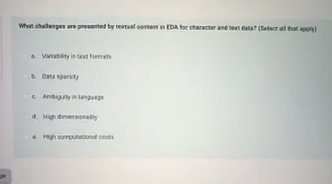

**What challenges are presented by textual content in EDA for character and text data? (Select all that apply)**

a. Variability in text formats
b. Data sparsity
c. Ambiguity in language
d. High dimensionality
e. High computational costs

---

## Question 3

**For matching IPv4 addresses, which regex is accurate and avoids matching numbers beyond the valid range of 0-255?**

a. \b(0-255){1,3}\.(0-255){1,3}\.(0-255){1,3}\.(0-255){1,3}\b
b. [0-9]{1,3}\.([0-9]{1,3}){3}
c. \b(25[0-5]|2[0-4][0-9]|[01]?[0-9][0-9]?)\.(25[0-5]|2[0-4][0-9]|[01]?[0-9][0-9]?)\.(25[0-5]|2[0-4][0-9]|[01]?[0-9][0-9]?)\.(25[0-5]|2[0-4][0-9]|[01]?[0-9][0-9]?)\b
d. \b(\d{1,3}\.){3}\d{1,3}\b

---

## Question 4

**What factors influence the choice of data pre-processing techniques? (Select all that apply)**

a. Algorithm requirements
b. Data quantity
c. Data integrity
d. Visualisation needs
e. Data type

---

## Question 5

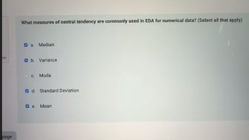

**What measures of central tendency are commonly used in EDA for numerical data? (Select all that apply)**

a. Median
b. Variance
c. Mode
d. Standard Deviation
e. Mean

---

## Question 6

**To create a bullet list in Markdown, which symbol can you use?**

a. All of the above
b. *
c. -
d. +

---

## Question 7

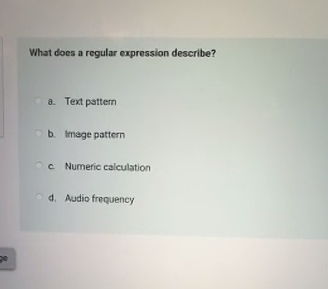

**What does a regular expression describe?**

a. Text pattern
b. Image pattern
c. Numeric calculation
d. Audio frequency

---

## Question 8

**How do you select rows 10 to 20 from a DataFrame df? (Select all that apply)**

a. df.iloc[9:20]
b. df.loc[10:20]
c. df.locate[9:20]
d. df[9:20]

---

## Question 9

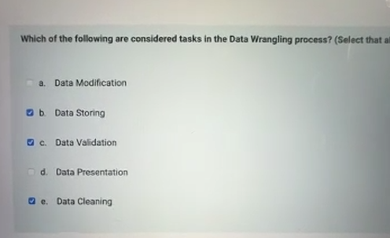

**Which of the following are considered tasks in the Data Wrangling process? (Select all that apply)**

a. Data Modification
b. Data Storing
c. Data Validation
d. Data Presentation
e. Data Cleaning

---

## Question 10

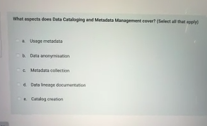

**What aspects does Data Cataloging and Metadata Management cover? (Select all that apply)**

a. Usage metadata
b. Data anonymisation
c. Metadata collection
d. Data lineage documentation
e. Catalog creation

---

## Question 11

**In the regex (?:foo)(foo), what is the difference between (?:foo) and (foo)?**

a. (?:foo) matches and captures "foo"; (foo) only matches "foo"
b. Neither captures "foo"; they only match
c. (?:foo) only matches "foo"; (foo) matches and captures "foo"
d. Both capture "foo" for future use

---

## Question 12

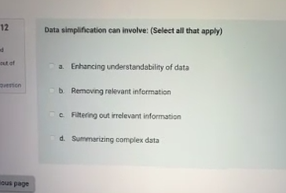

**Data simplification can involve: (Select all that apply)**

a. Enhancing understandability of data
b. Removing relevant information
c. Filtering out irrelevant information
d. Summarizing complex data

---

## Question 13

**What does the regex `(?<=\b20)\d{2}\b` match in "Class of 2024"?**

a. 2024
b. Class of
c. 24
d. 20

---

## Question 14

**The goals of data enrichment include: (Select all that apply)**

a. Adding value to the data
b. Improving data quality
c. Enhancing data analysis capabilities
d. Simplifying data formats

---

## Question 15

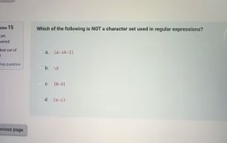

**Which of the following is NOT a character set used in regular expressions?**

a. [a-zA-Z]
b. \d
c. [0-9]
d. (a-z)

---

## Question 16

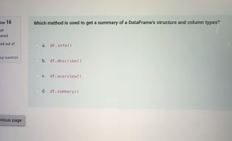

**Which method is used to get a summary of a DataFrame's structure and column types?**

a. df.info()
b. df.describe()
c. df.overview()
d. df.summary()

---

## Question 17

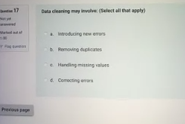

**Data cleaning may involve: (Select all that apply)**

a. Introducing new errors
b. Removing duplicates
c. Handling missing values
d. Correcting errors

---

## Question 18

**How would you match "http" at the beginning of a string?**

a. \bhttp
b. http$
c. http\b
d. ^http

---

## Question 19

**What will the regex (?<=\b20)[0-9]{2}\b match in "Graduating in 2025"?**

a. 2025
b. 25
c. 20
d. No match

---

## Question 20

**To emphasise text with bold in Markdown, you can use:**

a. Double tildes or double dollar signs
b. Double asterisks or double underscores
c. Single asterisks or single underscores
d. Triple asterisks or triple underscores

---

## Question 21

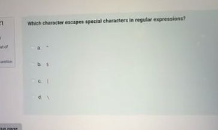

**Which character escapes special characters in regular expressions?**

a. ^
b. $
c. |
d. \

---

## Question 22

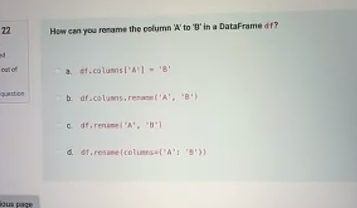

**How can you rename the column 'A' to 'B' in a DataFrame df?**

a. df.columns['A'] = 'B'
b. df.columns.rename('A', 'B')
c. df.rename('A', 'B')
d. df.rename(columns={'A': 'B'})

---

## Question 23

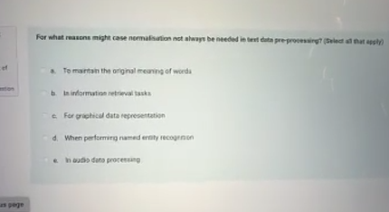

**For what reasons might case normalisation not always be needed in text data pre-processing? (Select all that apply)**

a. To maintain the original meaning of words
b. In information retrieval tasks
c. For graphical data representation
d. When performing named entity recognition
e. In audio data processing

---

## Question 24

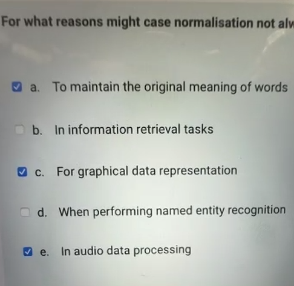

Based on the image provided, here is the transcribed quiz question:

**For what reasons might case normalisation not alw...** (Select all that apply)

a. To maintain the original meaning of words
b. In information retrieval tasks
c. For graphical data representation
d. When performing named entity recognition
e. In audio data processing

*(Note: The question text is cut off on the right side of the original image.)*

---

## Question 25

**The process that simplifies text by converting it to its base form is called:**

a. Case normalization
b. One-hot encoding
c. Tokenisation
d. Lemmatisation

---

## Question 26

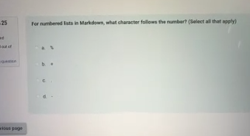

**For numbered lists in Markdown, what character follows the number? (Select all that apply)**

a. )
b. *
c. .
d. -

---

## Question 27

**Why is understanding the structure of language (syntax) important in EDA for character and text data? (Select all that apply)**

a. It is crucial for visual data representation
b. It supports the understanding of grammar rules
c. It assists in analysing sentence structure
d. It aids in constructing well-formed sentences and paragraphs
e. It helps in hardware optimisation

---

## Question 28

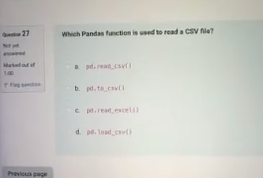

**Which Pandas function is used to read a CSV file?**

a. pd.read_csv()
b. pd.to_csv()
c. pd.read_excel()
d. pd.load_csv()

---

## Question 29

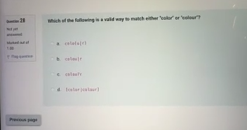

**Which of the following is a valid way to match either 'color' or 'colour'?**

a. colo(u|r)
b. colou|r
c. colou?r
d. (color|colour)

---

## Question 30

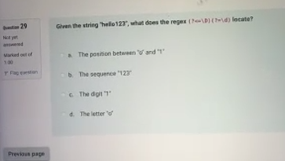

**Given the string 'hello123', what does the regex (?<=\D)(?=\d) locate?**

a. The position between 'o' and '1'
b. The sequence "123"
c. The digit "1"
d. The letter 'o'

---

## Question 31

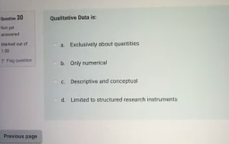

**Qualitative Data is:**

a. Exclusively about quantities
b. Only numerical
c. Descriptive and conceptual
d. Limited to structured research instruments

---

## Question 32

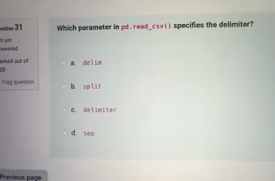

**Which parameter in `pd.read_csv()` specifies the delimiter?**

a. `delim`
b. `split`
c. `delimiter`
d. `sep`

---

## Question 33

**How do you check for missing values in a DataFrame df? (Select all that apply)**

a. df.isna()
b. df.has_null()
c. df.missing()
d. df.isnull()

---

## Question 34

**Scalability in data wrangling is essential for:**

a. Handling increased data loads without performance loss
b. Reducing data processing power
c. Maintaining a constant volume of data
d. Complicating data integration processes

---

## Question 35

**What does 'Character Data' consist of?**

a. Sequences of characters
b. Single alphabetic letters, symbols, or numerals
c. Quantifiable information
d. Binary data

---

## Question 36

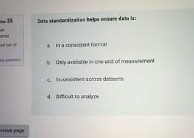

**Data standardization helps ensure data is:**

a. In a consistent format
b. Only available in one unit of measurement
c. Inconsistent across datasets
d. Difficult to analyze

---

## Question 37

**Which technique is used to handle categorical data by creating a binary column for each category?**

a. One-hot Encoding
b. Label Encoding
c. Normalisation
d. Vectorisation

---

## Question 38

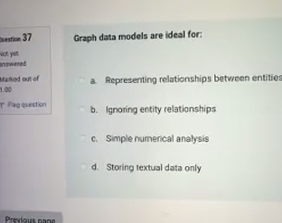

**Graph data models are ideal for:**

a. Representing relationships between entities
b. Ignoring entity relationships
c. Simple numerical analysis
d. Storing textual data only

---

## Question 39

**What process involves scaling data to a small, specified range?**

a. Diversification
b. Normalisation
c. Aggregation
d. Segmentation

---

## Question 40

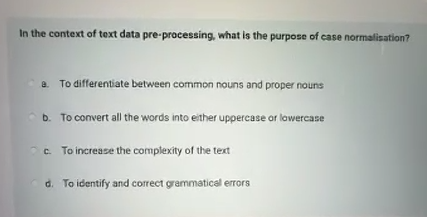

**In the context of text data pre-processing, what is the purpose of case normalisation?**

a. To differentiate between common nouns and proper nouns
b. To convert all the words into either uppercase or lowercase
c. To increase the complexity of the text
d. To identify and correct grammatical errors

---

## Question 41

**In data quality management, what is crucial for maintaining high-quality data?**

a. Aesthetic appeal
b. Data volume
c. Data Governance
d. Data variety

---

## Question 42

**Exploratory Data Analysis (EDA) is used for:**

a. Finalizing data collection methods
b. Reducing the volume of data
c. Uncovering patterns, trends, and anomalies
d. Reducing the volume of data

---

## Question 43

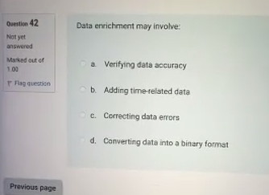

**Data enrichment may involve:**

a. Verifying data accuracy
b. Adding time-related data
c. Correcting data errors
d. Converting data into a binary format

---

## Question 44

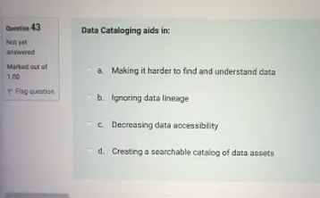

**Data Cataloging aids in:**

a. Making it harder to find and understand data
b. Ignoring data lineage
c. Decreasing data accessibility
d. Creating a searchable catalog of data assets

---

## Question 45

**Machine Learning enhances data quality management through:**

a. Solely focusing on data visualization
b. A combination of techniques including NLP and continuous monitoring
c. Only data cleansing
d. Only automated error detection

---

## Question 46

**Data Integration aims to:**

a. Reduce the overall data quality
b. Create inconsistent datasets
c. Combine multiple data sources for a unified view
d. Provide a disjointed view of information

---

## Question 47

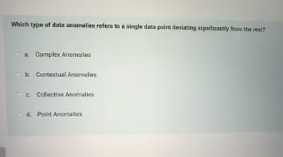

**Which type of data anomalies refers to a single data point deviating significantly from the rest?**

a. Complex Anomalies
b. Contextual Anomalies
c. Collective Anomalies
d. Point Anomalies

---

## Question 48

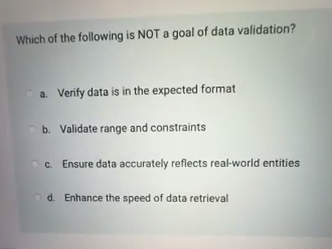

**Which of the following is NOT a goal of data validation?**

a. Verify data is in the expected format
b. Validate range and constraints
c. Ensure data accurately reflects real-world entities
d. Enhance the speed of data retrieval

---

## Question 49

**Which is NOT a method of collecting structured data?**

a. Relational databases
b. Online forms
c. Surveys and questionnaires
d. Text mining and NLP

---

## Question 50

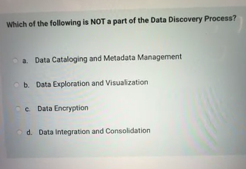

**Which of the following is NOT a part of the Data Discovery Process?**

a. Data Cataloging and Metadata Management
b. Data Exploration and Visualization
c. Data Encryption
d. Data Integration and Consolidation

---

## Question 51

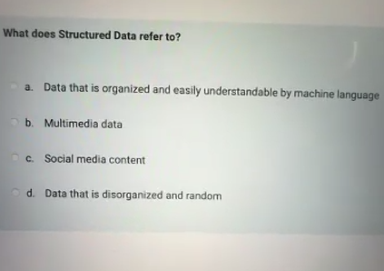

**What does Structured Data refer to?**

a. Data that is organized and easily understandable by machine language
b. Multimedia data
c. Social media content
d. Data that is disorganized and random

---

## Question 52

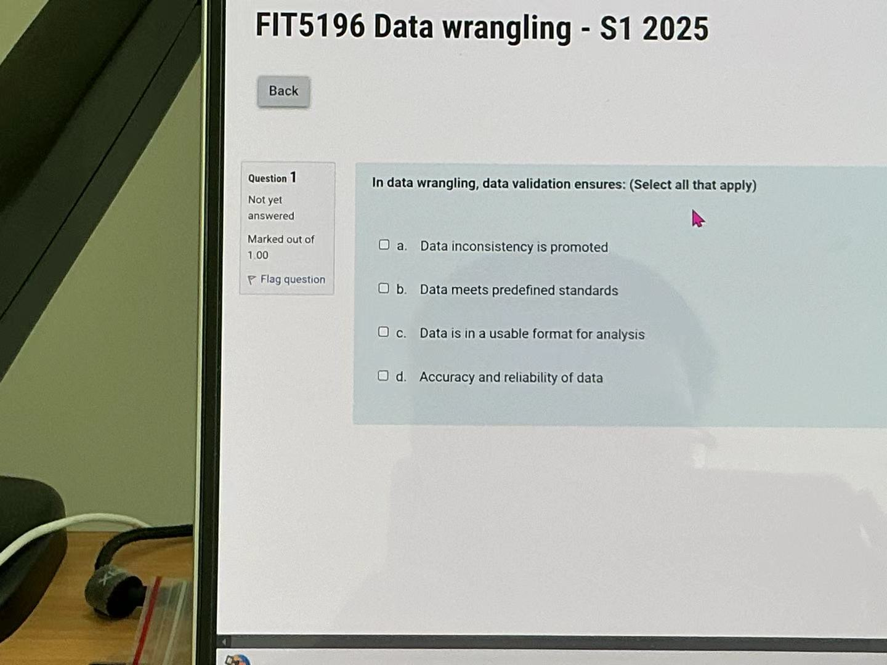

**In data wrangling, data validation ensures: (Select all that apply)**

a. Data inconsistency is promoted
b. Data meets predefined standards
c. Data is in a usable format for analysis
d. Accuracy and reliability of data

---

## Question 53

**How can you rename the column 'A' to 'B' in a DataFrame df?**

a. `df.rename(columns={'A': 'B'})`
b. `df.columns['A'] = 'B'`
c. `df.rename('A', 'B')`
d. `df.columns.rename('A', 'B')`

---

## Question 54

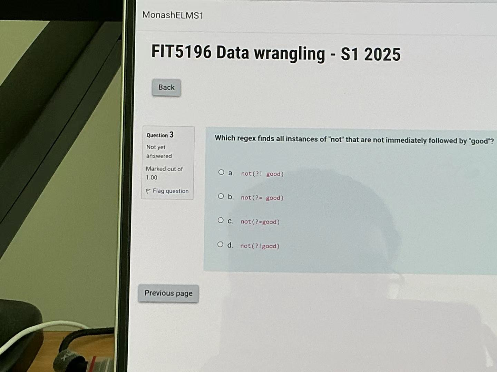

**Which regex finds all instances of "not" that are not immediately followed by "good"?**

a. not(?! good)
b. not(?= good)
c. not(?=good)
d. not(?!good)

---

## Question 55

**Why is it important to remove stop words in text data pre-processing? (Select all that apply)**

a. To highlight more meaningful words in text analysis
b. To prevent skew in analysis results
c. To add more complexity to the model
d. To increase data set size
e. To reduce computational load

---

## Question 56

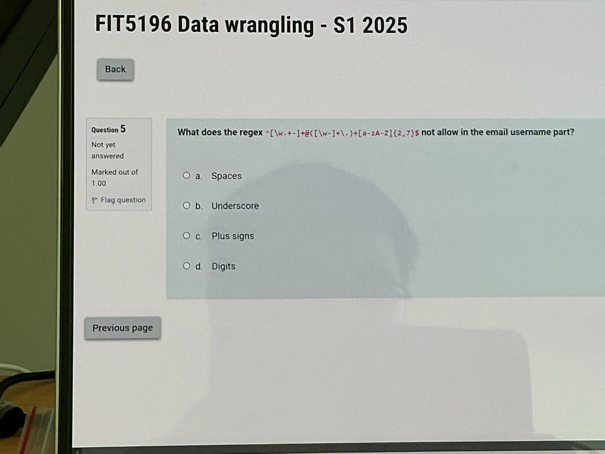

**What does the regex `^[\w.+-]+@([\w-]+\.)+[a-zA-Z]{2,7}$` not allow in the email username part?**

a. Spaces
b. Underscore
c. Plus signs
d. Digits

---

## Question 57

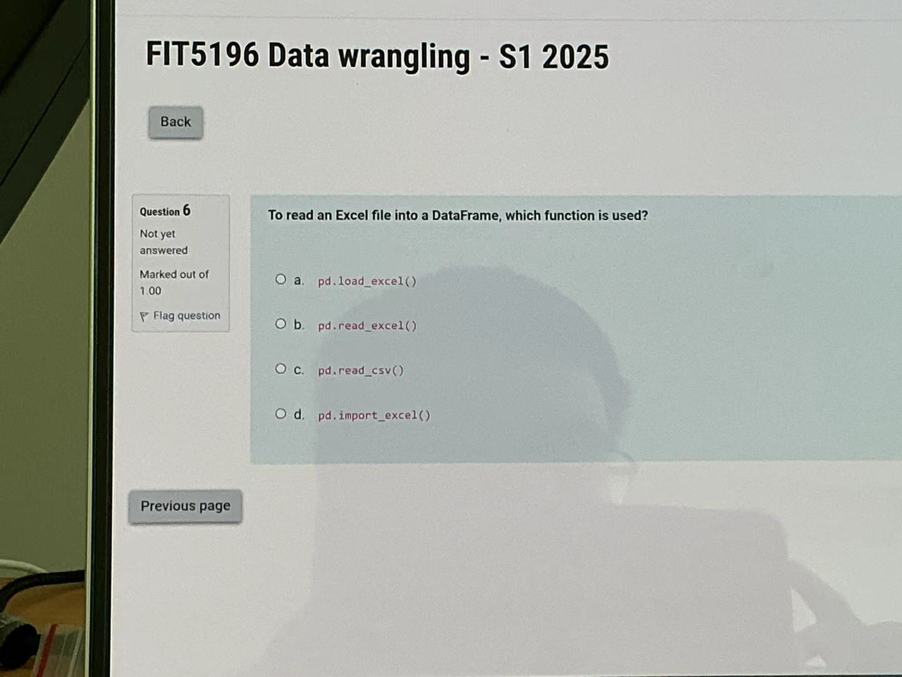

**To read an Excel file into a DataFrame, which function is used?**

a. `pd.load_excel()`
b. `pd.read_excel()`
c. `pd.read_csv()`
d. `pd.import_excel()`

---

## Question 58

**What does the regex (?<=\b20)\d{2}\b match in "Class of 2024"?**

a. 20
b. 24
c. 2024
d. Class of

---

## Question 59

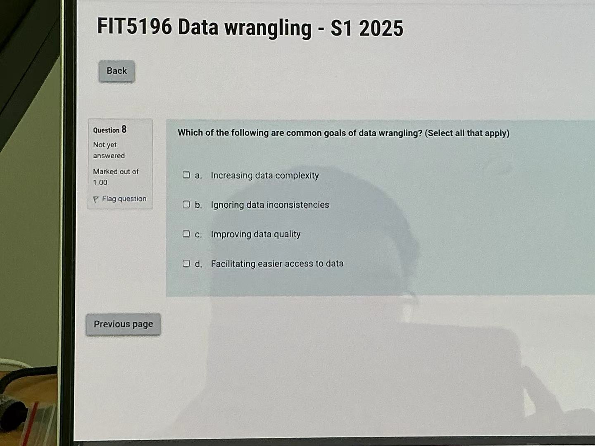

**Which of the following are common goals of data wrangling? (Select all that apply)**

a. Increasing data complexity
b. Ignoring data inconsistencies
c. Improving data quality
d. Facilitating easier access to data

---

## Question 60

**Data Profiling and Assessment involve understanding which types of data structure? (Select all that apply)**

a. Big data
b. Time-series data
c. Structured data
d. Unstructured data
e. Graph data

---

## Question 61

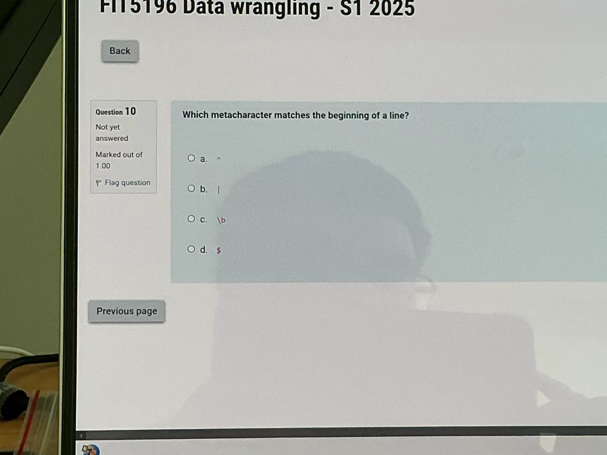

**Which metacharacter matches the beginning of a line?**

a. ^
b. |
c. \b
d. $

---

## Question 62

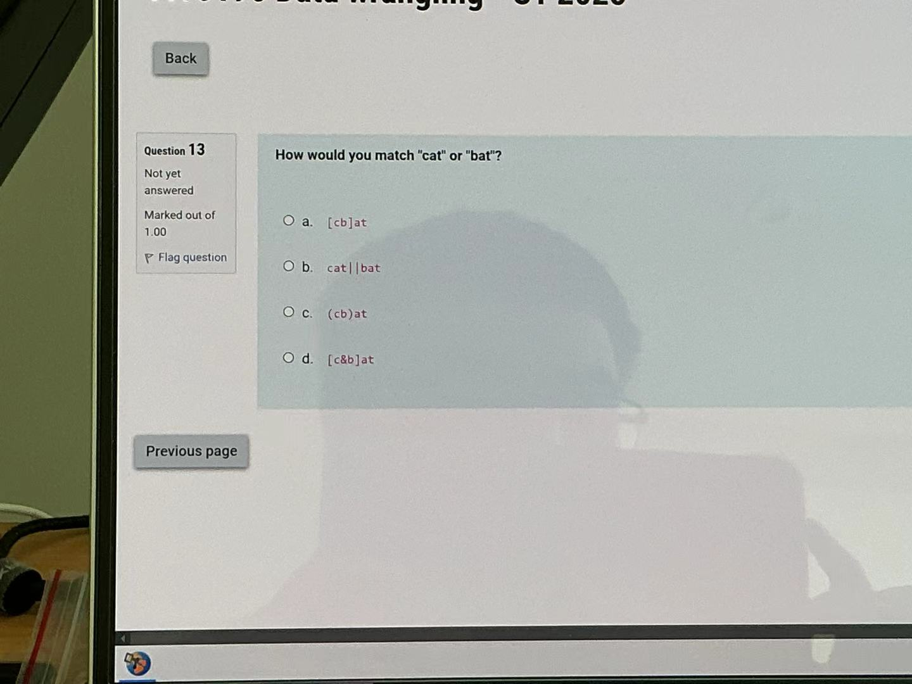

**How would you match "cat" or "bat"?**

a. [cb]at
b. cat||bat
c. (cb)at
d. [c&b]at

---

## Question 63

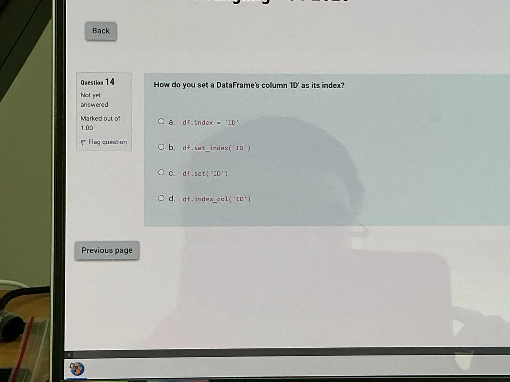

**How do you set a DataFrame's column 'ID' as its index?**

a. `df.index = 'ID'`
b. `df.set_index('ID')`
c. `df.set('ID')`
d. `df.index_col('ID')`

---

## Question 64

**In regex, what does (?:abc) represent?**

a. An optional character sequence
b. A non-capturing group
c. A capturing group
d. A repeated sequence

---

## Question 65

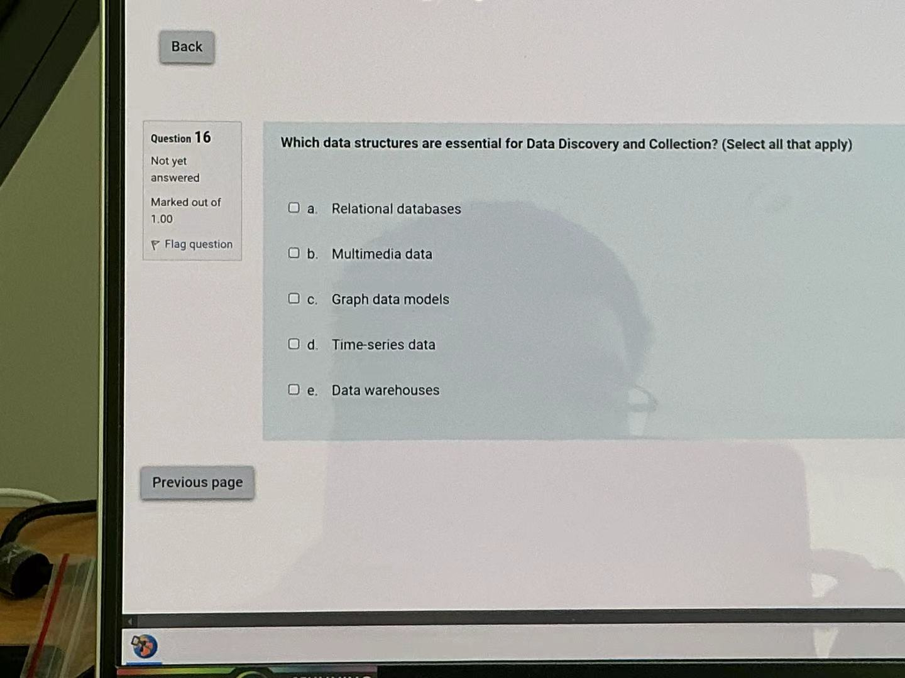

**Which data structures are essential for Data Discovery and Collection? (Select all that apply)**

a. Relational databases
b. Multimedia data
c. Graph data models
d. Time-series data
e. Data warehouses

---

## Question 66

**What does the pd.read_json() function do?**

a. Converts a DataFrame to a JSON object
b. Writes data to a JSON file
c. Reads data from a JSON file into a DataFrame
d. Parses JSON data into a list

---

## Question 67

**What role does machine learning play in data quality management?**

a. Enhancing processes of identifying and correcting data quality issues
b. Reducing the need for data governance
c. Only for data visualization
d. Only for database management

---

## Question 68

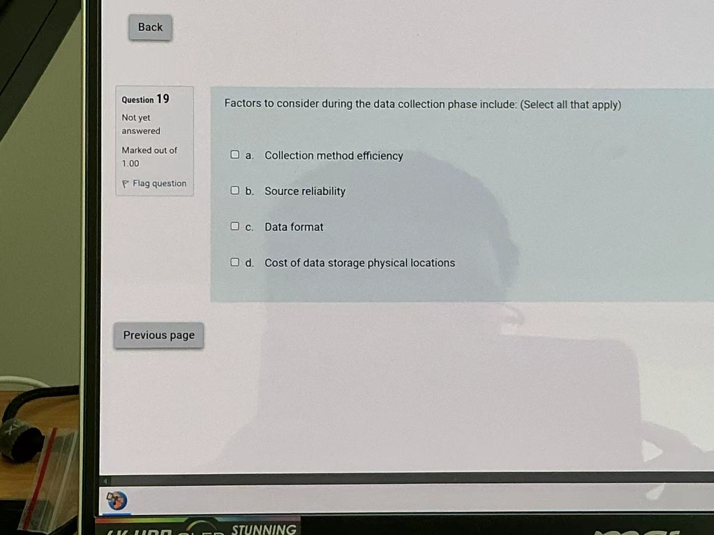

**Factors to consider during the data collection phase include: (Select all that apply)**

a. Collection method efficiency
b. Source reliability
c. Data format
d. Cost of data storage physical locations

---

## Question 69

**What does the + quantifier do?**

a. Matches exactly one occurrence
b. Matches zero or more occurrences
c. Matches zero or one occurrence
d. Matches one or more occurrences

---

## Question 70

**Data cleaning may involve: (Select all that apply)**

a. Correcting errors
b. Removing duplicates
c. Handling missing values
d. Introducing new errors

---

## Question 71

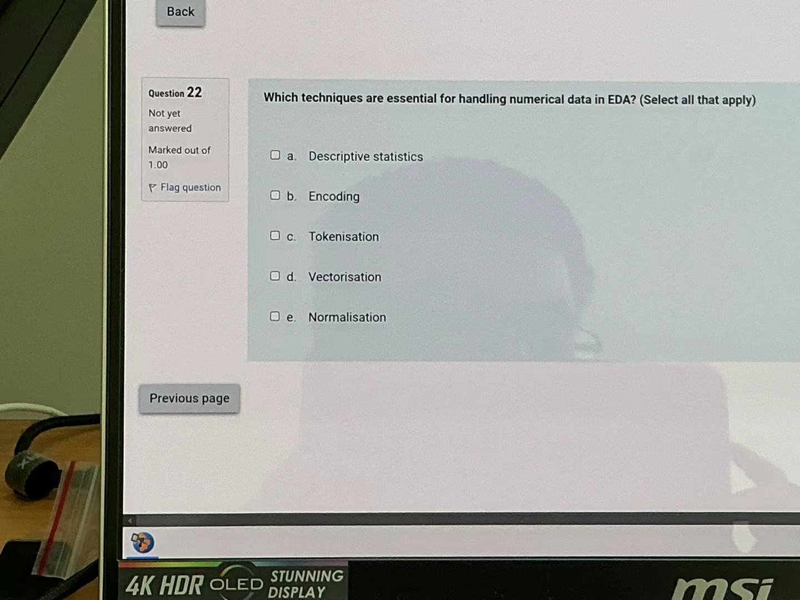

**Which techniques are essential for handling numerical data in EDA? (Select all that apply)**

a. Descriptive statistics
b. Encoding
c. Tokenisation
d. Vectorisation
e. Normalisation

---

## Question 72

**Which are considered primary sources of data? (Select all that apply)**

a. Observations
b. Experiments
c. Industry reports
d. Surveys
e. Government publications

---

## Question 73

**What does the {3,6} quantifier mean?**

a. Matches at least 3 occurrences of the preceding element
b. Matches up to 6 occurrences of the preceding element
c. Matches between 3 and 6 occurrences of the preceding element
d. Matches exactly 3 or exactly 6 occurrences of the preceding element

---

## Question 74

**In regular expressions, what does \A match?**

a. The beginning of a string
b. A word boundary
c. The end of a string
d. A non-word boundary

---

## Question 75

**Which parameter in read_csv() is used to specify which rows should be used as header?**

a. top_row
b. head_row
c. header
d. usecols

---

## Question 76

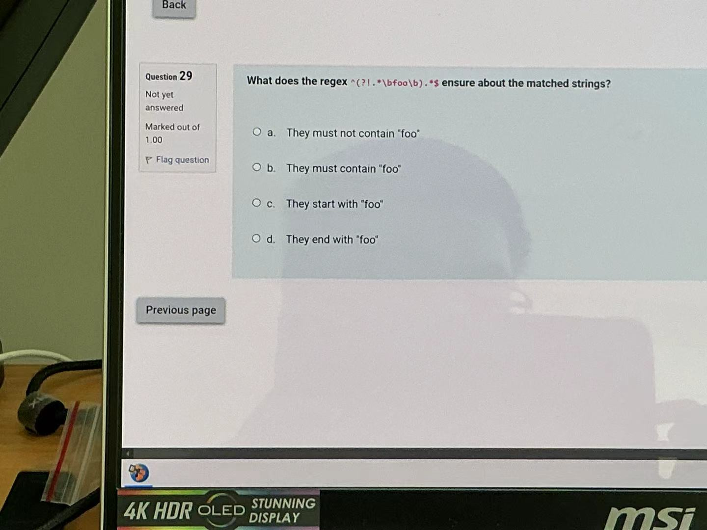

**What does the regex `^(?!.*\bfoo\b).*$` ensure about the matched strings?**

a. They must not contain "foo"
b. They must contain "foo"
c. They start with "foo"
d. They end with "foo"

---

## Question 77

**What does the `skiprows=3` parameter in `pd.read_csv()` do?**
**For example, `df = pd.read_csv('data.csv', skiprow = 3)`**

a. Skips any three rows randomly
b. Skips first three columns from the left of the file
c. Skips last three rows at the end of the file
d. Skips first three rows from the beginning of the file

---

## Question 78

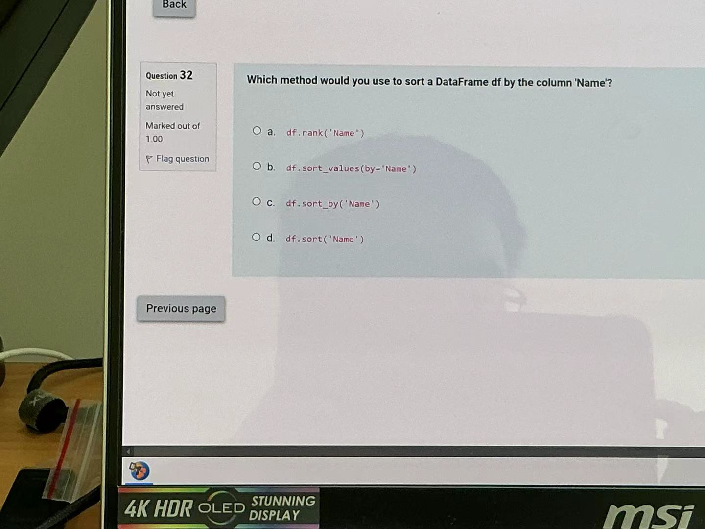

**Which method would you use to sort a DataFrame df by the column 'Name'?**

a. `df.rank('Name')`
b. `df.sort_values(by='Name')`
c. `df.sort_by('Name')`
d. `df.sort('Name')`

---

## Question 79

**Which is NOT a feature of Big Data?**

a. Manageable by traditional software
b. Voluminous
c. Includes various data structures
d. Involves high velocity

---

## Question 80

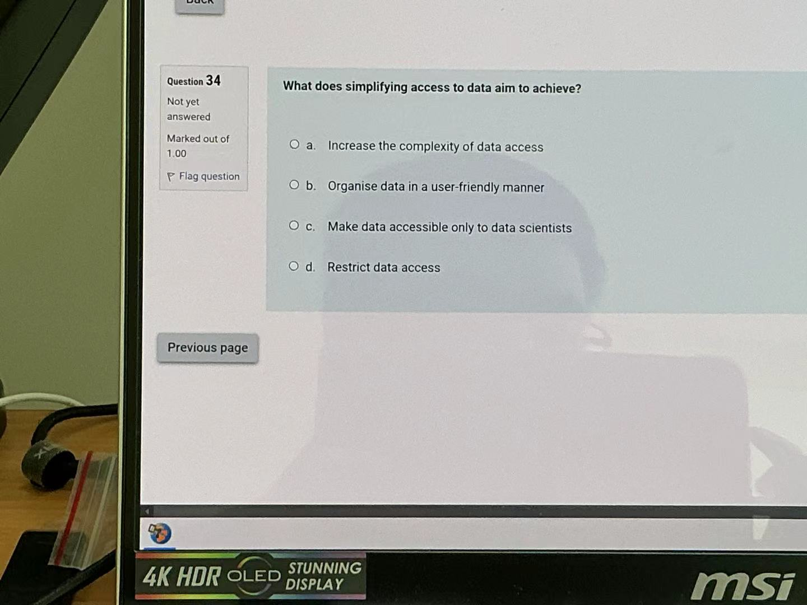

**What does simplifying access to data aim to achieve?**

a. Increase the complexity of data access
b. Organise data in a user-friendly manner
c. Make data accessible only to data scientists
d. Restrict data access

---

## Question 81

**What is the middle value after all values are ordered in a data set called?**

a. Mean
b. Mode
c. Variance
d. Median

---

## Question 82

**What is the primary purpose of Data Wrangling?**

a. To analyze complex data types
b. To ensure data privacy
c. To acquire, clean, structure, and enrich raw data for analysis
d. To visualize data trends

---

## Question 83

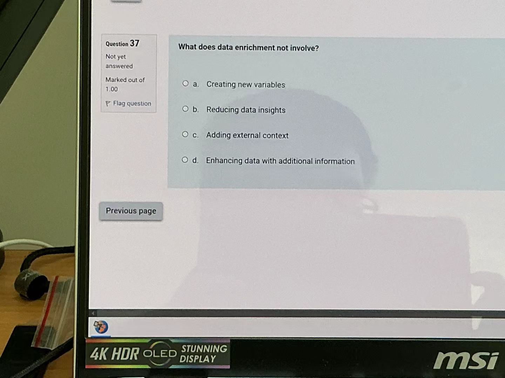

**What does data enrichment not involve?**

a. Creating new variables
b. Reducing data insights
c. Adding external context
d. Enhancing data with additional information

---

## Question 84

**Which is NOT a method of collecting structured data?**

a. Surveys and questionnaires
b. Online forms
c. Relational databases
d. Text mining and NLP

---

## Question 85

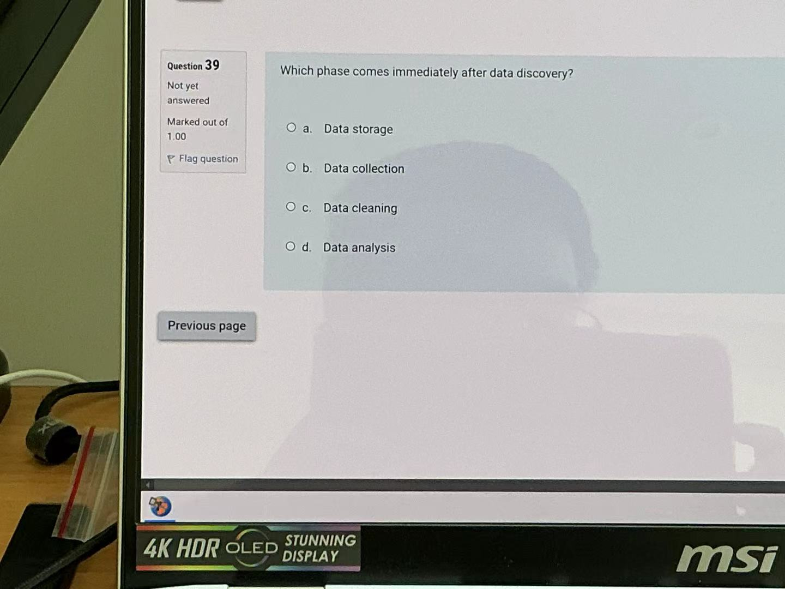

**Which phase comes immediately after data discovery?**

a. Data storage
b. Data collection
c. Data cleaning
d. Data analysis

---

## Question 86

**The process of identifying and correcting inconsistencies in data is called:**

a. Data collection
b. Data integration
c. Data cleaning
d. Data enrichment

---

## Question 87

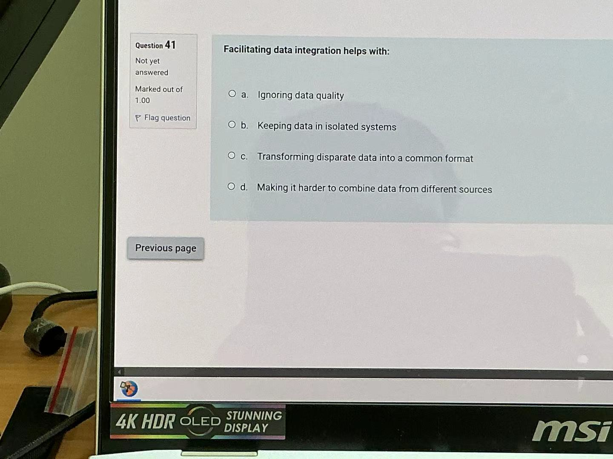

**Facilitating data integration helps with:**

a. Ignoring data quality
b. Keeping data in isolated systems
c. Transforming disparate data into a common format
d. Making it harder to combine data from different sources

---

## Question 88

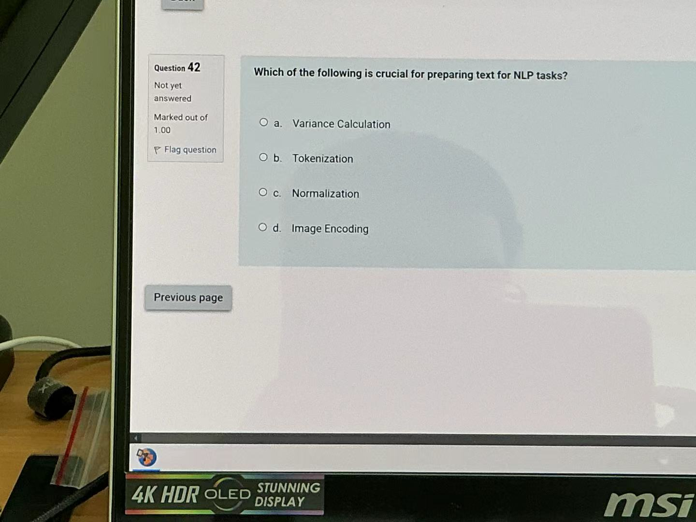

**Which of the following is crucial for preparing text for NLP tasks?**

a. Variance Calculation
b. Tokenization
c. Normalization
d. Image Encoding

---

## Question 89

**Data Security measures are essential for:**

a. Ensuring data is openly accessible
b. Secure storage and transmission of data
c. Reducing data quality
d. Encouraging unauthorized data access

---

## Question 90

**Which measure of central tendency is the arithmetic average of a set of values?**

a. Median
b. Mode
c. Mean
d. Range

---

## Question 91

**Data Cataloging aids in:**

a. Creating a searchable catalog of data assets
b. Ignoring data lineage
c. Making it harder to find and understand data
d. Decreasing data accessibility

---

## Question 92

**Which of the following is NOT a goal of data validation?**

a. Validate range and constraints
b. Ensure data accurately reflects real-world entities
c. Enhance the speed of data retrieval
d. Verify data is in the expected format

---

## Question 93

**A major challenge in data wrangling is:**

a. Avoiding data standardization
b. Maintaining low data quality
c. Data privacy and security
d. Handling small volumes of data

---

## Question 94

**Machine Learning enhances data quality management through:**

a. Only data cleansing
b. Only automated error detection
c. A combination of t## Question 95

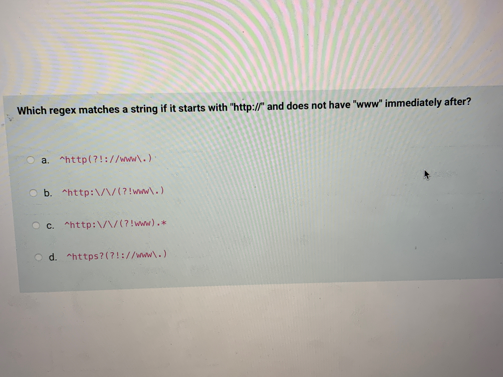

**Which regex matches a string if it starts with "http://" and does not have "www" immediately after?**

a. ^http(?!://www\.)
b. ^http:\/\/(?!www\.)
c. ^http:\/\/(?!www).*
d. ^https?(?!://www\.)

---

## Question 96

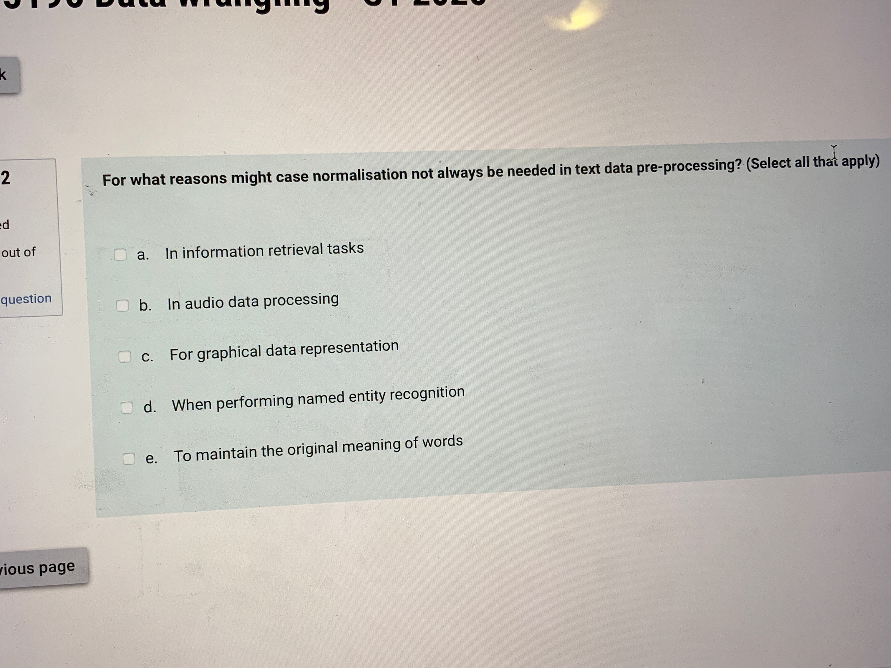

**For what reasons might case normalisation not always be needed in text data pre-processing? (Select all that apply)**

a. In information retrieval tasks
b. In audio data processing
c. For graphical data representation
d. When performing named entity recognition
e. To maintain the original meaning of words

---

## Question 97

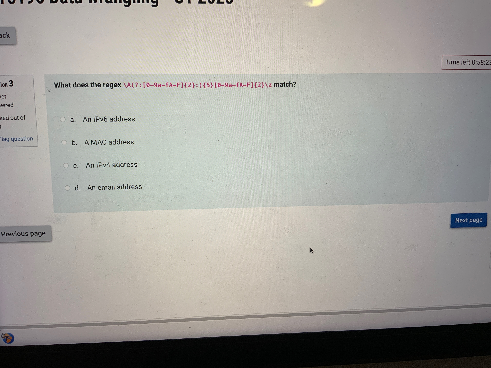

**What does the regex \A(?:[0-9a-fA-F]{2}:){5}[0-9a-fA-F]{2}\z match?**

a. An IPv6 address
b. A MAC address
c. An IPv4 address
d. An email address

---

## Question 98

**What roles does data play in decision-making? (Select all that apply)**

a. Crisis prediction and response
b. Compliance monitoring
c. Understanding customer behaviour
d. Enhancing product quality
e. Operational efficiency

---

## Question 99

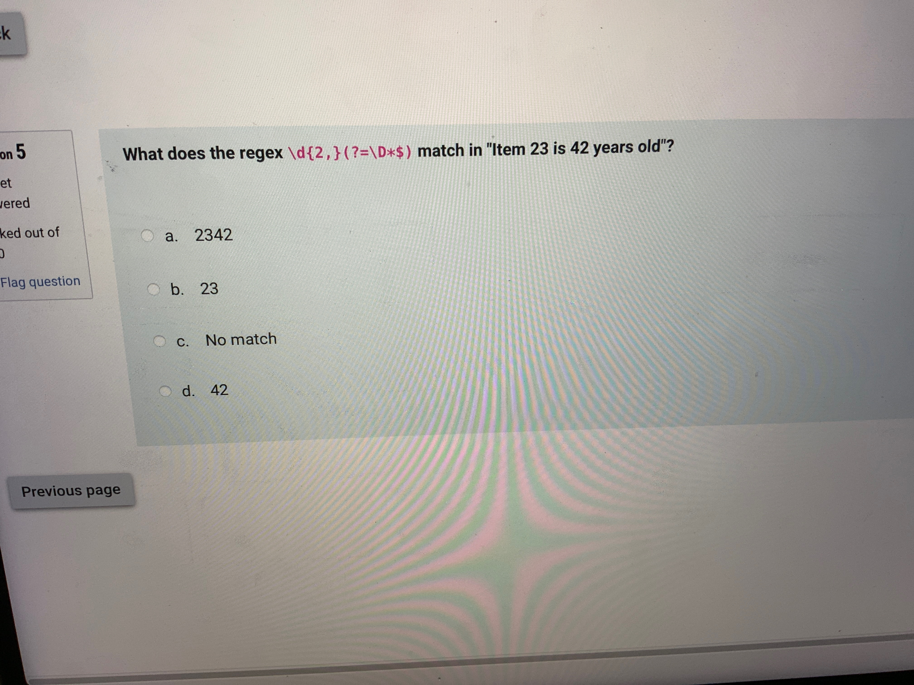

**What does the regex \d{2,}(?=\D*$) match in "Item 23 is 42 years old"?**

a. 2342
b. 23
c. No match
d. 42

---

## Question 100

**What is a regular expression?**

a. A way to calculate expressions in math
b. A method for searching text in a document
c. A sequence of characters that define a search pattern
d. A programming language

---

## Question 101

**Data Integration and Consolidation require: (Select all that apply)**

a. Combining data sources
b. Harmonise data formats
c. Data anonymisation
d. Data cleaning
e. Ensuring consistency

---

## Question 102

**What does the regex \b\d{1,3}(,\d{3})*\b match?**

a. A number formatted with commas (e.g., "1,000")
b. A comma-separated list of numbers
c. An IP address
d. Any digit sequence without commas

---

## Question 103

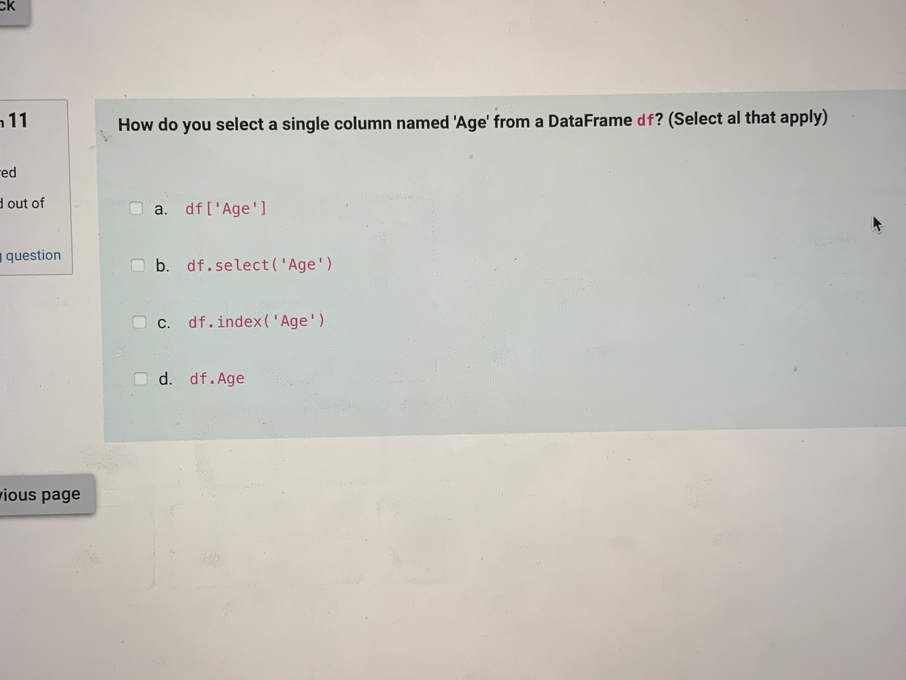

**How do you select a single column named 'Age' from a DataFrame df? (Select al that apply)**

a. `df['Age']`
b. `df.select('Age')`
c. `df.index('Age')`
d. `df.Age`

---

## Question 104

**Which of the following are common goals of data wrangling? (Select all that apply)**

a. Increasing data complexity
b. Ignoring data inconsistencies
c. Facilitating easier access to data
d. Improving data quality

---

## Question 105

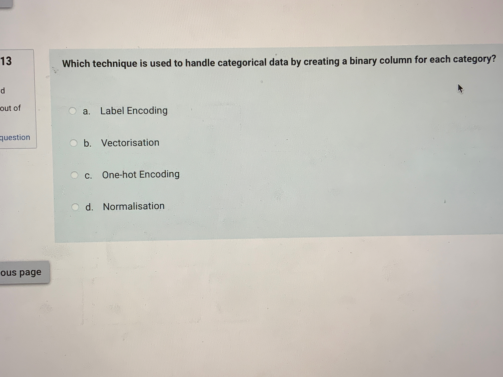

**Which technique is used to handle categorical data by creating a binary column for each category?**

a. Label Encoding
b. Vectorisation
c. One-hot Encoding
d. Normalisation

---

## Question 106

**Given the string "hello123", what does the regex (?<=\D)(?=\d) locate?**

a. The digit "1"
b. The letter "o"
c. The position between "o" and "1"
d. The sequence "123"

---

## Question 107

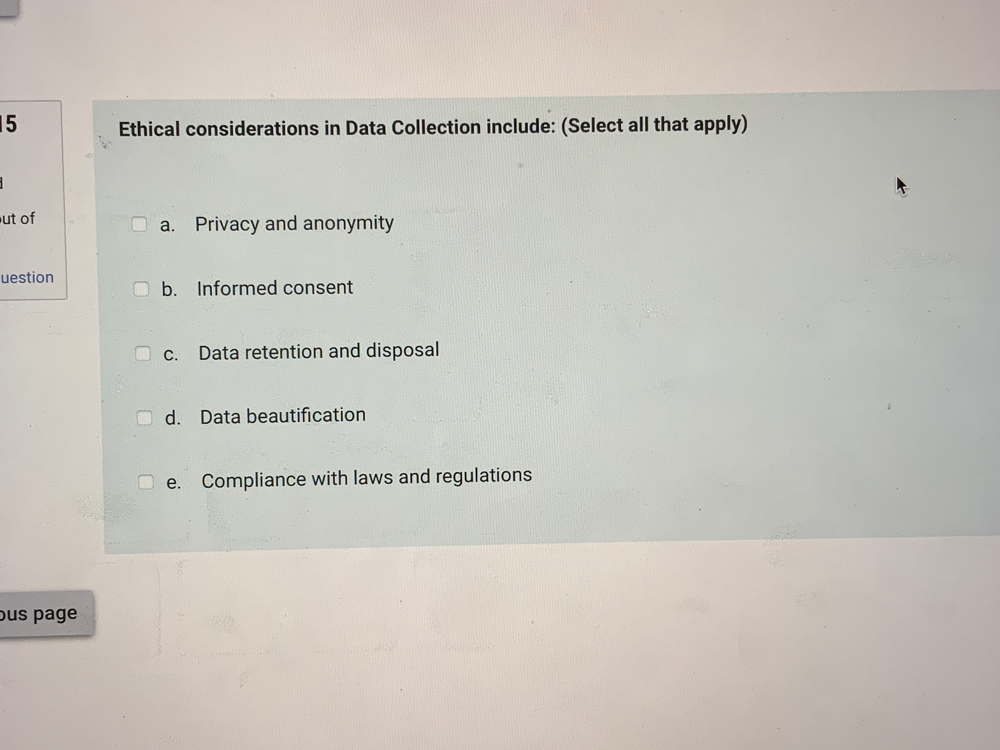

**Ethical considerations in Data Collection include: (Select all that apply)**

a. Privacy and anonymity
b. Informed consent
c. Data retention and disposal
d. Data beautification
e. Compliance with laws and regulations

---

## Question 108

**In data wrangling, data validation ensures: (Select all that apply)**

a. Data meets predefined standards
b. Accuracy and reliability of data
c. Data inconsistency is promoted
d. Data is in a usable format for analysis

---

## Question 109

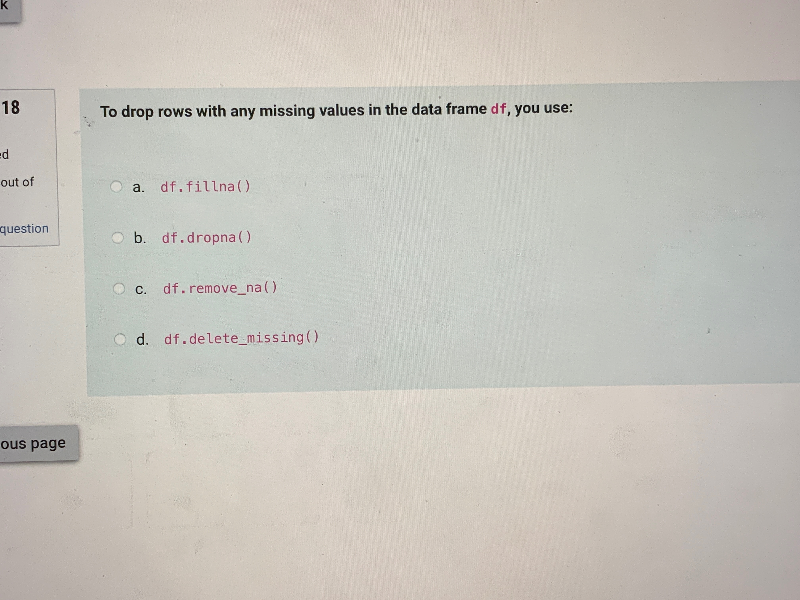

**To drop rows with any missing values in the data frame `df`, you use:**

a. `df.fillna()`
b. `df.dropna()`
c. `df.remove_na()`
d. `df.delete_missing()`

---

## Question 110

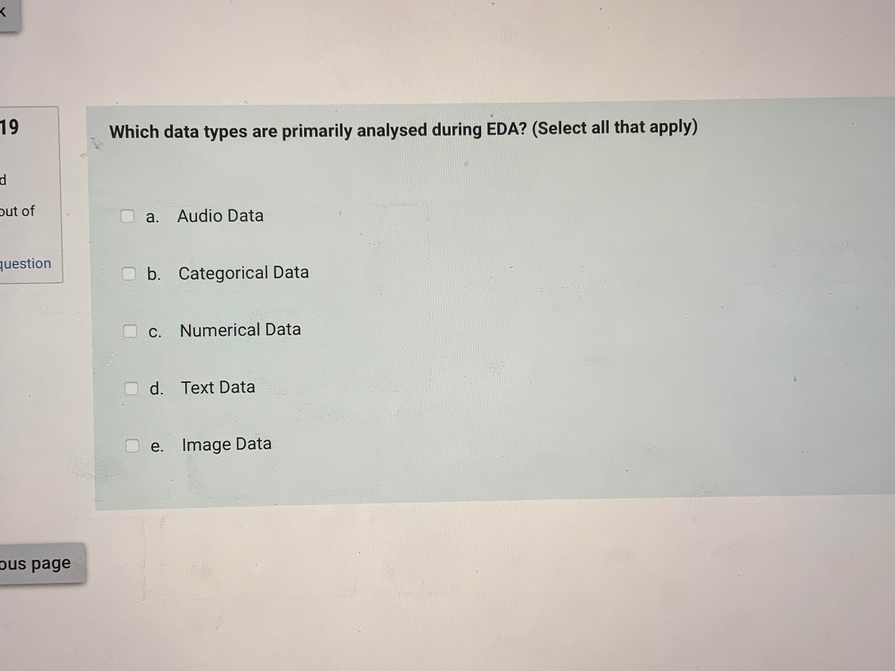

**Which data types are primarily analysed during EDA? (Select all that apply)**

a. Audio Data
b. Categorical Data
c. Numerical Data
d. Text Data
e. Image Data

---

## Question 111

**Which steps are involved in Lemmatisation for text data pre-processing? (Select all that apply)**

a. Reduction of words to their stems
b. Application of morphological analysis
c. Conversion of words to their base or dictionary form
d. Use of part-of-speech tags
e. Use of context surrounding the words

---

## Question 112

**What does the regex (?<!cat)dog ensure?**

a. "dog" is preceded by "cat"
b. "dog" is not preceded by "cat"
c. "dog" follows "cat"
d. Both "cat" and "dog" are present

---

## Question 113

**What would the regex ^(\w+)(\s+\1)+$ match?**

a. A word repeated at least once, separated by whitespace
b. Any number of repeated words without spaces
c. A single word with trailing whitespace
d. A line containing only whitespace

---

## Question 114

**Data cleaning may involve: (Select all that apply)**

a. Removing duplicates
b. Correcting errors
c. Handling missing values
d. Introducing new errors

---

## Question 115

**Which character escapes special characters in regular expressions?**

a. ^
b. |
c. \
d. $

---

## Question 116

**To emphasise text with bold in Markdown, you can use:**

a. Double asterisks or double underscores
b. Triple asterisks or triple underscores
c. Single asterisks or single underscores
d. Double tildes or double dollar signs

---

## Question 117

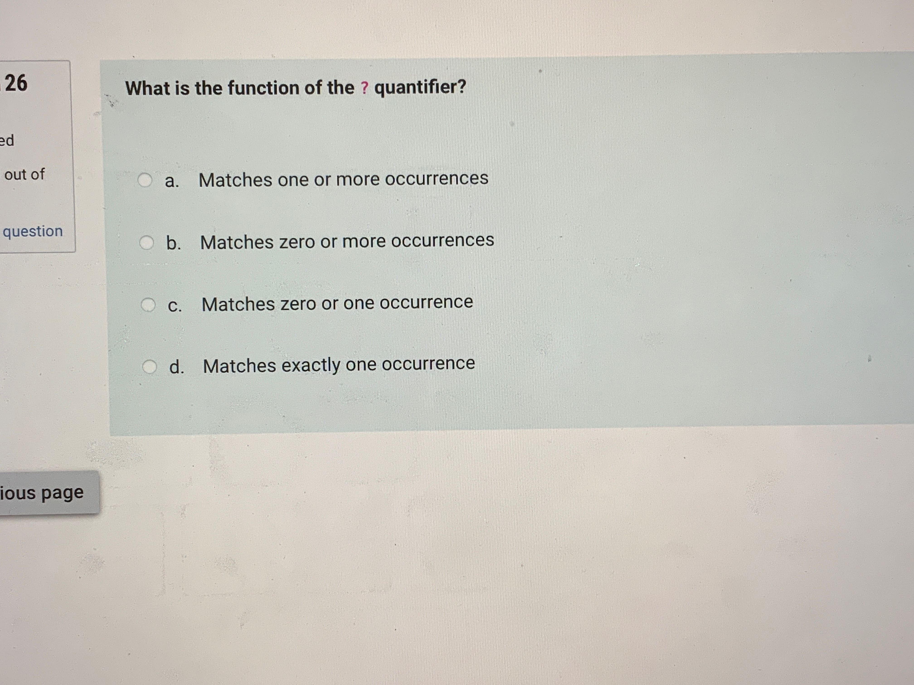

**What is the function of the ? quantifier?**

a. Matches one or more occurrences
b. Matches zero or more occurrences
c. Matches zero or one occurrence
d. Matches exactly one occurrence

---

## Question 118

**Which function is used to concatenate two DataFrames vertically?**

a. `pd.concat()`
b. `pd.join()`
c. `pd.merge()`
d. `pd.append()`

---

## Question 119

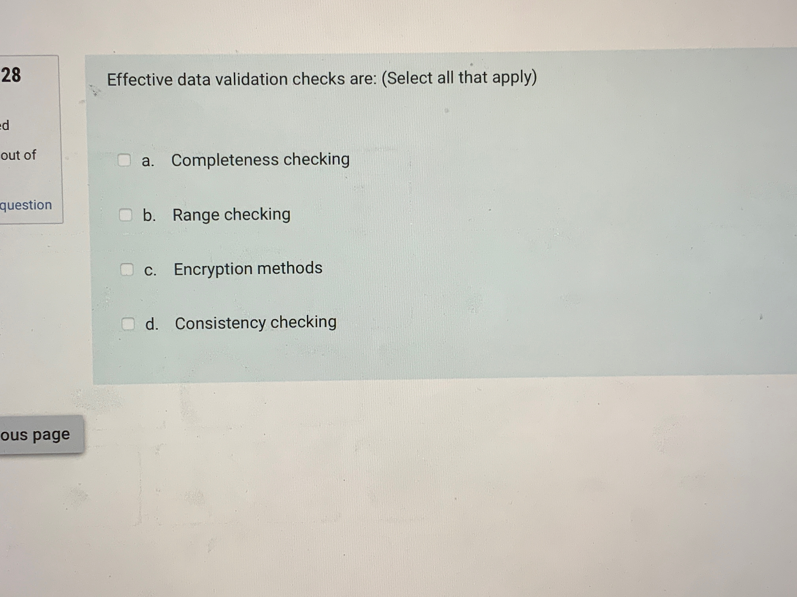

**Effective data validation checks are: (Select all that apply)**

a. Completeness checking
b. Range checking
c. Encryption methods
d. Consistency checking

---

## Question 120

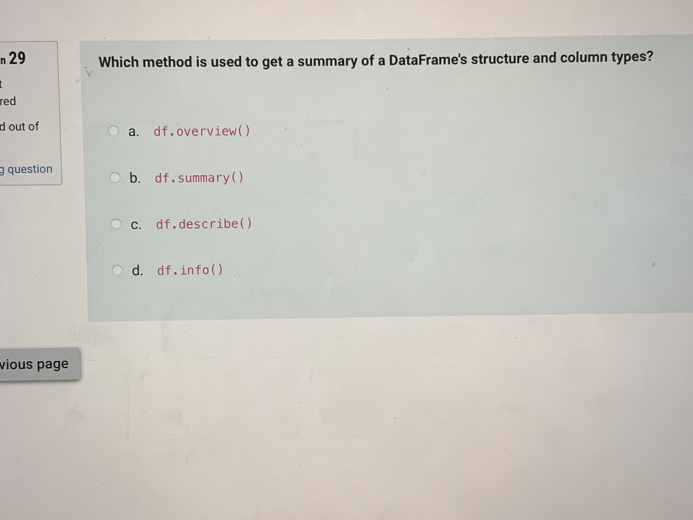

**Which method is used to get a summary of a DataFrame's structure and column types?**

a. df.overview()
b. df.summary()
c. df.describe()
d. df.info()

---

## Question 121

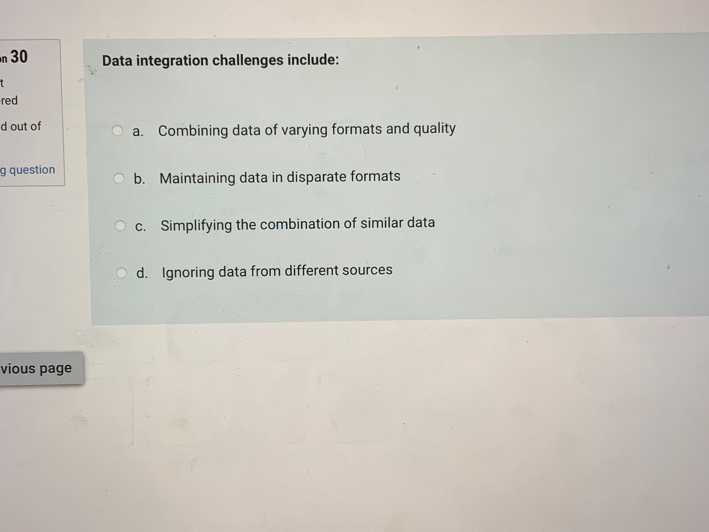

**Data integration challenges include:**

a. Combining data of varying formats and quality
b. Maintaining data in disparate formats
c. Simplifying the combination of similar data
d. Ignoring data from different sources

---

## Question 122

**Which parameter in pd.read_csv() specifies the delimiter?**

a. sep
b. delim
c. delimiter
d. split

---

## Question 123

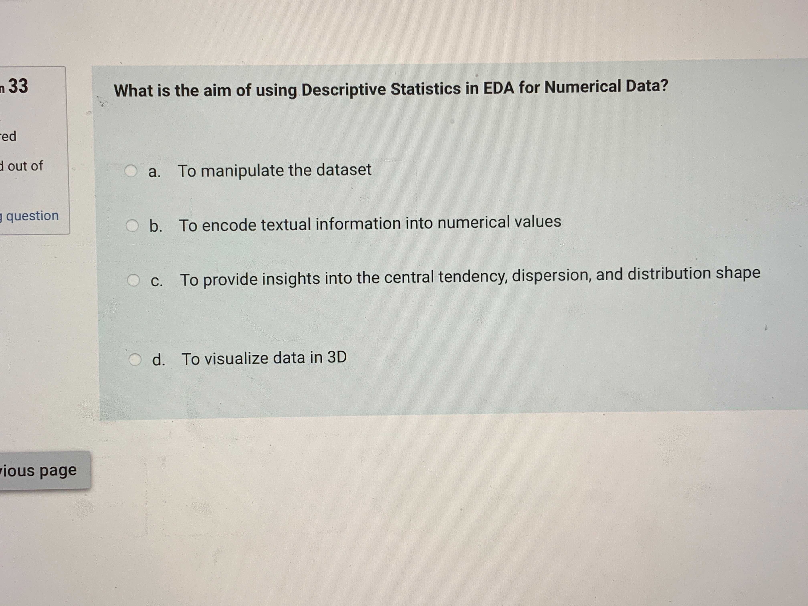

**What is the aim of using Descriptive Statistics in EDA for Numerical Data?**

a. To manipulate the dataset
b. To encode textual information into numerical values
c. To provide insights into the central tendency, dispersion, and distribution shape
d. To visualize data in 3D

---

## Question 124

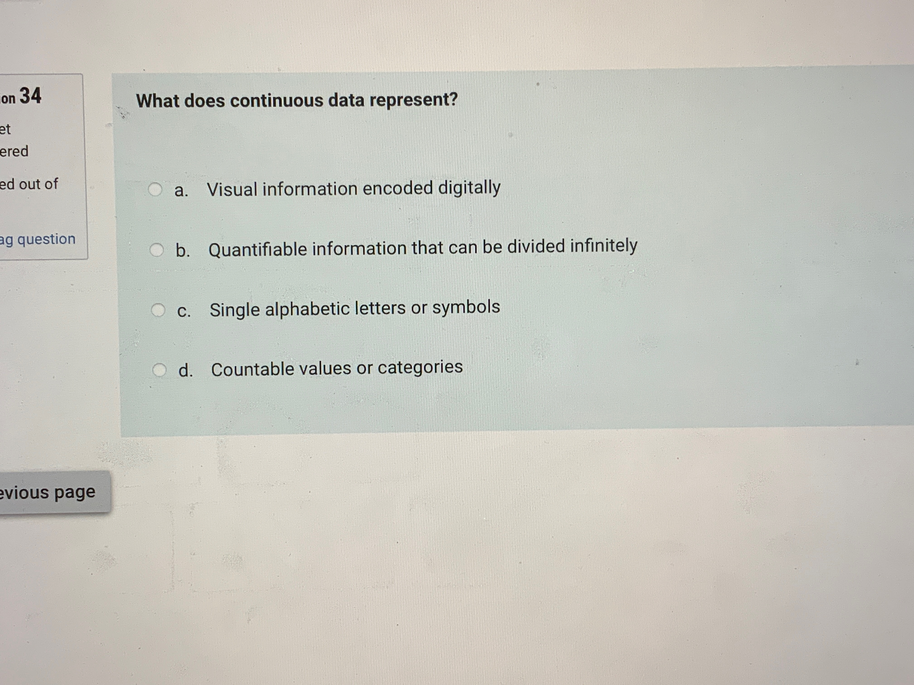

**What does continuous data represent?**

a. Visual information encoded digitally
b. Quantifiable information that can be divided infinitely
c. Single alphabetic letters or symbols
d. Countable values or categories

---

## Question 125

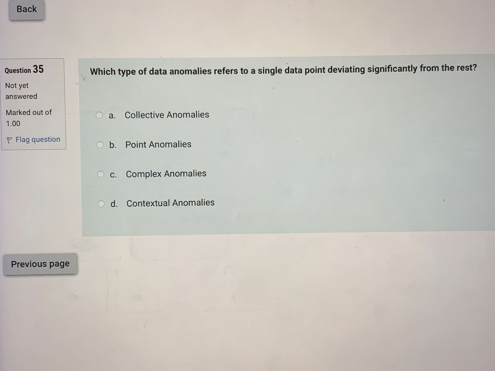

**Which type of data anomalies refers to a single data point deviating significantly from the rest?**

a. Collective Anomalies
b. Point Anomalies
c. Complex Anomalies
d. Contextual Anomalies

---

## Question 126

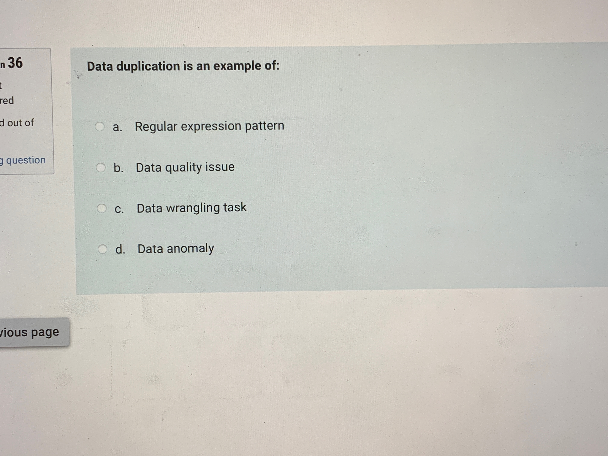

**Data duplication is an example of:**

a. Regular expression pattern
b. Data quality issue
c. Data wrangling task
d. Data anomaly

---

## Question 127

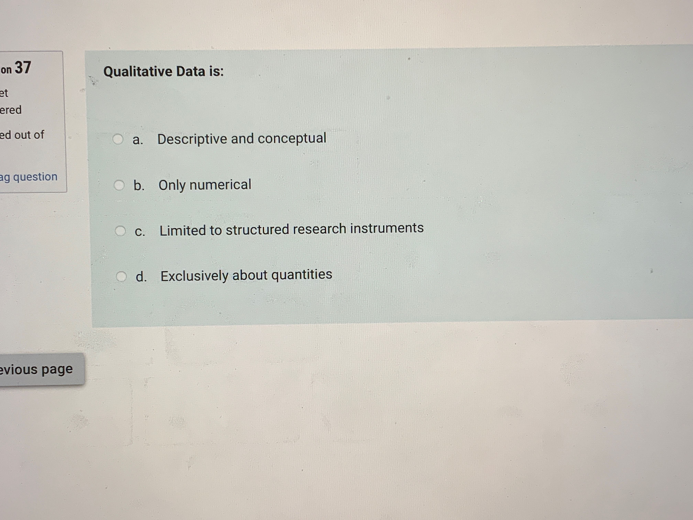

**Qualitative Data is:**

a. Descriptive and conceptual
b. Only numerical
c. Limited to structured research instruments
d. Exclusively about quantities

---

## Question 128

**The main advantage of using existing data is:**

a. Always perfectly matching specific needs
b. Time efficiency and cost reduction
c. Increased costs
d. Reduced access to diverse data

---

## Question 129

**Which is not a challenge in data wrangling?**

a. Handling large volumes of data
b. Ensuring data privacy and security
c. Maintaining outdated data formats
d. Decreasing analytical efficiency

---

## Question 130

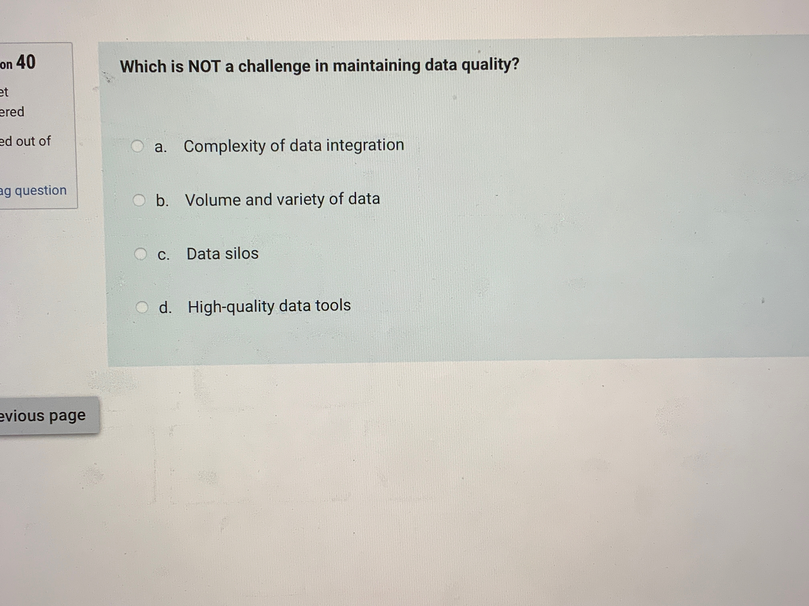

**Which is NOT a challenge in maintaining data quality?**

a. Complexity of data integration
b. Volume and variety of data
c. Data silos
d. High-quality data tools

---

## Question 131

**Exploratory Data Analysis (EDA) is used for:**

a. Reducing the volume of data
b. Uncovering patterns, trends, and anomalies
c. Reducing the volume of data
d. Finalizing data collection methods

---

## Question 132

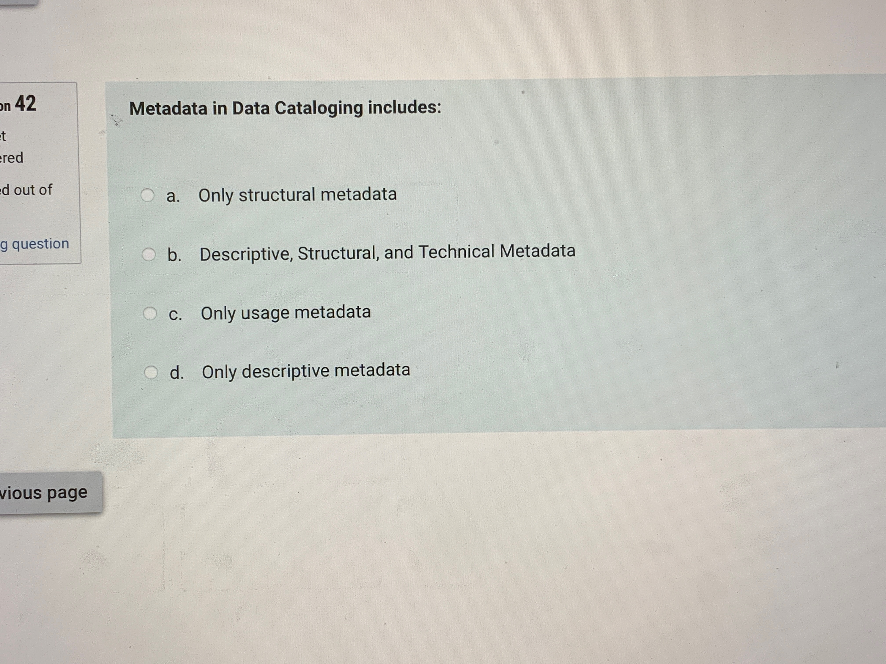

**Metadata in Data Cataloging includes:**

a. Only structural metadata
b. Descriptive, Structural, and Technical Metadata
c. Only usage metadata
d. Only descriptive metadata

---

## Question 133

**What role does data play in modern business decision-making?**

a. It is not significant in decision-making
b. It is exclusively used for financial analysis
c. It is only used for data storage
d. It aids in understanding customer behavior and evidence-based strategic planning

---

## Question 134

**Metadata Collection is critical for understanding:**

a. Only the data's numerical value
b. Restricting data access
c. How to delete the data
d. The data's origin, format, and characteristics

---

## Question 135

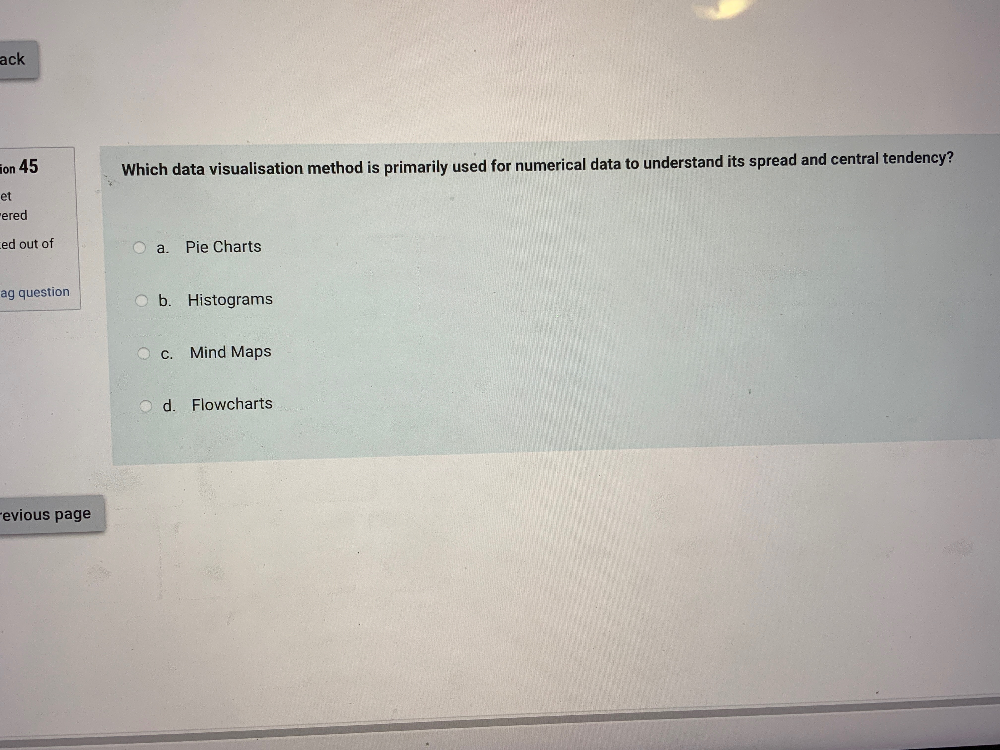

**Which data visualisation method is primarily used for numerical data to understand its spread and central tendency?**

a. Pie Charts
b. Histograms
c. Mind Maps
d. Flowcharts

---

## Question 136

**Ensuring data privacy and security is crucial due to:**

a. Regulations
b. Lack of regulations
c. Unimportance of data sensitivity
d. The ease of data handling

---

## Question 137

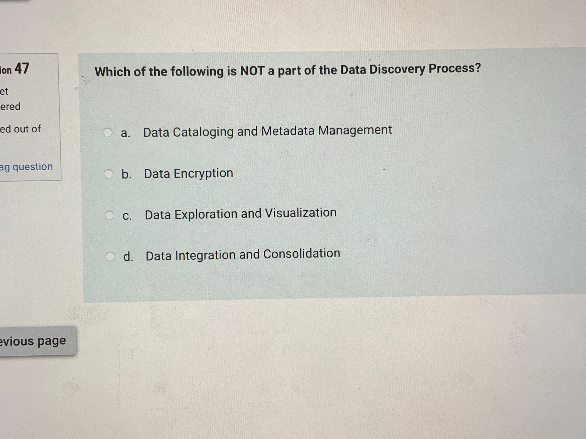

**Which of the following is NOT a part of the Data Discovery Process?**

a. Data Cataloging and Metadata Management
b. Data Encryption
c. Data Exploration and Visualization
d. Data Integration and Consolidation

---

## Question 138

**The purpose of data aggregation is to:**

a. Increase data detail
b. Disperse data across sources
c. Summarise data for analysis
d. Complicate data analysis

---

## Question 139

**Text Mining and Natural Language Processing (NLP) are methods for collecting:**

a. Structured data
b. Numerical data only
c. Semi-structured data
d. Unstructured data

---

## Question 140

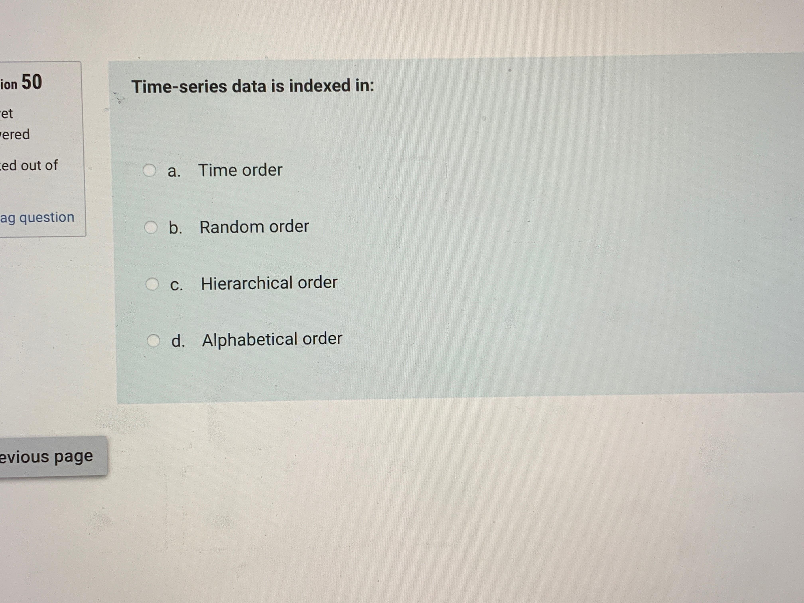

**Time-series data is indexed in:**

a. Time order
b. Random order
c. Hierarchical order
d. Alphabetical order

---

## Question 141

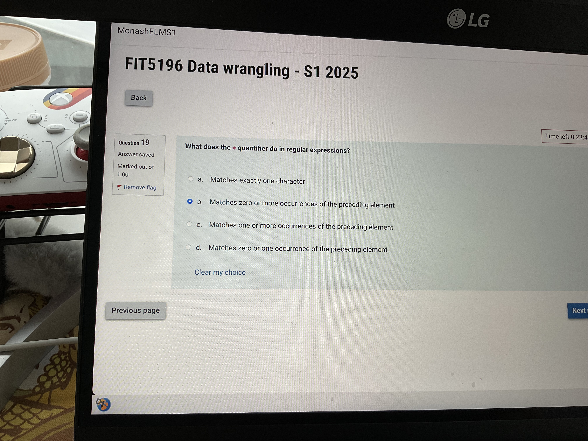

**What does the * quantifier do in regular expressions?**

a. Matches exactly one character
b. Matches zero or more occurrences of the preceding element
c. Matches one or more occurrences of the preceding element
d. Matches zero or one occurrence of the preceding element

---

## Question 142

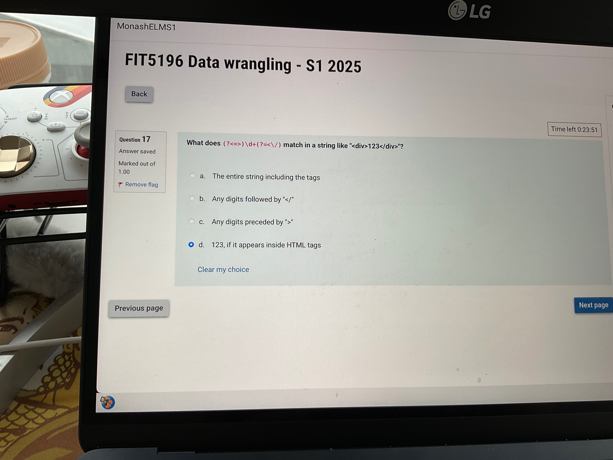

**What does (?<=>)\d+(?=<\/?) match in a string like "
123
"?**

a. The entire string including the tags
b. Any digits followed by "</"
c. Any digits preceded by ">"
d. 123, if it appears inside HTML tags

---

## Question 143

**What is a 'Point Anomaly'?**

a. A data point that adheres perfectly to the data set pattern
b. A data point that significantly deviates from the rest of the data set
c. A standard deviation in statistical analysis
d. A group of data points that are not unusual

---

## Question 144

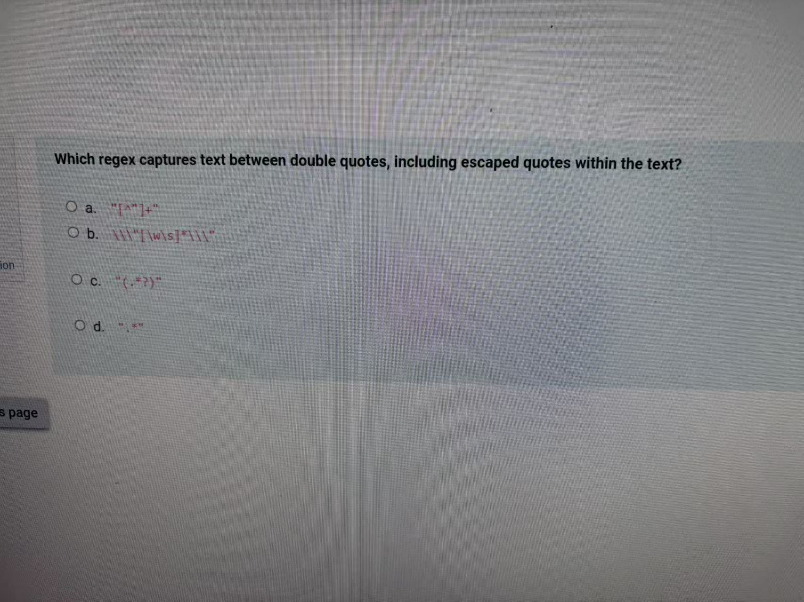

**Which regex captures text between double quotes, including escaped quotes within the text?**

a. `"[^"]+"`
b. `\\\"[\w\s]*\\\"`
c. `"(.*?)"`
d. `".*"`

---

## Question 145

**Which of the following are benefits of correctly identifying data types during EDA? (Select that all apply)**

a. Guides data cleaning and preprocessing
b. Enables effective visualisation
c. Determines the color scheme of visualisations
d. Assists in feature engineering
e. Allows for appropriate analysis

---

## Question 146

**What would the regex `\b(?!\d+\b)\w+\b` exclude in its matches?**

a. Words ending with a digit
b. Words starting with a digit
c. Words containing any digits
d. Words entirely composed of digits

---

## Question 147

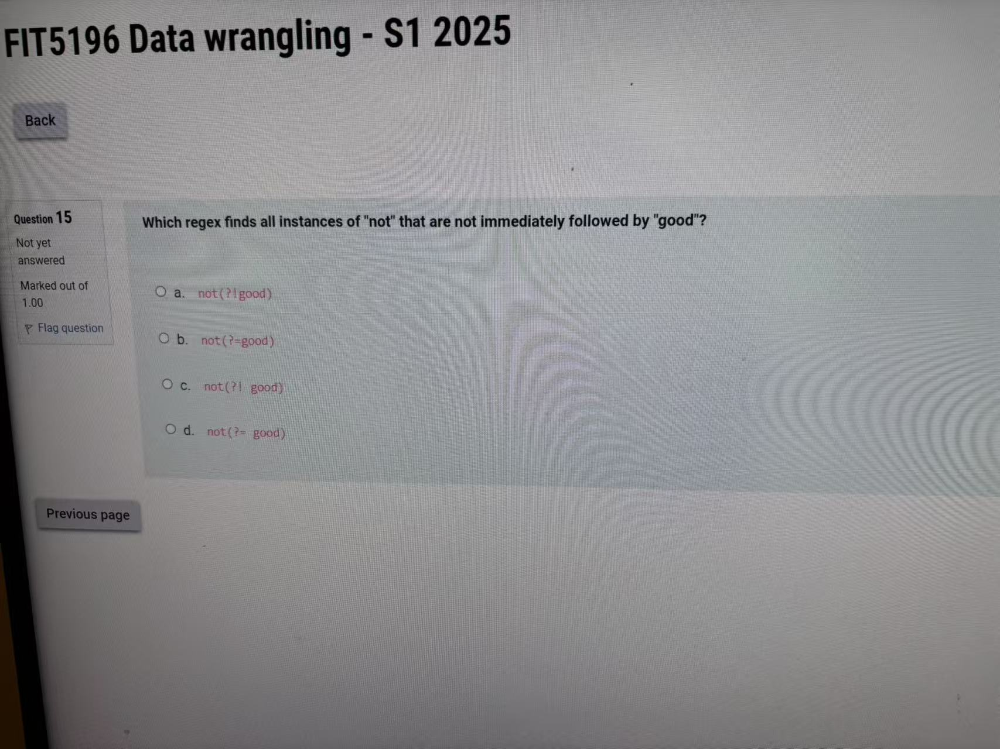

**Which regex finds all instances of "not" that are not immediately followed by "good"?**

a. `not(?!good)`
b. `not(?=good)`
c. `not(?! good)`
d. `not(?= good)`

---

## Question 148

**Which of the following is NOT a character set used in regular expressions?**

a. \d
b. [a-zA-Z]
c. [0-9]
d. {a-z}

---

## Question 149

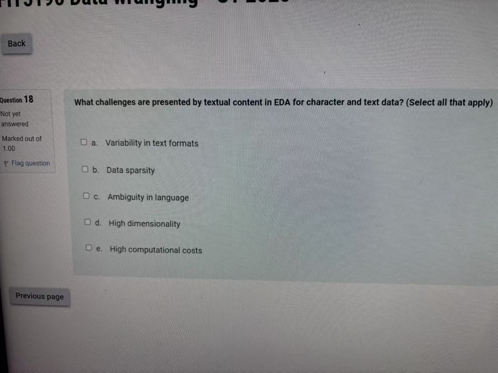

**What challenges are presented by textual content in EDA for character and text data? (Select all that apply)**

a. Variability in text formats
b. Data sparsity
c. Ambiguity in language
d. High dimensionality
e. High computational costs

---

## Question 150

**Which quantifier would match exactly 3 occurrences of the letter 'a'?**

a. a3
b. a{3}
c. a[3]
d. a(3)

---

## Question 151

**What are the steps involved in Count Vectorisation? (Select all that apply)**

a. Vocabulary Building
b. Normalisation
c. Count Calculation
d. Encoding
e. Tokenisation

---

## Question 152

**Which method would you use to sort a DataFrame df by the column 'Name'?**

a. `df.sort_values(by='Name')`
b. `df.sort('Name')`
c. `df.rank('Name')`
d. `df.sort_by('Name')`

---

## Question 153

**Which of the following are goals of Exploratory Data Analysis (EDA)? (Select all that apply)**

a. To understand the patterns, anomalies, and relationships in the data
b. To explore and summarise the main characteristics of the data visually
c. To use statistical graphics, plots, and information tables
d. To perform complex predictive modeling
e. To manipulate the data set

---

## Question 154

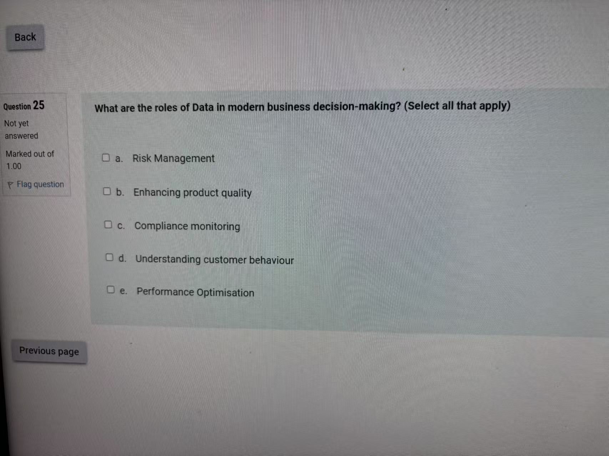

**What are the roles of Data in modern business decision-making? (Select all that apply)**

a. Risk Management
b. Enhancing product quality
c. Compliance monitoring
d. Understanding customer behaviour
e. Performance Optimisation

---

## Question 155

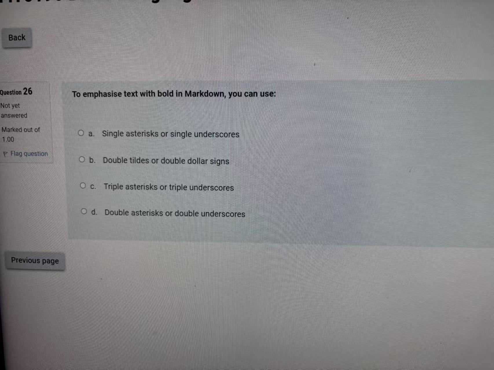

**To emphasise text with bold in Markdown, you can use:**

a. Single asterisks or single underscores
b. Double tildes or double dollar signs
c. Triple asterisks or triple underscores
d. Double asterisks or double underscores

---

## Question 156

**How would you match any line that does not contain the exact phrase "regex"?**

a. ^(?=.*\bregex\b).*$
b. ^(?!.*\bregex\b).*
c. .*\bregex\b.*
d. ^.*(regex).*

---

## Question 157

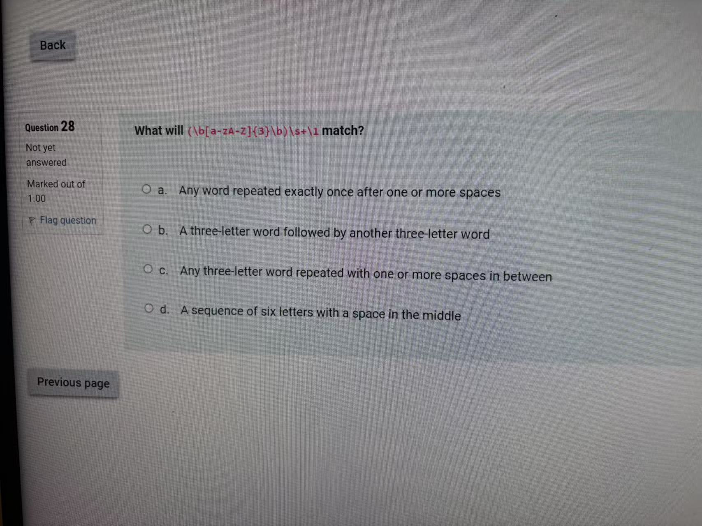

**What will (\b[a-zA-Z]{3}\b)\s+\1 match?**

a. Any word repeated exactly once after one or more spaces
b. A three-letter word followed by another three-letter word
c. Any three-letter word repeated with one or more spaces in between
d. A sequence of six letters with a space in the middle

---

## Question 158

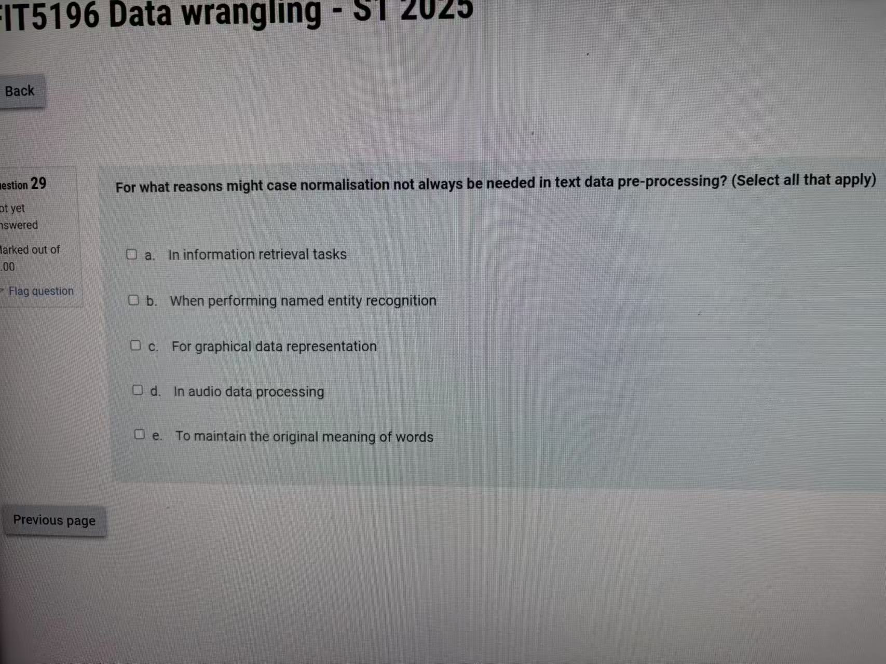

**For what reasons might case normalisation not always be needed in text data pre-processing? (Select all that apply)**

a. In information retrieval tasks
b. When performing named entity recognition
c. For graphical data representation
d. In audio data processing
e. To maintain the original meaning of words

---

## Question 159

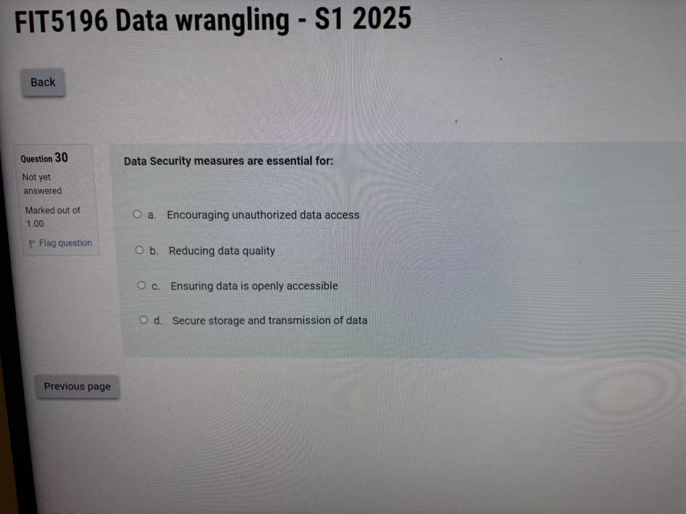

**Data Security measures are essential for:**

a. Encouraging unauthorized data access
b. Reducing data quality
c. Ensuring data is openly accessible
d. Secure storage and transmission of data

---

## Question 160

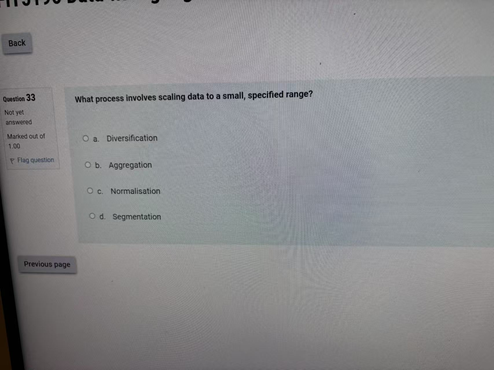

**What process involves scaling data to a small, specified range?**

a. Diversification
b. Aggregation
c. Normalisation
d. Segmentation

---

## Question 161

**Data Privacy measures are intended to:**

a. Expose sensitive information
b. Increase data accessibility to the public
c. Limit the use of data for analysis
d. Protect sensitive information in compliance with regulations

---

## Question 162

**Metadata Collection is critical for understanding:**

a. Only the data's numerical value
b. How to delete the data
c. Restricting data access
d. The data's origin, format, and characteristics

---

## Question 163

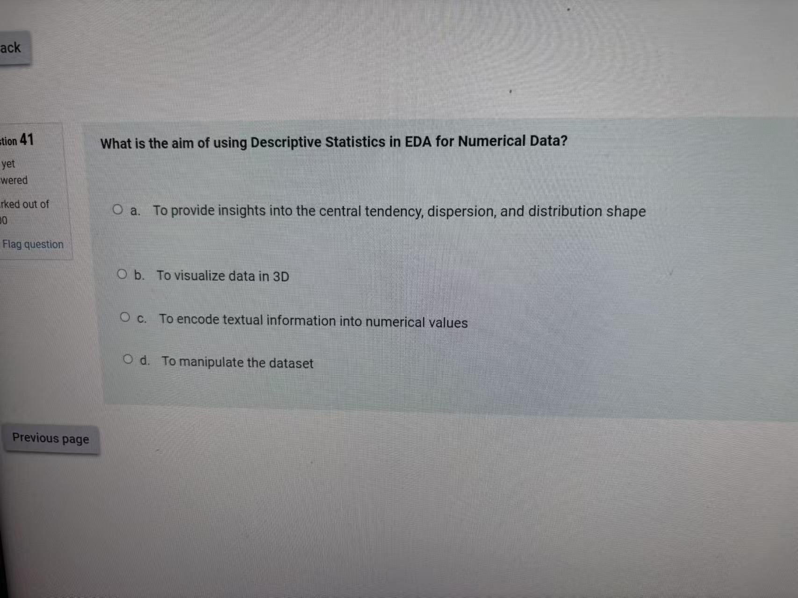

**What is the aim of using Descriptive Statistics in EDA for Numerical Data?**

a. To provide insights into the central tendency, dispersion, and distribution shape
b. To visualize data in 3D
c. To encode textual information into numerical values
d. To manipulate the dataset

---

## Question 164

**What is the significance of identifying data types during EDA?**

a. It changes the textual content into images
b. It influences how data will be processed and analyzed
c. It is only important for numerical data
d. It determines the type of cake to bake

---

