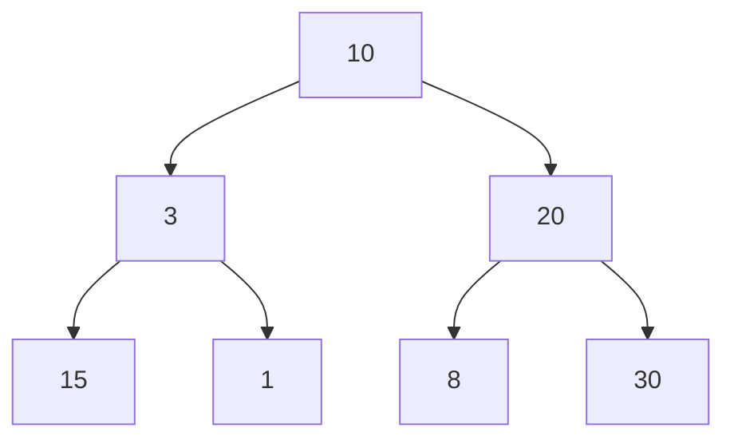
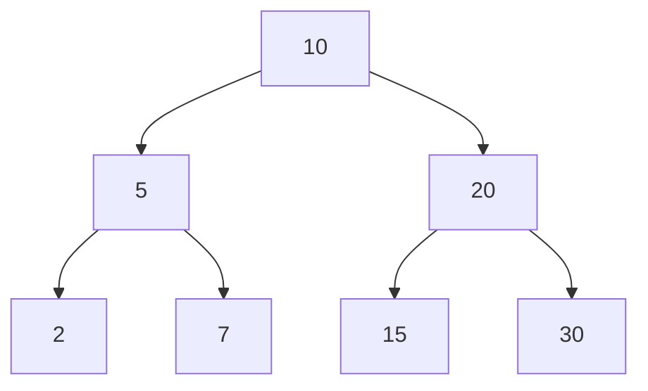
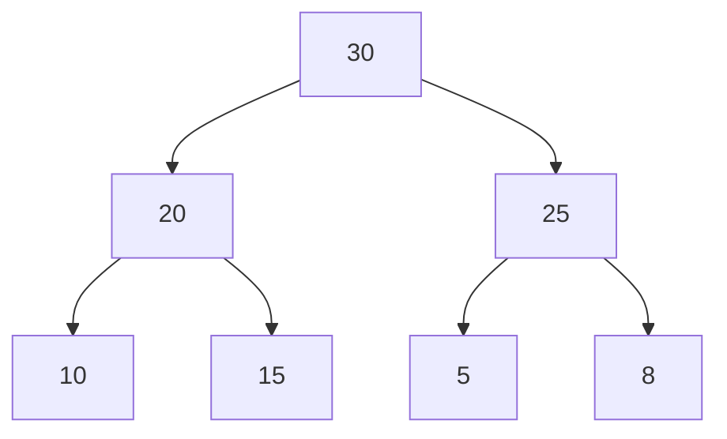
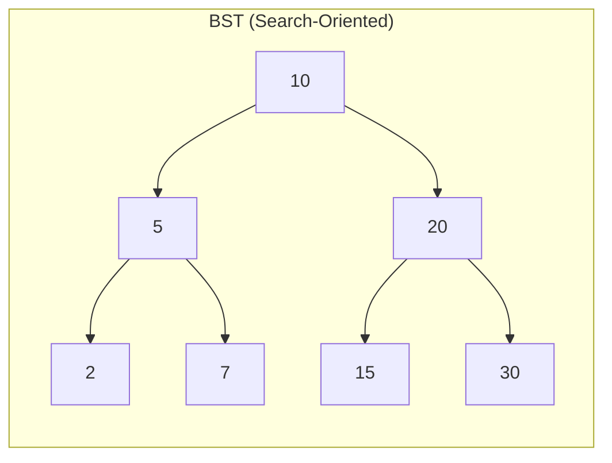
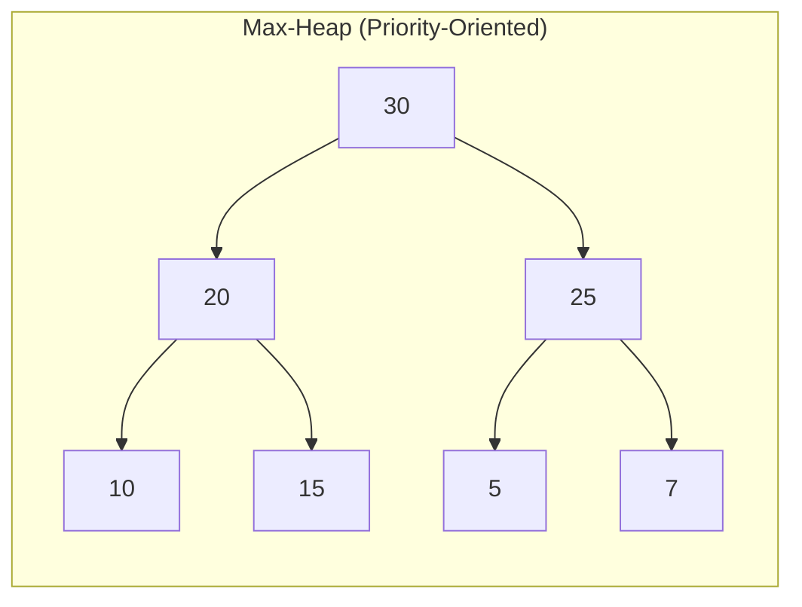

# FIT5196 Data Wrangling

## Week 6: Data Structuring

---

## layout: default

# 本周目标

| Learning Outcome             | 你要会什么                                       |
| ---------------------------- | ------------------------------------------------ |
| Explain data structuring     | 能解释 data structuring 的定义与价值             |
| Distinguish structure types  | 能区分 primitive / non-primitive / complex       |
| Choose structure by scenario | 能按场景判断用 array/list/map/tree/heap          |
| Understand BST core ops      | 会解释 insertion / search / deletion / traversal |
| Explain hashing basics       | 会讲 hash function 与 collision resolution       |
| Explain heap use cases       | 会说 priority queue 与 heapsort 的关系           |

---

## layout: section

# Part 1

# Data Structuring 基础

---

## layout: statement

## Data structuring 决定数据是否“可处理、可扩展、可维护”。

原始数据不经过结构化，后续 cleaning / transformation / analysis 成本会显著升高。

---

## layout: default

# Data Wrangling Tasks (Recap)

- Data discovery
- Data collection
- Data pre-processing
- Data cleaning
- Data structuring
- Data transformation
- Data enrichment
- Data validation

Week 6 聚焦在“structuring”这一步，为后续 quality/cleansing 奠定基础。

---

## layout: two-cols

# 什么是 Data Structuring

- 把数据组织成系统化格式
- 支持 retrieval / update / management
- 目标是更快、更稳、更省资源

::right::

# 为什么重要

- Efficiency：减少计算和操作成本
- Data Integrity：提高一致性与准确性
- Scalability：数据量增长时仍可用

---

## layout: default

# 真题演练

**In data wrangling, data structuring is important because it primarily improves:**

| 选项 | 内容                                    |
| ---- | --------------------------------------- |
| a    | visual color themes                     |
| b    | processing efficiency and accessibility |
| c    | social media engagement                 |
| d    | randomization of records                |

<strong>答案：</strong><code>b</code> 
<strong>讲解：</strong>structuring 的核心就是让数据“更容易处理与访问”。

---

## layout: section

# Part 2

# Primitive vs Non-Primitive

---

## layout: default

# Primitive Data Types

| Type           | Description | Typical Usage           |
| -------------- | ----------- | ----------------------- |
| Integer        | 整数        | counting / indexing     |
| Floating point | 小数和实数  | scientific calculations |
| Character      | 单字符      | text processing         |
| Boolean        | true/false  | control flow            |

---

## layout: default

# Primitive 类型特点

- 类型安全（type-safe）
- 运算通常更快（硬件直接支持）
- 内存占用小、结构固定

Primitive 是更复杂结构的构建块。

---

## layout: default

# Non-Primitive Data Types

| Type             | 结构特征           | 常见场景         |
| ---------------- | ------------------ | ---------------- |
| Array            | 连续内存、同类元素 | 快速索引访问     |
| String           | 字符序列           | 文本处理         |
| List/Linked List | 动态增删方便       | 插入删除频繁     |
| Queue            | FIFO               | 调度、排队任务   |
| Dictionary/Map   | key-value 映射     | 查找、缓存、计数 |

---

## layout: default

# 真题演练

**Which of the following is a non-primitive data structure?**

| 选项 | 内容       |
| ---- | ---------- |
| a    | Boolean    |
| b    | Integer    |
| c    | Dictionary |
| d    | Character  |

<strong>答案：</strong><code>c</code> 
<strong>讲解：</strong>Boolean / Integer / Character 都是 primitive。

---

## layout: section

# Part 3

# Complex Data Structures

---

## layout: default

# Complex Structures Overview

- Graphs
- Trees
- Hash Tables
- Heaps

这些结构面向更复杂的数据组织与操作优化问题。

---

## layout: two-cols

# Graphs

- 节点 + 边
- Directed / Undirected / Weighted
- 用于 network 建模

::right::

# 常见应用

- 社交网络关系
- 交通路径
- 通信网络拓扑

---

## layout: default

# Trees

- 层级结构
- 无环
- 一个根节点，多层子节点

常见类型：

- Binary Tree
- Binary Search Tree (BST)
- B-Tree
- AVL / Red-Black / Trie 等

---

## layout: default

# Binary Search Tree (BST)

BST 规则：

- 左子树键值小于父节点
- 右子树键值大于（或按实现约定大于等于）父节点

核心操作：

- Insertion
- Searching
- Deletion
- Traversal (Inorder / Preorder / Postorder)

---

## layout: default

# BST 优劣

| 维度 | 说明                                   |
| ---- | -------------------------------------- |
| 优势 | 平均搜索效率高、支持动态增删、保持有序 |
| 局限 | 不平衡时性能退化、指针有内存开销       |

---

## layout: default

# B-Tree（为什么数据库喜欢它）

- 每个节点可有多个子节点
- 比普通 BST 更适合磁盘/分页存储
- 常用于数据库索引与文件系统

---

## layout: default

# Hash Tables

- 通过 hash function 将 key 映射到 bucket/slot
- 支持高效 key-value 查找

关键机制：

- Hash function
- Buckets/slots
- Collision resolution（chaining / open addressing）

---

## layout: two-cols

# Hash Table 应用

- Database indexing
- Caching
- Frequency dictionary
- Associative arrays
- Session tracking

::right::

# Trade-offs

- 平均近 O(1) 访问
- hash 设计差会导致 collision 增多
- 冲突处理会带来额外内存开销

---

## layout: default

# Heaps

- 满足 heap property 的树结构（通常数组实现）
- Max-Heap：父节点 >= 子节点
- Min-Heap：父节点 <= 子节点

典型操作：

- Insert
- Extract Max/Min
- Heapify

---

## layout: section

# BST vs Heap

# 图解对比

---

## layout: default

# 普通 Binary Tree（无统一大小规则）

结论：这是树，但既不是 BST，也不是 Heap。

---

## layout: default

# BST（查找导向）

- 左 < 根 < 右
- 适合查找特定值和范围查询

---

## layout: default

# Max-Heap（优先级导向）

- 父 >= 子
- 适合反复取最大值（或最小值）

---

## layout: two-cols

# 同一组数据：BST vs Heap

::right::

# ‎

记忆：BST 为查找设计；Heap 为取顶优先级设计。

---

## layout: default

# Heaps 的应用

- Priority Queue
- Heapsort（O(n log n)）
- 图算法（Dijkstra / Prim）

---

## layout: default

# 真题演练

**Which data structure is most directly used to implement a priority queue?**

| 选项 | 内容   |
| ---- | ------ |
| a    | Array  |
| b    | Heap   |
| c    | String |
| d    | Stack  |

<strong>答案：</strong><code>b</code> 
<strong>讲解：</strong>priority queue 的核心就是“按优先级取值”，heap 最自然。

---

## layout: section

# Part 4

# Week 6 收束

---

## layout: default

# Week 6 Checklist

1. 能解释 data structuring 在 wrangling 中的作用
2. 能区分 primitive / non-primitive / complex
3. 能说出 BST 的 4 类基本操作
4. 能解释 hash table 的 collision 问题
5. 能说出 heap 在 priority queue 的作用

---

## layout: default

# Summary & To-do

- 复习 Week 6 核心结构与操作
- 继续 Group Assessment 1
- 准备 Quiz 1 applied session
- 下周进入 Week 7：Data Quality and Anomalies

---

## layout: end

# Next Week

Data Quality & Anomalies
