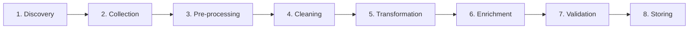

# FIT5196 Data Wrangling

## Week 1-2 补习班

---
layout: default
---

# 课程安排

| Week | 主题 |
|------|------|
| 1 | Introduction to Data Wrangling |
| 2 | Data Wrangling Process & Tasks |
| 3 | Regular Expression |
| 4-5 | EDA / Data Discovery / Collection |
| 6 | Data Structuring |
| 7-11 | Quality, Cleaning, Transformation, Enrichment, Validation |
| 12 | Advanced Data Wrangling |

---
layout: section
---

# 作业与时间

---
layout: default
---

# Assessment 总表

| 项目 | 权重 | 内容 | 截止时间 | 形式 |
|------|------|------|----------|------|
| Quiz 1 | 10% | Applied session MCQ | Week 6 | 个人、线下 |
| Quiz 2 | 10% | Applied session MCQ | Week 12 | 个人、线下 |
| Assessment 1 | 35% | Coding + Report + Demo Video | Week 7 周四 23:55 | 小组 |
| Assessment 2 | 40% | Coding + Report | Week 12 周四 23:55 | 小组 |
| Presentation | 未单独列权重 | 课堂展示 | Week 15 周一 / 周二 | 小组 |
| In-class Participation | 5% | 课堂活动 | 若干周 seminar | 个人 |

---
layout: two-cols
---

# Assessment 1

### - EDA

- 读取和提取数据
- 做基础预处理
- 做 exploratory data analysis
- 使用合适的可视化
- 总结 raw / processed data 的发现

::right::

# Assessment 2
### - Parsing, Cleansing, Integrating

- 检查并审计 parsed data
- 识别 lexical errors / irregularities
- 处理 duplication / inconsistency
- 修复并整合多源数据


---
layout: two-cols
---

# 上课节奏

- seminar: `Monday 6pm-8pm`
- seminar 地点：`S7 Lecture Theatre`
- 每周还有 `2-hour applied session`
- applied session 时间按 `Allocate+`
- seminar 讲概念、流程、判断题思路
- applied session 更偏 notebook / Python / pandas 操作
- attendance 很重要，尤其 quiz 和 in-class participation 都跟线下节奏强相关

::right::

# 沟通方式

- 讨论优先走 `Ed Forum`
- 教学团队会定期看 forum
- 回复可能需要最多 `3 business days`
- 紧急情况才发邮件
- 涉及个人情况用 private post 更合适

---
layout: default
---

# Quiz 和 Group Assessment 规则

- `Quiz 1` 覆盖 Week 1-6，`Quiz 2` 覆盖 Week 7-12
- 每次 quiz `30 minutes`
- 必须 `in-person` 完成 applied session quiz
- quiz 是个人作业，不允许 collaboration，不应使用 AI
- quiz 会使用 `Safe Exam Browser`
- in-class participation 也是跟 seminar 时段绑定的
- `Assessment 1/2` 是 group work，通常没有 2-day short extension
- presentation 在 `Week 15`，而且有 hurdle 要求

---
layout: default
---

# 你需要尽早掌握什么

- `Python` 基础：变量、list、dict、for loop、function  
- `Jupyter Notebook`：写代码、写 markdown、记录分析过程  
- `pandas` 基础操作：读取、查看和简单处理数据  
- 数据清洗思路：缺失值、异常值、重复、不一致  
- 基础数据可视化  
- 读懂常见数据格式：`CSV`、`JSON`、`HTML/XML`

---
layout: default
---

# 一句话定义

Data Wrangling 是把原始数据变成可分析数据的过程。

`Raw Data -> Clean / Tidy Data -> Actionable Insights`

| 不要误解成 | 原因 |
|-----------|------|
| 只是可视化 | 可视化只是后续分析的一部分 |
| 只是收集数据 | 收集只是流程中的一环 |
| 只是机器学习 | wrangling 是分析前准备工作 |

---
layout: section
---

# Week 1

---
layout: default
---

# Data Wrangling 的主要目标

| 目标 | 含义 |
|------|------|
| Improve quality | 提高数据质量 |
| Simplify access | 让数据更容易获取和使用 |
| Support integration | 让多源数据更容易整合 |
| Reduce complexity | 降低处理难度 |
| Improve efficiency | 提高分析效率 |
| Support decisions | 支持后续决策 |

<div class="callout text-sm">
常见反向陷阱：不是增加复杂度，不是忽略不一致，不是制造冗余。
</div>

---
layout: default
---

# 为什么一定要做 Wrangling

| 原始数据问题 | 会导致什么 |
|--------------|------------|
| Missing values | 结果不稳定、信息不完整 |
| Wrong values | 结论错误 |
| Duplicate records | 统计被放大 |
| Inconsistent formats | 难以合并和比较 |
| Complex structures | 无法直接分析 |

---
layout: default
---

# 现实中的数据来源

- 表格：CSV、Excel、数据库导出
- 半结构化：JSON、XML、HTML
- 文本：日志、评论、报告
- 图像与传感器：医疗影像、wearable devices
- 开放与平台数据：UCI、Wikipedia、social media

<div class="muted mt-4 text-sm">
重点不是来源越多越好，而是 accessibility、relevance、quality、cost 是否合适。
</div>

---
layout: default
---

# Week 1 认识到的挑战

| 挑战 | 具体表现 |
|------|----------|
| Volume and scalability | 数据量大，传统工具顶不住 |
| Data quality | 缺失、错误、异常、重复 |
| Diverse sources | 来源多、结构杂 |
| Lack of standardization | 日期、货币、命名规则不统一 |
| Time-consuming | 大量时间花在清洗和整理 |
| Skills and tools | 要会 Python、统计、数据库、NLP |
| Privacy and security | 敏感数据要合规处理 |

---
layout: two-cols
---

# Week 1 默认工具链

| 工具 | 用途 |
|------|------|
| Python 3 | 主语言 |
| Jupyter Notebook | 代码、文字、输出放一起 |
| Google Colab | 免安装练习环境 |
| Anaconda | 本地数据科学环境 |
| VS Code / PyCharm | 后续脚本开发 |

::right::

| 常见库 | 用途 |
|--------|------|
| `pandas` | 表格数据处理 |
| `numpy` | 数值计算 |
| `scipy` | 科学计算 |
| `scikit-learn` | 数据分析与建模工具 |
| `BeautifulSoup` | HTML/XML 解析 |
| `NLTK` | 文本处理 |

---
layout: default
---

# Week 1 Applied Session 在练什么

- Jupyter Notebook 的两种 cell
- markdown 写说明
- Python 变量、list、dict
- `for loop` 与 nested `for loop`
- `function`
- `transpose_matrix` 练习

---
layout: default
---

# Week 1 Applied Session 练习

| 练习 | 要求 |
|------|------|
| Markdown 总结 | 写你过去处理过的数据、遇到的问题、怎么处理、学到了什么 |
| Matrix transpose | 写一个函数，把矩阵行列互换 |

---
layout: default
---

# `transpose_matrix` 参考写法

```python
def transpose_matrix(matrix):
    rows = len(matrix)
    cols = len(matrix[0])

    result = []
    for col in range(cols):
        new_row = []
        for row in range(rows):
            new_row.append(matrix[row][col])
        result.append(new_row)

    return result
```

---
layout: default
---

# Jupyter 里必须会的两种 Cell

| 类型 | 作用 |
|------|------|
| Code cell | 写并执行 Python |
| Markdown cell | 写标题、说明、列表、表格 |

<div class="muted mt-4 text-sm">
FIT5196 的 group assessment 很依赖 notebook 表达过程，所以“会写解释”跟“会写代码”同样重要。
</div>

---
layout: default
---

# Week 1 结束前至少要会

1. 能打开并运行 notebook
2. 能切换 markdown / code cell
3. 能写基础 Python
4. 能自己定义简单函数
5. 能看懂 list of lists 和 nested loops
6. 能完成简单 notebook 报告表达

---
layout: section
---

# Week 2

---
layout: section
---

# 八大任务流程总览



---
layout: two-cols
---

# 1. Discovery

- 先确认要解决什么分析问题
- 找可能的数据来源，不是立刻下载
- 评估来源是否可访问、相关、可用
- 先看 suitability / availability / quality

::right::

# 医疗案例里会找什么

- EHR / 电子病历
- admission / discharge records
- insurance claims
- wearable device data
- patient histories / medications

<div class="muted mt-4 text-sm">
关键词：identify sources, accessibility, suitability, quality
</div>

---
layout: default
---

# 2. Collection

| 收集前要想清楚 | 为什么 |
|----------------|--------|
| objective | 你到底要回答什么问题 |
| data requirements | 需要哪些字段和粒度 |
| source / format | 从哪里拿、是什么格式 |
| quality / volume | 数据够不够、质量稳不稳 |
| ethics / privacy | 合规、授权、敏感信息处理 |
| methods / tools | API、database、spreadsheet 还是 web |
| timeframe / budget | 时间和资源能不能支撑 |
| documentation | 后面要复现和解释过程 |

---
layout: default
---

# 3. Pre-processing

| 常见动作 | 说明 |
|----------|------|
| Subsetting | 只保留相关行或列 |
| Sampling | 数据太大时抽代表性样本 |
| Date formatting | 统一日期格式 |
| Numeric formatting | 小数点、千位分隔符统一 |
| Categorical formatting | `Male/M`、`Female/F` 统一 |
| Unit / currency conversion | 公里英里、USD/AUD 等统一 |
| Encoding / timezone | UTF-8、时区对齐 |
| File conversion | XML 转 CSV，JSON 转结构化表 |

<div class="muted mt-4 text-sm">
关键词：subset、sample、format、unit、encoding、conversion
</div>

---
layout: default
---

# 4. Cleaning

- 找并修复 `missing values`
- 检查 `outliers`
- 删除或合并 `duplicate records`
- 修正 `consistency issues`
- 识别 data anomalies
- 注意 anomaly 不一定只是错误，也可能是新模式或重要信号

<div class="callout text-sm">
考试里看到 correcting inaccuracies / inconsistencies / duplicates，优先想到 cleaning。
</div>

---
layout: two-cols
---

# 5. Transformation

- 把数据变成更适合分析的结构或表示
- 常见于 numeric / text / image 三类数据
- 目标是让后续分析、建模、比较更稳定

::right::

| Numeric 常见操作 | 作用 |
|------------------|------|
| Normalization | 缩放到固定范围 |
| Standardization | 调到均值 0、方差 1 |
| Aggregation | 求和、均值、分组统计 |
| Discretization | 连续值切成区间 |
| Binning / Bucketing | 分桶后变成类别 |

---
layout: default
---

# 5. Transformation 还包括什么

| 数据类型 | 常见操作 |
|----------|----------|
| Text | tokenization, stemming / lemmatization, vectorization |
| Image | resize, crop, normalization, colour conversion |
| Image augmentation | rotation, flipping, translation, noise / brightness / contrast adjustment |

<div class="muted mt-4 text-sm">
易混点：normalization 和 standardization 不一样；discretization 和 binning 也不要混。
</div>

---
layout: default
---

# 6. Enrichment

| 方式 | 含义 |
|------|------|
| Data integration | 合并不同来源数据 |
| Data augmentation | 给现有记录补更多信息 |
| Attribute enrichment | 新增特征或属性 |
| Temporal enrichment | 补充时间维度 |
| Semantic enrichment | 加 metadata / tag / meaning |

一句话：不是修错，而是让数据“更完整、更有上下文”。

---
layout: default
---

# 7. Validation

| 检查项 | 典型问题 |
|--------|----------|
| Accuracy | 值是否反映真实世界 |
| Consistency | 同一字段规则是否统一 |
| Completeness | 关键值是否缺失 |
| Logical integrity | 年龄、日期、关系是否讲得通 |
| Range / constraints | 值域是否超界 |
| Format validation | 格式是否符合预期 |
| Uniqueness | 本应唯一的键是否重复 |
| Cross-validation | 能否用别的数据源交叉验证 |

---
layout: default
---

# 8. Storing

| 存储阶段要考虑 | 重点 |
|----------------|------|
| Storage solution | database / warehouse / cloud |
| Schema design | 查询和维护是否方便 |
| Normalization / denormalization | 完整性 vs 读取效率 |
| Format / encoding | 存储格式要一致 |
| Security | 权限、隐私、合规 |
| Indexing / optimization | 检索速度 |
| Backup / recovery | 可恢复性 |
| Metadata / monitoring | 后续治理与维护 |

---
layout: default
---

# 用一个例子串起来

1. `Discovery`：找医院再入院预测相关数据源
2. `Collection`：确认权限、字段、格式、预算、时间
3. `Pre-processing`：筛时间范围、抽样、统一日期和单位
4. `Cleaning`：处理缺失、重复、异常和不一致
5. `Transformation`：聚合、标准化、把文本转成可分析形式
6. `Enrichment`：补保险、地理、行为或时间信息
7. `Validation`：检查范围、唯一性、逻辑约束
8. `Storing`：把结果存进可复用的数据表或仓库

---
layout: default
---

# 课程里出现过的 pandas 高频题

| 任务 | 常见写法 |
|------|----------|
| 读 CSV | `pd.read_csv(...)` |
| 读 Excel | `pd.read_excel(...)` |
| 读 JSON | `pd.read_json(...)` |
| 改列名 | `df.rename(columns={'A': 'B'})` |
| 设 index | `df.set_index('ID')` |
| 排序 | `df.sort_values(by='Name')` |
| 指定 header | `header=` |
| 跳过前几行 | `skiprows=3` |

---
layout: section
---

# Quiz 易错点

---
layout: default
---

# 最容易混的概念

| 概念组 | 区别 |
|--------|------|
| Discovery vs Collection | 找来源 vs 真正收集 |
| Subsetting vs Sampling | 取子集 vs 抽样本 |
| Cleaning vs Validation | 修问题 vs 检规则 |
| Enrichment vs Storing | 补信息 vs 保存管理 |
| Normalization vs Standardization | 缩放范围 vs 均值方差标准化 |
| Discretization vs Binning | 分类别区间 vs 分桶 |

---
layout: default
---

# 看到题目先抓关键词

| 题目关键词 | 先想到什么 |
|------------|------------|
| identify sources | discovery |
| budget / privacy / objectives | collection |
| subset / sample / format / unit | pre-processing |
| duplicates / missing / outliers | cleaning |
| aggregate / normalize / discretize | transformation |
| external context / merge more info | enrichment |
| allowed values / ranges / uniqueness | validation |
| schema / backup / warehouse / indexing | storing |

---
layout: default
---

# 典型单选题判断规则

- “What is data wrangling?” -> 选把 raw data 变成可分析数据
- “What is not a goal?” -> 看 increasing complexity / redundancy 这类反项
- “What comes after discovery?” -> collection
- “Correcting inconsistencies” -> cleaning
- “Adding external context” -> enrichment
- “Checking M/F only” -> validation

---
layout: section
---

# 学习建议

---
layout: default
---

# Week 1 必须完成

1. 能打开并运行 Jupyter Notebook 或 Google Colab
2. 能创建并运行 code cell
3. 能写 markdown cell
4. 会写变量、list、dict
5. 会写 for loop 和 nested loop
6. 会定义简单函数
7. 能手写 `transpose_matrix`
8. 知道 Quiz 1、Assessment 1、Assessment 2 的时间点

---
layout: default
---

# 接下来怎么学

| 时间 | 建议 |
|------|------|
| 本周 | 把 Python / Jupyter 基础补齐 |
| Week 2-4 | 跟上 wrangling 流程、regex、EDA |
| Week 5-6 | 开始为 Quiz 1 和 A1 做准备 |
| Week 7 后 | 重点转向 parsing / cleansing / integrating |

---
layout: section
---

# Final Checklist

---
layout: default
---

# 考前最后确认

1. 能用自己的话定义 data wrangling
2. 能说出它的目标和主要挑战
3. 能按顺序写出 8 个步骤
4. 能给每一步举一个例子
5. 能分清 discovery / collection / pre-processing / cleaning / transformation / enrichment / validation / storing
6. 知道 subsetting、sampling、normalization、standardization、discretization、binning 的区别
7. 能在 Jupyter Notebook 里完成基础代码与 markdown 操作
8. 能用 pandas 读入 CSV 并查看数据结构
9. 会做基础缺失值处理

---
layout: default
---

# 最后一句话

> 看到任何数据处理任务时，先判断它在 wrangling pipeline 的哪一步，再决定该用什么方法和工具。

这就是 Week 1-2 最核心的能力。

---
layout: end
---

# 下阶段

Week 3 会开始更具体地碰到 regex / text handling；
