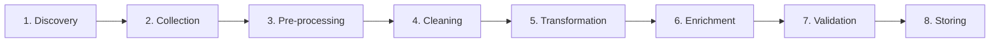

# FIT5196 Data Wrangling

## Week 1-2 补习班

---
layout: default
---

# 这份课件讲什么

1. 前两周到底在学什么
2. 课程要求、assessment 与时间点
3. Week 1 的核心概念与工具要求
4. Week 2 的八大 wrangling 流程
5. case study 怎么把概念变成真实任务
6. Jupyter / pandas 实操重点
7. quiz 易错点与最终 checklist

---
layout: statement
---

前两周的重点不是建模。

重点是先建立一套稳定的 `data wrangling` 思维框架。

---
layout: default
---

# 这两周的学习目标

<v-clicks>

- 知道什么是 `data wrangling`
- 知道为什么分析前必须先做 wrangling
- 能按顺序说出 8 个步骤
- 能判断每个操作属于哪一步
- 能在 Jupyter 里做最基本的 Python / pandas 操作

</v-clicks>

---
layout: section
---

# 课程概览

---
layout: default
---

# 这门课到底要求你做什么

| 能力 | 说明 |
|------|------|
| Parse data | 读取并解析不同格式的数据 |
| Assess quality | 判断数据质量，定位问题 |
| Resolve issues | 修复缺失、错误、重复、不一致 |
| Integrate data | 合并多源数据并做 enrichment |
| Document process | 用 notebook / report 记录过程 |
| Write scripts | 用 Python 写 wrangling 脚本 |

---
layout: statement
---

这门课默认你已经会基础 Python。

辅导课会帮你补方法和节奏，不会从零开始教编程。

---
layout: default
---

# 你现在至少要会这些

<v-clicks>

- Python 基础：变量、list、dict、for loop、function
- Jupyter：会创建 / 运行 code cell 和 markdown cell
- 文件处理：知道 CSV、JSON、HTML/XML 是什么
- Python 包：至少能 import 并使用基础库
- 结果展示：会把代码输出保留在 notebook 里

</v-clicks>

<div v-click class="callout text-sm">
如果这些不熟，Week 6 之后的 quiz 和 group assessment 会明显吃力。
</div>

---
layout: section
---

# 作业与时间

---
layout: default
---

# Assessment 总表

| 项目 | 权重 | 内容 | 截止时间 | 形式 |
|------|------|------|----------|------|
| Quiz 1 | 10% | Applied session MCQ | Week 6 | 个人、线下 |
| Quiz 2 | 10% | Applied session MCQ | Week 12 | 个人、线下 |
| Assessment 1 | 35% | Coding + Report + Demo Video | Week 7 周四 23:55 | 小组 |
| Assessment 2 | 40% | Coding + Report | Week 12 周四 23:55 | 小组 |
| Presentation | 未单独列权重 | 课堂展示 | Week 15 周一 / 周二 | 小组 |
| In-class Participation | 5% | 课堂活动 | 若干周 seminar | 个人 |

---
layout: two-cols
---

# 每个作业考什么

### Assessment 1 - EDA

- 读取和提取数据
- 做基础预处理
- 做 exploratory data analysis
- 使用合适的可视化
- 总结 raw / processed data 的发现

::right::

### Assessment 2 - Parsing, Cleansing, Integrating

- 检查并审计 parsed data
- 识别 lexical errors / irregularities
- 处理 duplication / inconsistency
- 修复并整合多源数据

---
layout: default
---

# 你需要尽早掌握什么

<v-clicks>

1. `pandas` 基础操作
2. Jupyter Notebook 写报告
3. 数据清洗思路：缺失、异常、重复、不一致
4. 基础可视化
5. Python 函数和循环
6. 读懂并处理表格 / 文本 / 网页数据

</v-clicks>

---
layout: default
---

# 一句话定义

Data Wrangling 是把原始数据变成可分析数据的过程。

`Raw Data -> Clean / Tidy Data -> Actionable Insights`

| 不要误解成 | 原因 |
|-----------|------|
| 只是可视化 | 可视化只是后续分析的一部分 |
| 只是收集数据 | 收集只是流程中的一环 |
| 只是机器学习 | wrangling 是分析前准备工作 |

---
layout: section
---

# Week 1

---
layout: default
---

# Data Wrangling 的主要目标

| 目标 | 含义 |
|------|------|
| Improve quality | 提高数据质量 |
| Simplify access | 让数据更容易获取和使用 |
| Support integration | 让多源数据更容易整合 |
| Reduce complexity | 降低处理难度 |
| Improve efficiency | 提高分析效率 |
| Support decisions | 支持后续决策 |

<div class="callout text-sm">
常见反向陷阱：不是增加复杂度，不是忽略不一致，不是制造冗余。
</div>

---
layout: default
---

# 为什么一定要做 Wrangling

| 原始数据问题 | 会导致什么 |
|--------------|------------|
| Missing values | 结果不稳定、信息不完整 |
| Wrong values | 结论错误 |
| Duplicate records | 统计被放大 |
| Inconsistent formats | 难以合并和比较 |
| Complex structures | 无法直接分析 |

---
layout: default
---

# 现实中的数据来源

<v-clicks>

- 表格：CSV、Excel、数据库导出
- 半结构化：JSON、XML、HTML
- 文本：日志、评论、报告
- 图像与传感器：医疗影像、wearable devices
- 开放与平台数据：UCI、Wikipedia、social media

</v-clicks>

<div v-click class="muted mt-4 text-sm">
重点不是来源越多越好，而是 accessibility、relevance、quality、cost 是否合适。
</div>

---
layout: default
---

# Week 1 认识到的挑战

| 挑战 | 具体表现 |
|------|----------|
| Volume and scalability | 数据量大，传统工具顶不住 |
| Data quality | 缺失、错误、异常、重复 |
| Diverse sources | 来源多、结构杂 |
| Lack of standardization | 日期、货币、命名规则不统一 |
| Time-consuming | 大量时间花在清洗和整理 |
| Skills and tools | 要会 Python、统计、数据库、NLP |
| Privacy and security | 敏感数据要合规处理 |

---
layout: two-cols
---

# Week 1 默认工具链

| 工具 | 用途 |
|------|------|
| Python 3 | 主语言 |
| Jupyter Notebook | 代码、文字、输出放一起 |
| Google Colab | 免安装练习环境 |
| Anaconda | 本地数据科学环境 |
| VS Code / PyCharm | 后续脚本开发 |

::right::

| 常见库 | 用途 |
|--------|------|
| `pandas` | 表格数据处理 |
| `numpy` | 数值计算 |
| `scipy` | 科学计算 |
| `scikit-learn` | 数据分析与建模工具 |
| `BeautifulSoup` | HTML/XML 解析 |
| `NLTK` | 文本处理 |

---
layout: default
---

# Week 1 Applied Session 在练什么

- Jupyter Notebook 的两种 cell
- markdown 写说明
- Python 变量、list、dict
- `for loop` 与 nested `for loop`
- `function`
- `transpose_matrix` 练习

---
layout: default
---

# Week 1 Applied Session 练习

| 练习 | 要求 |
|------|------|
| Markdown 总结 | 写你过去处理过的数据、遇到的问题、怎么处理、学到了什么 |
| Matrix transpose | 写一个函数，把矩阵行列互换 |

---
layout: default
---

# `transpose_matrix` 参考写法

```python
def transpose_matrix(matrix):
    rows = len(matrix)
    cols = len(matrix[0])

    result = []
    for col in range(cols):
        new_row = []
        for row in range(rows):
            new_row.append(matrix[row][col])
        result.append(new_row)

    return result
```

---
layout: default
---

# Jupyter 里必须会的两种 Cell

| 类型 | 作用 |
|------|------|
| Code cell | 写并执行 Python |
| Markdown cell | 写标题、说明、列表、表格 |

<div class="muted mt-4 text-sm">
FIT5196 的 group assessment 很依赖 notebook 表达过程，所以“会写解释”跟“会写代码”同样重要。
</div>

---
layout: default
---

# Week 1 结束前至少要会

1. 能打开并运行 notebook
2. 能切换 markdown / code cell
3. 能写基础 Python
4. 能自己定义简单函数
5. 能看懂 list of lists 和 nested loops
6. 能完成简单 notebook 报告表达

---
layout: section
---

# Week 2

---
layout: default
---

# 八大任务流程总览



---
layout: default
---

# 1. Data Discovery

| 核心问题 | 说明 |
|----------|------|
| 数据源在哪里 | 找可用来源 |
| 能不能拿到 | accessibility |
| 适不适合目标 | relevance |
| 质量如何 | quality |
| 值不值得用 | cost |

> Discovery 是 “找什么数据可以用”，不是开始清洗。

---
layout: default
---

# 2. Data Collection

| 要考虑什么 | 说明 |
|------------|------|
| Objectives | 收集目的是什么 |
| Format | 数据是什么格式 |
| Volume | 量有多大 |
| Privacy | 有没有敏感信息 |
| Budget | 成本能不能承受 |
| Timeline | 时间是否可行 |


> Discovery 是找来源，Collection 是真正收集并规划收集过程。

---
layout: default
---

# 3. Data Pre-processing

| 技术 | 例子 |
|------|------|
| Subsetting | 只保留 2000-2010 年记录 |
| Sampling | 从超大数据中抽样 |
| Formatting | 日期改成统一格式 |
| Unit conversion | USD 转 AUD |
| Text normalization | 大小写、编码、空格统一 |

---
layout: default
---

# 最容易混：Subsetting vs Sampling

| 情况 | 正确术语 |
|------|----------|
| 只选某几年、某几列、某一部分记录 | `Subsetting` |
| 从大量数据中抽一部分代表样本 | `Sampling` |

---
layout: default
---

# 4. Data Cleaning

| 任务 | 说明 |
|------|------|
| Missing values | 删除、插补、替换 |
| Outliers | 识别异常值 |
| Duplicates | 去重 |
| Inconsistencies | 统一标签、编码、格式 |
| Errors | 修正明显错误值 |

> remove duplicates / handle missing values / correct inconsistencies 基本都属于 cleaning。

---
layout: default
---

# 5. Data Transformation

### Numeric

- normalization
- standardization
- aggregation
- discretization
- binning

### Other structures

- XML to CSV
- categorical encoding
- feature engineering

---
layout: default
---

# Transformation 常考对比

| 技术 | 例子 |
|------|------|
| Aggregation | 汇总每月消费总额 |
| Standardization | 均值 0、标准差 1 |
| Normalization | 缩放到统一范围 |
| Discretization | `Age -> Youth / Adult / Senior` |
| Binning | 连续数值分桶 |

---
layout: default
---

# 6-8. Enrichment / Validation / Storing

| 步骤 | 在做什么 | 典型关键词 |
|------|----------|------------|
| Enrichment | 给数据补更多上下文 | merge external data, add context |
| Validation | 检查规则、范围、逻辑 | allowed values, range, uniqueness |
| Storing | 为后续使用保存和管理 | schema, backup, index, lifecycle |

<div class="muted mt-4 text-sm">
enrichment 是增加信息；validation 是检查规则；storing 是设计后续可持续使用方式。
</div>

---
layout: section
---

# Case Study

## 医疗数据：预测病人 30 天内再入院

---
layout: default
---

# 医疗案例中的典型操作归类

| 操作 | 属于哪一步 |
|------|------------|
| 找 EHR、医保、wearable data | Discovery |
| 检查隐私与关键字段是否齐全 | Collection |
| 统一日期格式、标签格式 | Pre-processing |
| 删除重复、处理缺失、不一致 | Cleaning |
| 年龄标准化、分箱 | Transformation |
| 加 postcode 对应区域 / 收入信息 | Enrichment |
| 检查年龄范围、ID 唯一性、时间逻辑 | Validation |
| 设计 schema 与 backup | Storing |

---
layout: section
---

# Pandas 实操

---
layout: default
---

# Week 2 Applied Session 真正在练什么

<v-clicks>

- `import pandas as pd`
- `pd.DataFrame()`
- DataFrame 的 index / columns / values
- `shape`, `dtypes`, `info()`, `describe()`
- `head()`, `tail()`
- `read_csv(...)`
- `isna()`, `dropna()`, `fillna()`
- 创建新列、合并列

</v-clicks>

---
layout: default
---

# 探索 DataFrame 的最小命令集

```python
import pandas as pd

df = pd.read_csv("xmart.csv", skiprows=1)

df.shape
df.columns
df.dtypes
df.info()
df.describe()
df.head()
```

<div class="muted mt-4 text-sm">
目标是先理解“数据长什么样”，再决定后面怎么清洗和处理。
</div>

---
layout: default
---

# 缺失值处理的基础操作

```python
ufo.isna()
ufo.isna().sum()

ufo1 = ufo.dropna()
ufo2 = ufo.fillna(value=0)

ufo3 = ufo.copy()
ufo3["Colors Reported"].fillna("BLUE", inplace=True)
```

| 关键理解 | 说明 |
|----------|------|
| 不是所有缺失值都该删 | 删除可能丢掉太多信息 |
| 不是所有字段都能填 0 | 要看字段语义 |
| 处理前最好先复制 | 保留原始版本 |

---
layout: default
---

# 课程里出现过的 pandas 高频题

| 任务 | 常见写法 |
|------|----------|
| 读 CSV | `pd.read_csv(...)` |
| 读 Excel | `pd.read_excel(...)` |
| 读 JSON | `pd.read_json(...)` |
| 改列名 | `df.rename(columns={'A': 'B'})` |
| 设 index | `df.set_index('ID')` |
| 排序 | `df.sort_values(by='Name')` |
| 指定 header | `header=` |
| 跳过前几行 | `skiprows=3` |

---
layout: section
---

# Quiz 易错点

---
layout: default
---

# 最容易混的概念

| 概念组 | 区别 |
|--------|------|
| Discovery vs Collection | 找来源 vs 真正收集 |
| Subsetting vs Sampling | 取子集 vs 抽样本 |
| Cleaning vs Validation | 修问题 vs 检规则 |
| Enrichment vs Storing | 补信息 vs 保存管理 |
| Normalization vs Standardization | 缩放范围 vs 均值方差标准化 |
| Discretization vs Binning | 分类别区间 vs 分桶 |

---
layout: default
---

# 看到题目先抓关键词

| 题目关键词 | 先想到什么 |
|------------|------------|
| identify sources | discovery |
| budget / privacy / objectives | collection |
| subset / sample / format / unit | pre-processing |
| duplicates / missing / outliers | cleaning |
| aggregate / normalize / discretize | transformation |
| external context / merge more info | enrichment |
| allowed values / ranges / uniqueness | validation |
| schema / backup / warehouse / indexing | storing |

---
layout: default
---

# 典型单选题判断规则

<v-clicks>

- “What is data wrangling?” -> 选把 raw data 变成可分析数据
- “What is not a goal?” -> 看 increasing complexity / redundancy 这类反项
- “What comes after discovery?” -> collection
- “Correcting inconsistencies” -> cleaning
- “Adding external context” -> enrichment
- “Checking M/F only” -> validation

</v-clicks>

---
layout: section
---

# 学习建议

---
layout: default
---

# Week 1 必须完成

1. 能打开并运行 Jupyter Notebook 或 Google Colab
2. 能创建并运行 code cell
3. 能写 markdown cell
4. 会写变量、list、dict
5. 会写 for loop 和 nested loop
6. 会定义简单函数
7. 能手写 `transpose_matrix`
8. 知道 Quiz 1、Assessment 1、Assessment 2 的时间点

---
layout: default
---

# 接下来怎么学

| 时间 | 建议 |
|------|------|
| 本周 | 把 Python / Jupyter 基础补齐 |
| Week 2-4 | 跟上 wrangling 流程、regex、EDA |
| Week 5-6 | 开始为 Quiz 1 和 A1 做准备 |
| Week 7 后 | 重点转向 parsing / cleansing / integrating |

---
layout: section
---

# Final Checklist

---
layout: default
---

# 考前最后确认

1. 能用自己的话定义 data wrangling
2. 能说出它的目标和主要挑战
3. 能按顺序写出 8 个步骤
4. 能给每一步举一个例子
5. 能分清 discovery / collection / pre-processing / cleaning / transformation / enrichment / validation / storing
6. 知道 subsetting、sampling、normalization、standardization、discretization、binning 的区别
7. 能在 Jupyter Notebook 里完成基础代码与 markdown 操作
8. 能用 pandas 读入 CSV 并查看数据结构
9. 会做基础缺失值处理

---
layout: default
---

# 最后一句话

> 看到任何数据处理任务时，先判断它在 wrangling pipeline 的哪一步，再决定该用什么方法和工具。

这就是 Week 1-2 最核心的能力。

---
layout: end
---

# 下阶段

Week 3 会开始更具体地碰到 regex / text handling；
