# FIT5196 Data Wrangling

## Week 1 课外辅导

<div class="muted mt-8 text-sm">
课程要求、作业安排、Week 1 核心概念、Python/Jupyter 入门
</div>

---
layout: default
---

# 今日内容

<v-clicks>

1. 这门课要你具备什么能力
2. 这门课有哪些作业，什么时候交
3. Week 1 核心概念 + 随堂 quiz
5. Python / Jupyter 入门
6. 本周必须完成什么

</v-clicks>

---
layout: section
---

# 课程要求

---
layout: default
---

# FIT5196 要求你做什么

| 能力 | 说明 |
|------|------|
| Parse data | 读取并解析不同格式的数据 |
| Assess quality | 判断数据质量，发现问题 |
| Resolve issues | 修复缺失、错误、重复、不一致 |
| Integrate data | 合并多源数据做 enrichment |
| Document process | 用 report/notebook 记录过程 |
| Write scripts | 用 Python 写 wrangling 脚本 |

---
layout: statement
---

这门课默认你已经会 Python。

课内不会从零开始教编程。

---
layout: default
---

# 你现在至少要会这些

<v-clicks>

- Python 基础：变量、list、dict、for loop、function
- Jupyter：会创建/运行 code cell 和 markdown cell
- 文件处理：知道 CSV、JSON、HTML/XML 是什么
- Python 包：至少能 import 并使用基础库
- 结果展示：会把代码输出保留在 notebook 里

</v-clicks>

<div v-click class="callout text-sm">
如果这些不熟，Week 6 之后的 quiz 和 group assessment 会明显吃力。
</div>

---
layout: section
---

# 作业与时间

---
layout: default
---

# Assessment 总表

| 项目 | 权重 | 内容 | 截止时间 | 形式 |
|------|------|------|----------|------|
| Quiz 1 | 10% | Applied session MCQ | Week 6 | 个人、线下 |
| Quiz 2 | 10% | Applied session MCQ | Week 12 | 个人、线下 |
| Assessment 1 | 35% | Coding + Report + Demo Video | Week 7 周四 23:55 | 小组 |
| Assessment 2 | 40% | Coding + Report | Week 12 周四 23:55 | 小组 |
| Presentation | 未单独列权重 | 课堂展示 | Week 15 周一/周二 | 小组 |
| In-class Participation | 5% | 课堂活动 | 若干周 seminar | 个人 |

---
layout: two-cols
---

# 每个作业考什么

### Assessment 1 — EDA

- 读取和提取数据  
- 做基础预处理  
- 做 exploratory data analysis (EDA)  
- 使用合适的可视化  
- 总结 raw / processed data 的发现  

::right::

### Assessment 2 — Parsing, Cleansing, Integrating

- 检查并审计 parsed data  
- 识别 lexical errors / irregularities  
- 处理 duplication / inconsistency  
- 修复并整合多源数据  

---
layout: default
---

# 你需要尽早掌握什么

<v-clicks>

1. `pandas` 基础操作
2. Jupyter Notebook 写报告
3. 数据清洗思路：缺失、异常、重复、不一致
4. 基础可视化
5. Python 函数和循环
6. 读懂并处理表格/文本/网页数据

</v-clicks>

---
layout: section
---

# Week 1 核心概念

---
layout: default
---

# 什么是 Data Wrangling

> 把原始数据转换成可以直接分析的数据。

| 环节 | 作用 |
|------|------|
| Acquiring | 获取数据 |
| Cleaning | 清洗数据 |
| Structuring | 结构化数据 |
| Enriching | 增加信息 |
| Validating | 检查结果是否可用 |

---
layout: default
---

# Quiz 1

Data wrangling 是什么？

- a. 只做可视化
- b. 只收集数据
- c. 获取、清洗、结构化、丰富原始数据，使其可分析
- d. 构建机器学习模型

<div v-click class="callout text-sm">
答案：`c`。这是 Week 1 对 data wrangling 的核心定义。
</div>

---
layout: default
---

# 为什么要做 Data Wrangling

| 原始数据常见问题 | 后果 |
|------------------|------|
| 缺失值 | 统计结果不可靠 |
| 错误值 | 分析结论错误 |
| 重复记录 | 结果偏差 |
| 格式不一致 | 难以合并和处理 |
| 结构复杂 | 无法直接分析 |

---
layout: default
---

# Quiz 2

下列哪一个不是 data wrangling 的主要目标？

- a. Simplifying access to data
- b. Reducing data complexity
- c. Supporting decision making
- d. Maximizing redundancy

<div v-click class="callout text-sm">
答案：`d`。data wrangling 的目标是减少复杂度、提高可用性，不是制造冗余。
</div>

---
layout: default
---

# Week 1 的八步流程

```mermaid
%%{init: {'theme': 'base', 'themeVariables': { 'primaryColor': '#ffffff', 'primaryTextColor': '#1a1a1a', 'primaryBorderColor': '#002FA7', 'lineColor': '#666666', 'secondaryColor': '#f5f5f5', 'tertiaryColor': '#f5f5f5'}}}%%
flowchart LR
    A[Data Discovery] --> B[Data Collection]
    B --> C[Data Pre-processing]
    C --> D[Data Cleaning]
    D --> E[Data Transformation]
    E --> F[Data Enrichment]
    F --> G[Data Validation]
    G --> H[Data Storing]
```



---
layout: default
---

# 这八步分别在干什么

<v-clicks>

1. `Data Discovery`：找数据源
2. `Data Collection`：获取数据
3. `Pre-processing`：先做格式、单位、抽样等预处理
4. `Cleaning`：处理缺失、错误、重复
5. `Transformation`：标准化、归一化、重构
6. `Enrichment`：增加新特征或外部信息
7. `Validation`：检查准确性和一致性
8. `Storing`：设计存储与后续使用方式

</v-clicks>

---
layout: default
---

# Quiz 3

只选择 2000-2010 年事故记录进行分析，属于：

- a. Sampling
- b. Subsetting
- c. Discretisation
- d. Normalisation

<div v-click class="callout text-sm">
答案：`b`。这是 pre-processing 里的子集选择，不是抽样。
</div>

---
layout: default
---

# Week 1 提到的主要挑战

| 挑战 | 具体内容 |
|------|----------|
| Data volume | 数据量大，处理成本高 |
| Data quality | 缺失、错误、重复、不一致 |
| Diverse sources | CSV、Excel、PDF、JSON、XML、图片等 |
| Complex structures | 结构化、半结构化、非结构化 |
| Standardization | 命名、格式、标准不统一 |
| Time-consuming | 数据清洗通常很耗时 |
| Skills/tools | 需要 Python、统计、数据库等 |
| Privacy/security | 某些数据有合规要求 |

---
layout: default
---

# Quiz 4

下列哪一个不是 data wrangling 的 challenge？

- a. Volume and scalability
- b. Lack of standardization
- c. Data privacy concerns
- d. High interpretability of all datasets

<div v-click class="callout text-sm">
答案：`d`。真实问题通常相反，很多数据集并不容易解释。
</div>

<div v-after class="muted mt-4 text-sm">
完整 mock quiz 已整理成 markdown：`materials/lincoin/fit5196/week1/mock-quiz.md`
</div>

---
layout: section
---

# 编程环境

---
layout: default
---

# Week 1 默认工具

| 工具 | 用途 |
|------|------|
| Python 3.12 | 主语言 |
| Jupyter Notebook | 写代码 + 写说明 + 展示结果 |
| Google Colab | 免安装练习环境 |
| Anaconda | 本地环境安装方案 |
| VS Code / PyCharm | 后续脚本开发 |

---
layout: default
---

# 常用 Python 包

| 包 | 用途 |
|----|------|
| `pandas` | 表格数据处理 |
| `numpy` | 数值计算 |
| `scipy` | 科学计算 |
| `scikit-learn` | 数据分析/建模工具 |
| `BeautifulSoup` | HTML/XML 解析 |
| `NLTK` | 文本处理 |

---
layout: section
---

# Python / Jupyter 入门

---
layout: default
---

# Jupyter Notebook 里最重要的两种 cell

| 类型 | 用途 |
|------|------|
| Code cell | 写并执行 Python |
| Markdown cell | 写标题、说明、列表、链接、表格 |

<div class="callout text-sm">
FIT5196 的 report 很多时候就是 notebook：代码、文字说明、输出结果放在一起。
</div>

---
layout: default
---

# Jupyter 快捷键

| 快捷键 | 功能 |
|--------|------|
| `Esc` | 进入 command mode |
| `Enter` | 进入 edit mode |
| `Shift + Enter` | 运行当前 cell |
| `A` | 上方插入 cell |
| `B` | 下方插入 cell |
| `M` | 转成 markdown cell |
| `Y` | 转成 code cell |
| `L` | 显示行号 |
| `H` | 查看全部快捷键 |

---
layout: default
---

# Markdown 最基本会这些就够

```markdown
# 一级标题
## 二级标题

- 无序列表
- 无序列表

1. 有序列表
2. 有序列表

[链接文字](https://example.com)
```

---
layout: default
---

# Python 入门：变量和常见类型

```python
# number
x = 10
y = 3.14

# string
name = "Alice"

# list
fruits = ["apple", "banana", "cherry"]

# dict
person = {"name": "Bob", "age": 25}
```

---
layout: default
---

# Python 入门：for loop

```python
for item in ["apple", "banana", "cherry"]:
    print(item)

for i in range(5):
    print(i)

for char in "data":
    print(char)
```

---
layout: default
---

# Python 入门：nested loop

```python
matrix = [
    [1, 2, 3],
    [4, 5, 6],
    [7, 8, 9]
]

for row in matrix:
    for element in row:
        print(element, end=" ")
    print()
```

---
layout: default
---

# Python 入门：function

```python
def greet(name):
    return f"Hello, {name}!"

message = greet("Alice")
print(message)
```

| 组成 | 说明 |
|------|------|
| `def` | 定义函数 |
| `greet` | 函数名 |
| `name` | 参数 |
| `return` | 返回结果 |

---
layout: default
---

# Week 1 applied session 练习

| 练习 | 要求 |
|------|------|
| Markdown 总结 | 写你过去处理过的数据、遇到的问题、怎么处理、学到了什么 |
| Matrix transpose | 写一个函数，把矩阵行列互换 |

---
layout: default
---

# transpose_matrix 参考写法

```python
def transpose_matrix(matrix):
    rows = len(matrix)
    cols = len(matrix[0])

    result = []
    for col in range(cols):
        new_row = []
        for row in range(rows):
            new_row.append(matrix[row][col])
        result.append(new_row)

    return result
```

---
layout: section
---

# 本周 checklist

---
layout: default
---

# Week 1 必须完成

1. 能打开并运行 Jupyter Notebook 或 Google Colab
2. 能创建并运行 code cell
3. 能写 markdown cell
4. 会写变量、list、dict
5. 会写 for loop 和 nested loop
6. 会定义简单函数
7. 能手写 `transpose_matrix`
8. 知道 Quiz 1、Assessment 1、Assessment 2 的时间点

---
layout: default
---

# 接下来怎么学

| 时间 | 建议 |
|------|------|
| 本周 | 把 Python / Jupyter 基础补齐 |
| Week 2-4 | 跟上 wrangling 流程、regex、EDA |
| Week 5-6 | 开始为 Quiz 1 和 A1 做准备 |
| Week 7 后 | 重点转向 parsing / cleansing / integrating |

---
layout: default
---

# 下周预告

## Week 2：Data Wrangling Process & Tasks

- 继续展开 wrangling pipeline
- 进入更具体的方法
- 开始为后续 EDA / cleaning 内容打基础
