# FIT5196 Week 1 Quiz 文字版

> OCR 提取自 quiz 图片
> 注意：部分文字可能识别不准确，建议对照原图查看

---

## Question 1


```
_—_B. Surround the text with ~~

& Surround the text with _

~ d. Surround the text with *
```

---

## Question 2


*(No text extracted)*

---

## Question 3

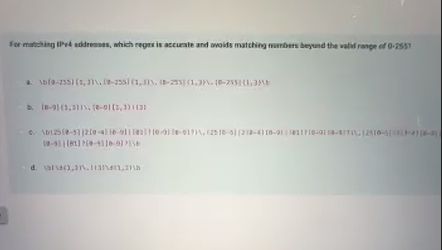

```
Ble 281 (4.5. =I CLIN (eDIELINE

feat i03

95). 12069) 2c 000-9)
Hou re-siie-0) ie

pan.inns.srs
```

---

## Question 4

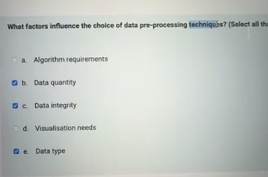

*(No text extracted)*

---

## Question 5


*(No text extracted)*

---

## Question 6

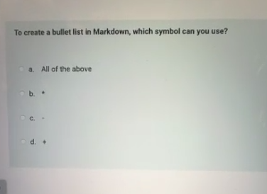

*(No text extracted)*

---

## Question 7


*(No text extracted)*

---

## Question 8

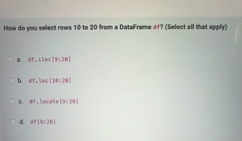

*(No text extracted)*

---

## Question 9


*(No text extracted)*

---

## Question 10


*(No text extracted)*

---

## Question 11

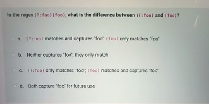

```
isthe difference between (7:

matches and captures “fox foo) enly matches Yoo!
captures “for theyonty match

only matches “os (02) matches and captures oo!

eaptre oo! for fire use
```

---

## Question 12


```
on can valve: (Select al htop)

ng undersendabilty of data
Removing elvan infermation
 teeng oxtertevant intormstion

‘Summarizing cometex dats
```

---

## Question 13

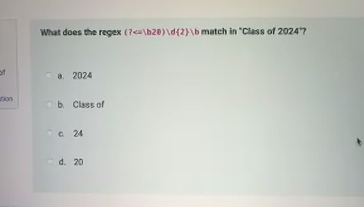

*(No text extracted)*

---

## Question 14

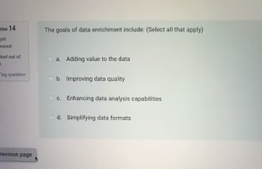

*(No text extracted)*

---

## Question 15


*(No text extracted)*

---

## Question 16


*(No text extracted)*

---

## Question 17


*(No text extracted)*

---

## Question 18

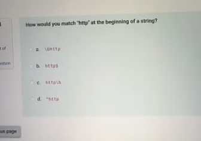

*(No text extracted)*

---

## Question 19

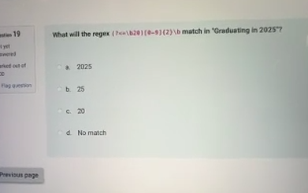

```
(roan (0-91 2)\0 ath
```

---

## Question 20

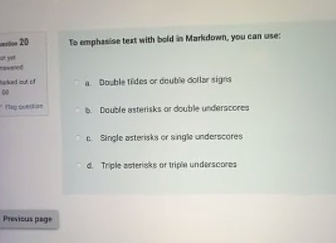

```
— e Sife ates cr ange ndeecores

6 ple cers origin underscores
```

---

## Question 21


*(No text extracted)*

---

## Question 22


*(No text extracted)*

---

## Question 23


```
“4 Tomaresn morons! nennaat ws

4. Wenptemngranaderany yin

nao ca poser
```

---

## Question 24


```
intain the original meaning of

In information retrieval tasks
c. For graphical data representation

|. When performing named entity recogni

In audio data processing
```

---

## Question 25

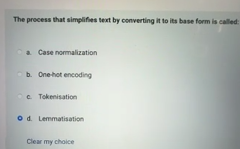

```
Lemmatisation

my choice
```

---

## Question 26


*(No text extracted)*

---

## Question 27

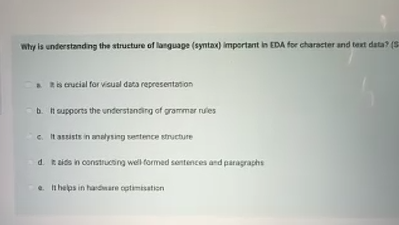

```
4. Ree ncensrvcom welfomed sartences edgar,

fees inrarcnae tmnt
```

---

## Question 28


```
functions wed ood 2 CSV fle?
```

---

## Question 29


```
2 cel

= coterie

4. festerieataird
```

---

## Question 30


```
2 at dome oes (2010)

pone btn 28
Tress VIF
6 Teast

4 Delany
```

---

## Question 31


```
ees we cunies

. On rere

engane un corse

“4. nnd sncred earch ramus
```

---

## Question 32


```
tet in pd rend_csv() specifies the:

elie
split
delinster

seo
```

---

## Question 33

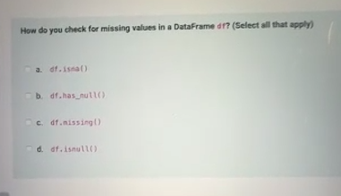

*(No text extracted)*

---

## Question 34

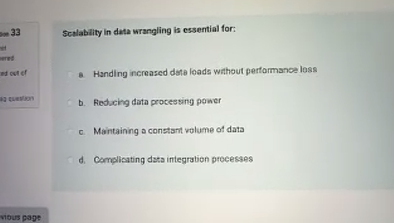

```
wrangling i esse or

creased dite loads wahout portance ess
dat procesting power
_ Mariainng 2 conetort volume of ra

‘Cemelicaing det inegration processes
```

---

## Question 35

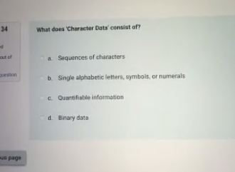

*(No text extracted)*

---

## Question 36


```
np eure dat i:

Ina consent format
“ony arate n oe unt of messuiement
& Incesistncacoesdetorets

4 Ofteut to size

7
```

---

## Question 37

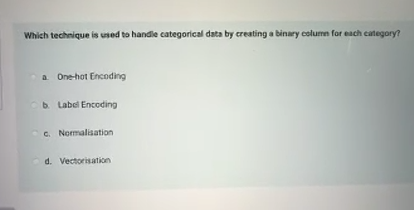

*(No text extracted)*

---

## Question 38


```
Representing relationships between entities
 &. gnoring entity relationships
> 6. Semple numerical analysis

Storing textual data only
```

---

## Question 39

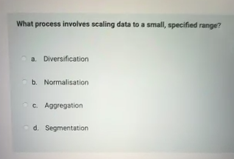

*(No text extracted)*

---

## Question 40


```
To.convert al the words into ether uppercase or lowercase
“Folncreaze the complexity of the text

Toidentfy and corect rammestia! errs
```

---

## Question 41

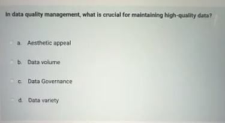

```
what is erucal for
```

---

## Question 42

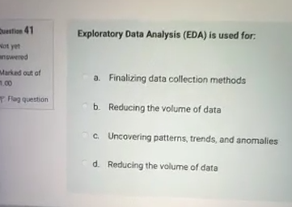

```
Data Analysis (EDA) is

Finalizing data collection methods
b Reducing the volume of data
© Uncovering pattems, rend, and anomalies

4. Reducing the volume of date
```

---

## Question 43


```
© b Addingtimereisted data
€ Cocecting data enore

d. Converting data into a binary format
```

---

## Question 44


```
Catsloging ais ns

| Making it harder to find and understand data
1. tgpcring data tineape
& Decreasing data woceestity

44. Crestng a zearchabecatsiog of dat asets
```

---

## Question 45

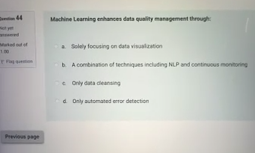

```
Learning enhances dts quality management

= a. Sale focusing on dete visualization

|b Acembination of ecnniqus including NLP 2d
~ & onyastaceanaing

1 & nly autorated rer detection

b
```

---

## Question 46

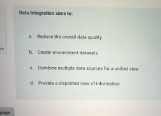

*(No text extracted)*

---

## Question 47


```
data anomabies refers «sng dota pi

“Complex Aromas
Conner Ancates
 Colkctn Anralen

Point tecrates
```

---

## Question 48


```
ify data is in the expected format

‘Validate range and constraints
Ensure data accurately reflects real-world entities

the speed of data retrieval
```

---

## Question 49

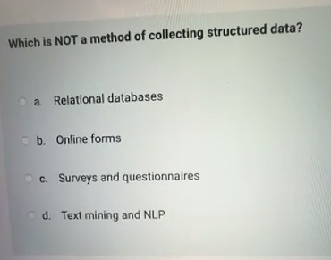

```
‘and questionnaires

mining and NLP
```

---

## Question 50


```
is NOT a part of the Data

‘Cataloging and Metadata Management
Exploration and Visualization

‘Encryption

Integration and Consolidation
```

---

## Question 51


```
that is organized and easily understandable by
timedia data
Social media content

‘that is disorganized and random
```

---

## Question 52


```
FIT5196 Data wrangling - $1 2025

Back

Question 1

Not yet
answered

Marked out of
1,00

¥ Flag question

In data wrangling, data validation ensures: (Select all that apply)

Da.

h

Data inconsistency is promoted

. Data meets predefined standards

Data is in a usable format for analysis

. Accuracy and reliability of data
```

---

## Question 53

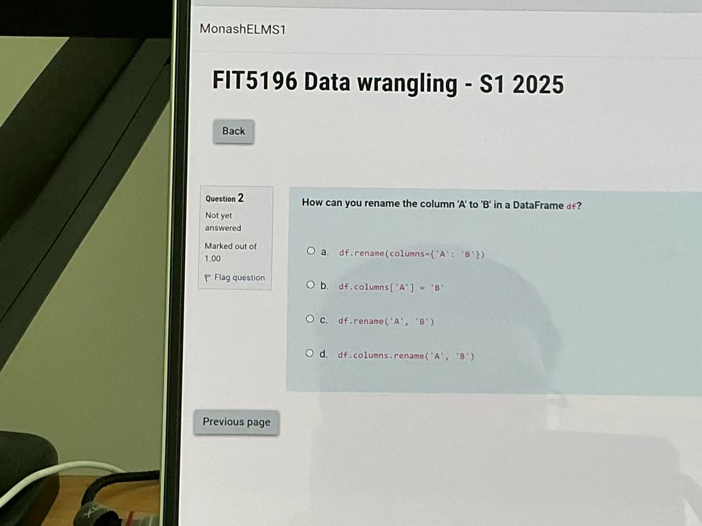

```
MonashELMS1

FIT5196 Data wrangling - $1 2025

Back
Question 2 How can you rename the column ‘A’ to 'B' in a DataFrame a+?
Not yet
answered
Mipcalennth O a. df.rename(columns={"A': ‘B'})

1.00

P Flag question
A O b. df.columns['a'] = *B°

Oc. df.rename(‘a', *B’)

Od, df.columns.rename(*A’, 'B8')

Previous page
```

---

## Question 54


```
MonashELMS1

FITS196 Data wrangling - $1 2025

Back
Question 3 Which regex finds all instances of "not" that are not immediately followed by "good"?
Not yet
answered
Marked out of O a. not(?! good)
1.00

F Flag question
Saneas O b. not(?= good)

O ¢. not(?=good)

Od. not(?!good)

Previous page
```

---

## Question 55

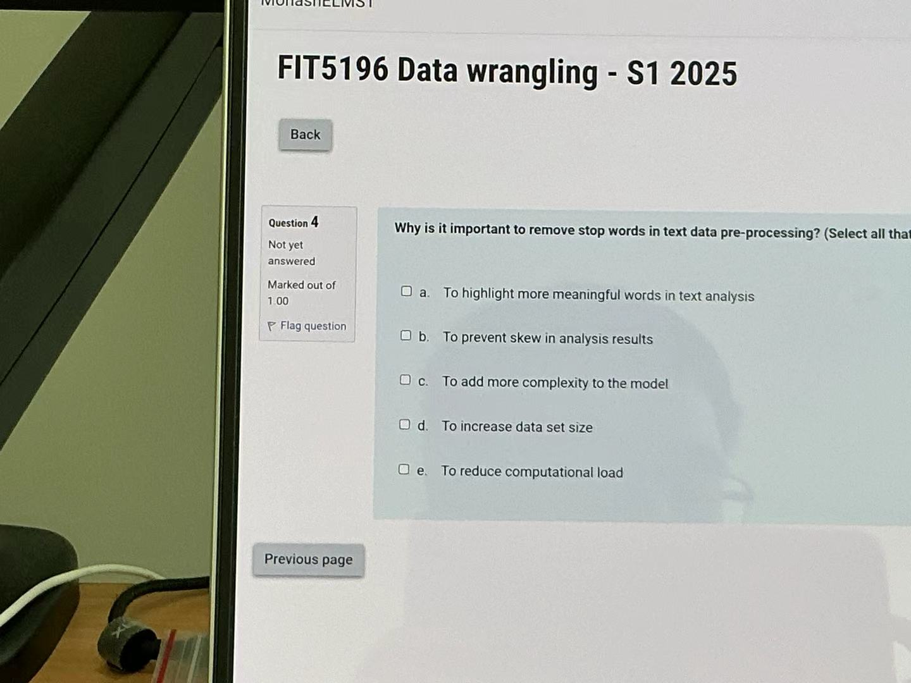

```
DNIMEGSHUELIVIO I

FIT5196 Data wrangling - $1 2025

Back

Question 4

Not yet
answered

Marked out of
100

¥ Flag question

Previous page

Why is it important to remove stop words in text data pre-processing? (Select all tha’

To highlight more meaningful words in text analysis

To prevent skew in analysis results

To add more complexity to the model

To increase data set size

To reduce computational load
```

---

## Question 56


```
Back

Question 9

Not yet
answered

Marked out of
1.00

F Flag question

Previous page

FIT5196 Data wrangling - $1 2025

What does the regex *[\w. +-]+@([\w-]+\.)+[a-zA-Z]{2, 7}$ not allow in the email username part?

O a, Spaces

O b. Underscore

Oc. Plus signs

Od. Digits
```

---

## Question 57


```
FIT5196 Data wrangling - $1 2025

Back

Question 6

Not yet
answered

Marked out of
1.00

¥ Flag question

Previous page

To read an Excel file into a DataFrame, which function is used?

. pd. load_excel()

. pd-read_excel()

. pd.read_csv()

. pd. import_excel()
```

---

## Question 58

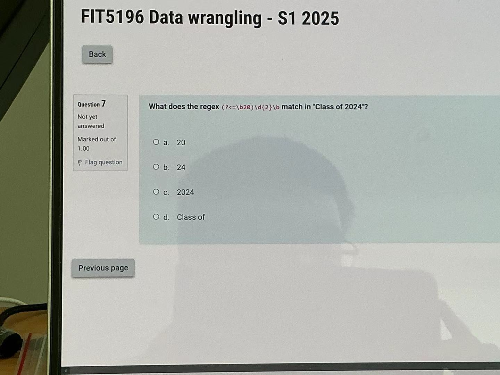

```
FIT5196 Data wrangling - $1 2025

_ Back
question 7 What does the regex (?<=\b20)\d{2}\b match in "Class of 2024"
Not yet
answered
Marked out of Oa 20
7,00
& Flag question Ob. 24
Oc. 2024
Od. Class of

Previous page
```

---

## Question 59


```
FIT5196 Data wrangling - $1 2025

Back

Question 8

Not yet
answered

Marked out of
1,00

F Flag question

Previous page

Which of the following are common goals of data wrangling? (Select all that apply)

Oa,

Increasing data complexity
Ignoring data inconsistencies
Improving data quality

Facilitating easier access to data
```

---

## Question 60

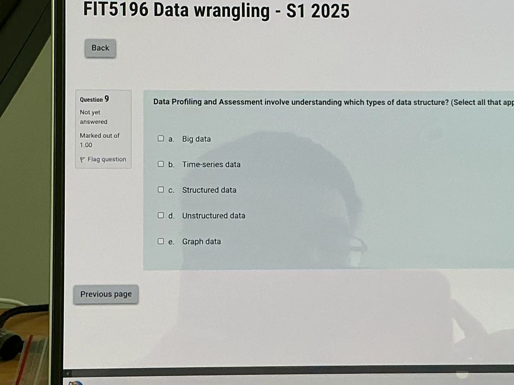

```
FIT5196 Data wrangling - $1 2025

Back
Question 9 Data Profiling and Assessment involve understanding which types of data structure? (Select all that apr
Not yet
answered
Marked out of Oa Big data
1.00 ‘

Flag question i
sare O b. Timeseries data

Oc. Structured data

O d. Unstructured data

O e. Graph data

Previous page
```

---

## Question 61


```
Fill 70 Vata Wrangling - oI ZUZo

Back
Question 10 Which metacharacter matches the beginning of a line?
Not yet
answered
Marked out of Oa -
1.00 i

¥ Flag question

Ob. |
Oc. \b
Od $

Previous page
```

---

## Question 62


```
Back

Question 13

Not yet
answered

Marked out of
1.00

¥ Flag question

Previous page

How would you match "cat" or "bat"?

Oa. [cb]at

Ob. cat||bat

Oc. (cb)at

Od. [c&bJat
```

---

## Question 63


```
Back

Question 14

Not yet
answered

Marked out of
1.00

¥ Flag question

Previous page

How do you set a DataFrame's column ‘ID’ as its index?

df.index = "ID"

df.set_index(‘ID')

df.set(‘ID")

df.index_col(‘ID")
```

---

## Question 64

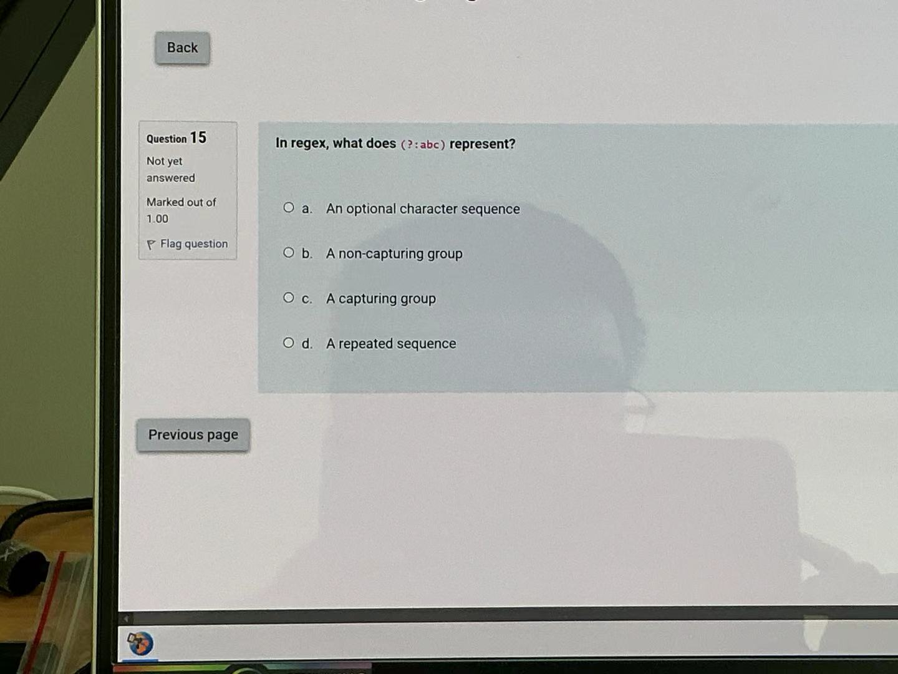

```
Back

Question 15

Not yet
answered

Marked out of
1.00

¥ Flag question

Previous page

In regex, what does (?: abc) represent?

An optional character sequence

A non-capturing group

A capturing group

A repeated sequence
```

---

## Question 65


```
Back

Question 16 Which data structures are essential for Data Discovery and Collection? (Select all that apply)
Not yet

answered

one CMe O a. Relational databases

> Flag question
Fahad ues? 0 b. Multimedia data

Oc. Graph data models

Od. Time-series data

Oe. Data warehouses

Previous page
```

---

## Question 66

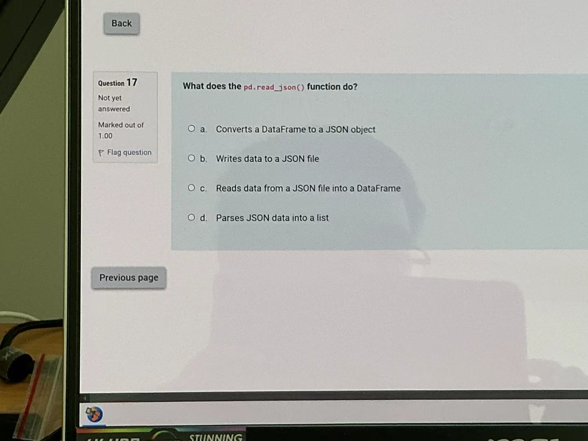

```
Back

Question 17

Not yet
answered

Marked out of
1,00

F Flag question

Previous page

What does the pd. read_json() function do?

O a. Converts a DataFrame to a JSON object
O b. Writes data to a JSON file
Oc. Reads data from a JSON file into a DataFrame

O d. Parses JSON data into a list
```

---

## Question 67

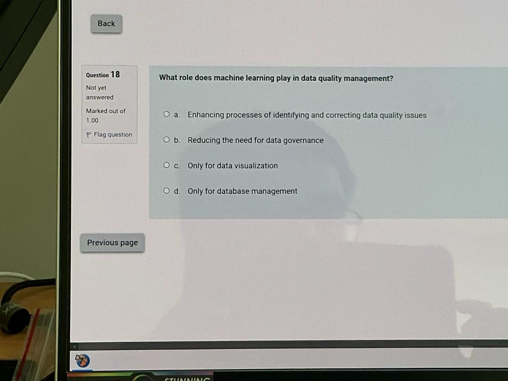

```
Back

Question 18 What role does machine learning play in data quality management?

Not yet

answered

Hee aoe © a. Enhancing processes of identifying and correcting data quality issues

¥ Flag question A
O b. Reducing the need for data governance

Oc. Only for data visualization

Od. Only for database management

Previous page
```

---

## Question 68


```
Back

Question 19 Factors to consider during the data collection phase include: (Select all that apply)
Not yet

answered

es otal O a. Collection method efficiency

& Flag question ass
a8 O b. Source reliability

Oc. Data format

O d. Cost of data storage physical locations

Previous page
```

---

## Question 69

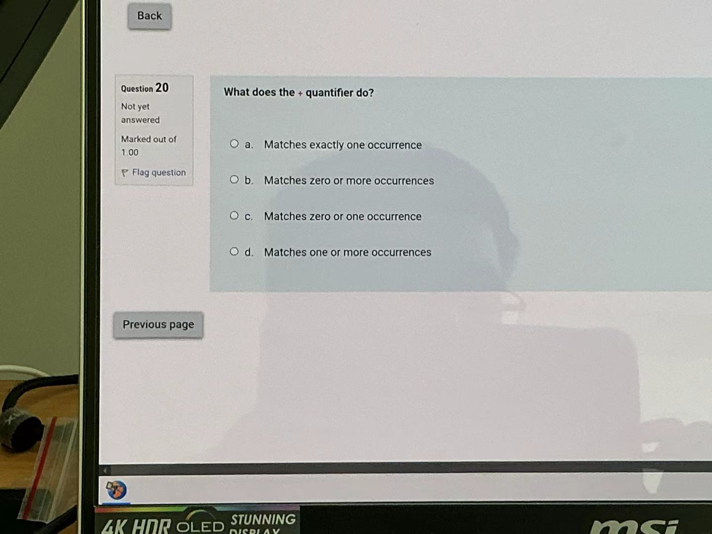

```
Back

Question 20

Not yet
answered

Marked out of
1,00

F Flag question

Previous page

What does the + quantifier do?

O a. Matches exactly one occurrence
O b. Matches zero or more occurrences
Oc. Matches zero or one occurrence

O d. Matches one or more occurrences

STUNNING
```

---

## Question 70

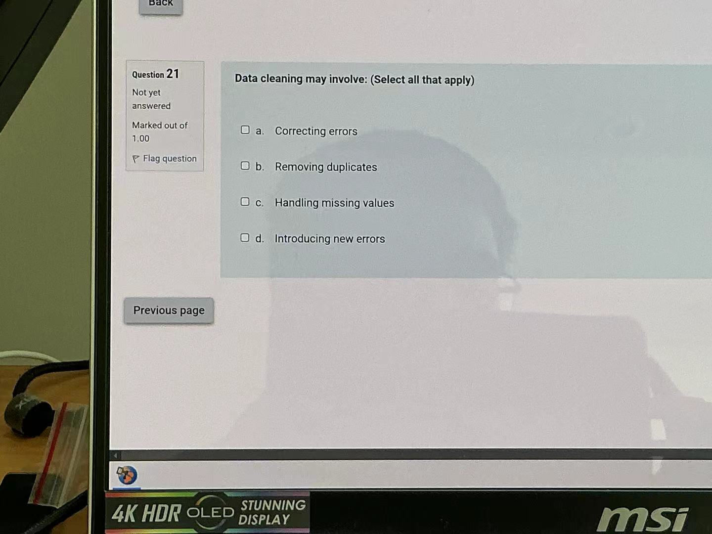

```
Path

Question 21

Not yet
answered

Marked out of Oa

Correcting errors
1.00

FI i i i
¥ Flag question © b. Removing duplicates

Oc. Handling missing values

O d. Introducing new errors

Previous page

1, STUNNING
4K HDR OLED pispray

Data cleaning may involve: (Select all that apply)
```

---

## Question 71


```
Back

Question 22

Not yet
answered

Marked out of Oa

Descriptive statistics
1.00

e Fl 7
ae Ob. Encoding
Oc. Tokenisation

Od. Vectorisation

O e. Normalisation

Previous page

STUNNING
4K HDR OLED pispray

Which techniques are essential for handling numerical data in EDA? (Select all that apply)
```

---

## Question 72

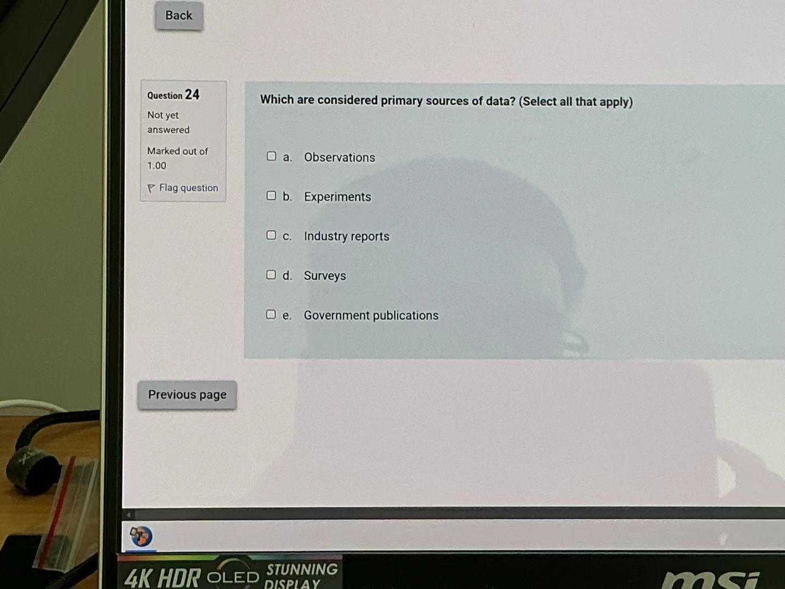

```
Back

Question 24

Not yet
answered

Marked out of
1.00

¥ Flag question

Previous page

4K HDR Ove

Which are considered primary sources of data? (Select all that apply)

O a. Observations
O b. Experiments

O c. Industry reports
Od. Surveys

O e. Government publications

STUNNING

> 4
```

---

## Question 73

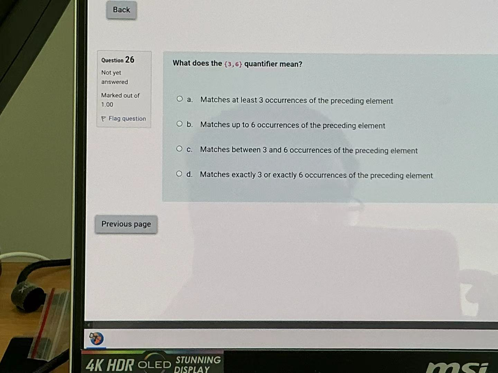

```
Back

Question 26 What does the {3,6} quantifier mean?
Not yet
answered

Marked out of
1.00

(0)
ry

Matches at least 3 occurrences of the preceding element
¥ Flag question
© b. Matches up to 6 occurrences of the preceding element

Oc. Matches between 3 and 6 occurrences of the preceding element

O d. Matches exactly 3 or exactly 6 occurrences of the preceding element

Previous page

4K HOR ees STUNNING
```

---

## Question 74

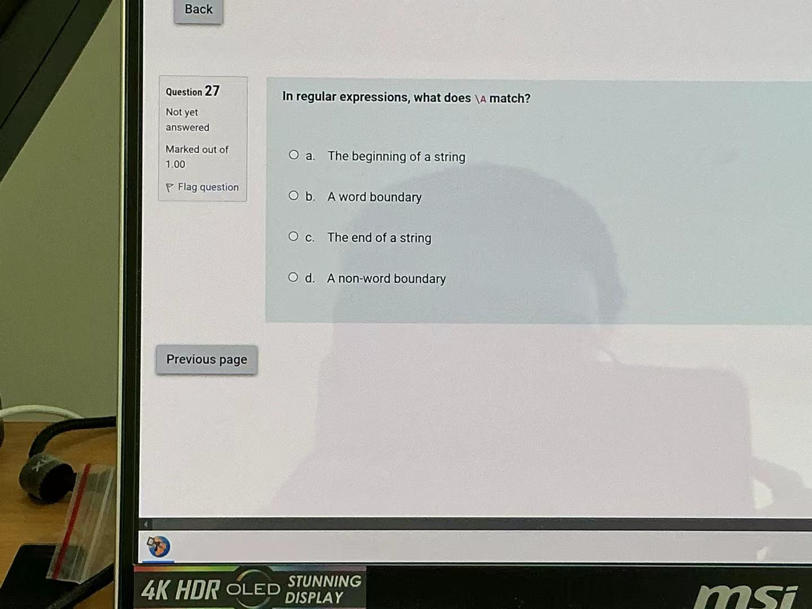

```
Back

Question 27

Not yet
answered

In regular expressions, what does \a match?

Marked out of Oa.

00 The beginning of a string

Fi
Seep © b. Aword boundary
Oc. The end ofa string

O d. Anon-word boundary

Previous page

STUNNING
4K HOR ¢ HOR Sep Sunn
```

---

## Question 75

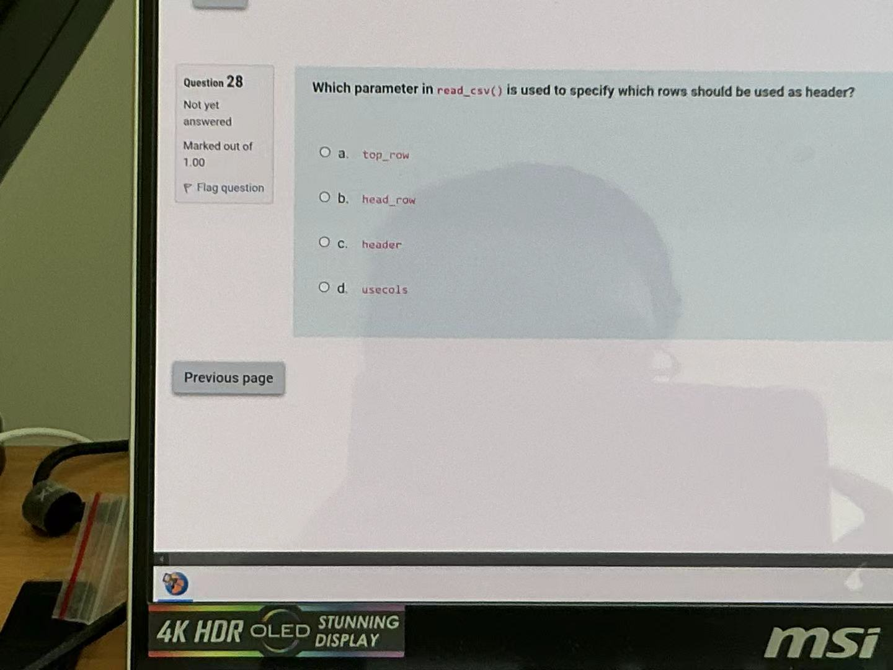

```
Question 28

Not yet
answered

Which parameter in read_csv() is used to specify which rows should be used as header?

Marked out of Oa

top_row
1.00
F Flag question
Ob. head_row
Oc. header
Od. usecols

Previous page

4 STUNNING
4K HDR OLED pispray

oa
```

---

## Question 76


```
Back

Question 29

Not yet
answered

What does the regex *(?!.*\bfoa\b).*$ ensure about the matched strings?

Marked out of Oa

A They must not contain "foo"

r Fl tion
Nel O b. They must contain “foo”

Oc. They start with "foo"

Od, They end with "foo"

Previous page

44 STUNNING ry: ;
4K HDR OLED pispray 4
```

---

## Question 77

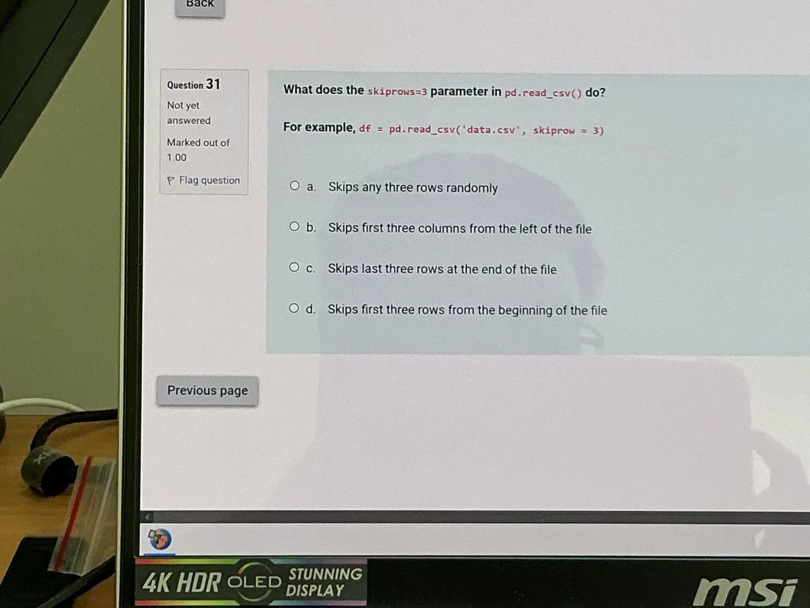

```
DACK

Question 31

Not yet
answered

Marked out of
1.00

F Flag question

Previous page

4K HDR SLED

What does the skiprows=3 parameter in pd.read_csv() do?

For example, df = pd.read_csv(‘data.csv", skiprow

= 3)

O a. Skips any three rows randomly

O b. Skips first three columns from the left of the file

O c. Skips last three rows at the end of the file

O d. Skips first three rows from the beginning of the file
STUNNING

DISPLAY

—

WW23si
```

---

## Question 78


```
Back

Question 32 Which method would you use to sort a DataFrame df by the column ‘Name’?

Not yet
answered

Marked out of Oa.

df.rank('Name")
1.00

& Flag question
3 Ob. df.sort_values(by='Name')

Oc. df.sort_by('Name')

Od. df.sort('Name")

Previous page

7 ED STUNNING
4K HDR OLED pispray
```

---

## Question 79

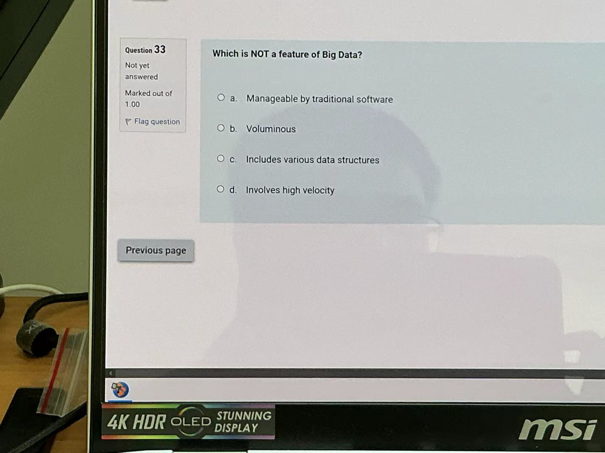

```
Question 33 Which is NOT a feature of Big Data?
Not yet
answered

Marked out of Oa

an Manageable by traditional software

¥ Flag question
O b. Voluminous

O c. Includes various data structures

O d. Involves high velocity

Previous page

STUNNING
4K HOR ¢ OLED P DISPLAY

=
```

---

## Question 80


```
Nett)

Question 34

Not yet
answered

What does simplifying access to data aim to achieve?

Marked out of Oa

i Increase the complexity of data access

> Flag question , 5 ;
eds O b. Organise data in a user-friendly manner

Oc, Make data accessible only to data scientists

Od. Restrict data access

Previous page

4K HOR Sep ED pisplar msi

me
```

---

## Question 81

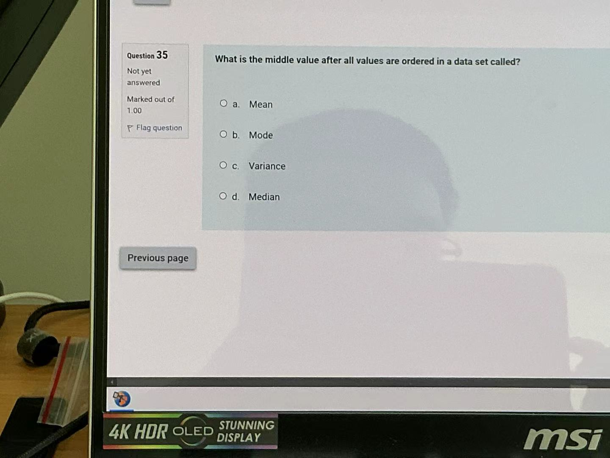

```
Question 35

Not yet
answered

Marked out of
1.00

4K HOR

¥ Flag question

Previous page

Va
OLE

What is the middle value after all values are ordered in a data set called?

O a. Mean
O b. Mode
Oc. Variance

Od. Median

D STUNNING
DISPLAY
```

---

## Question 82

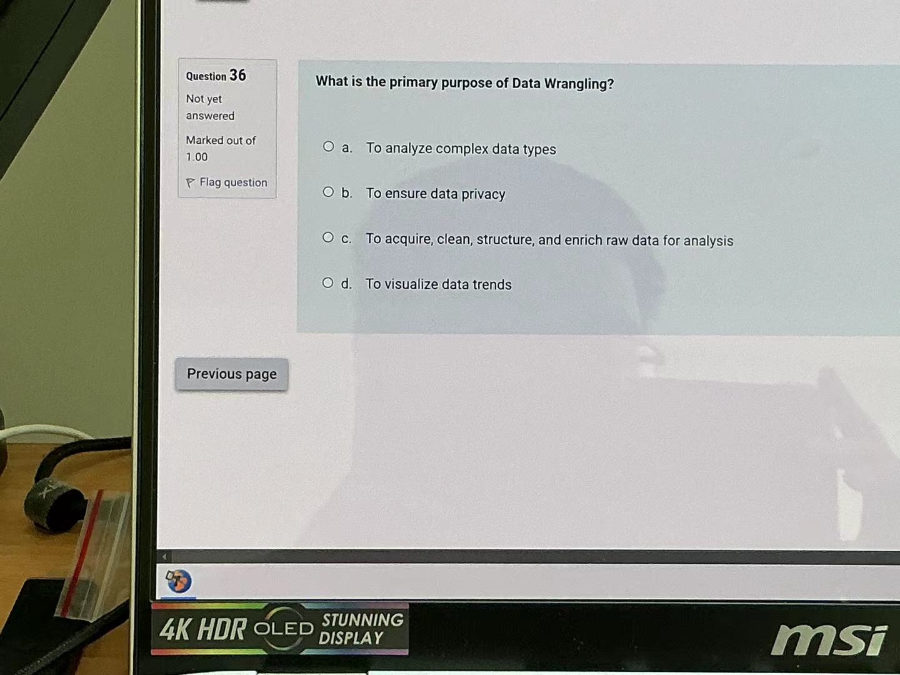

```
Question 36 What is the primary purpose of Data Wrangling?

Not yet
answered

Marked out of

q100 O a. To analyze complex data types

e Fil juesti a
AEE © b. Toensure data privacy

Oc. To acquire, clean, structure, and enrich raw data for analysis

O d. To visualize data trends

Previous page

~ STUNNING
4K HOR OLED P DISPLAY

eT
```

---

## Question 83


```
Question 37

Not yet
answered

Marked out of
1.00

¥ Flag question

Previous page

4K HOR Ee E

What does data enrichment not involve?

O a. Creating new variables
O b. Reducing data insights
O c. Adding external context

O d. Enhancing data with additional information

5 STUNNING
> DISPLAY

a)
```

---

## Question 84

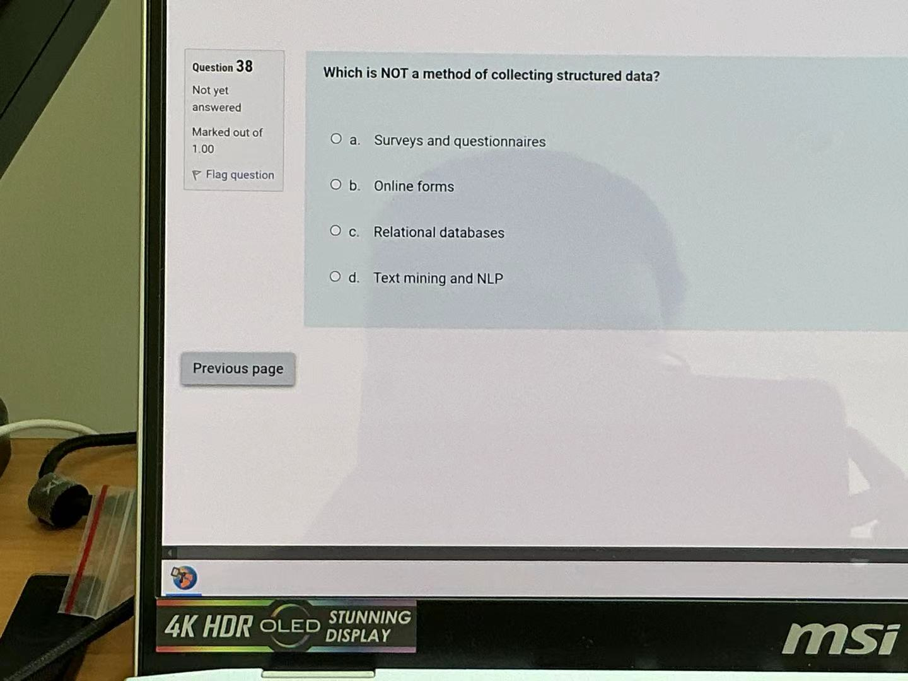

```
Question 38 Which is NOT a method of collecting structured data?

Not yet
answered

Marked out of Oa

108 Surveys and questionnaires

& Flag question :
p O b. Online forms

Oc. Relational databases

O d. Text mining and NLP

Previous page

4 STUNNING
4K HOR OLED pispray y
```

---

## Question 85


```
Question 39

Not yet
answered

Marked out of
1.00

¥ Flag question

Previous page

4K HOR £0

~ “

Which phase comes immediately after data discovery?

O a. Data storage
© b. Data collection
Oc. Data cleaning

Od. Data analysis

STUNNING
DISPLAY
```

---

## Question 86

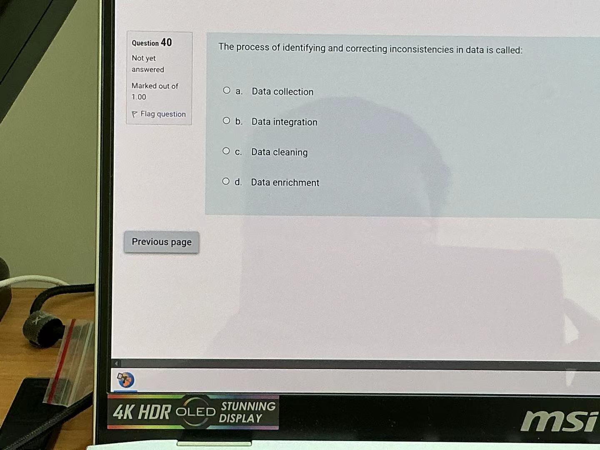

```
Question 40
Not yet

The process of identifying and correcting inconsistencies in data is called:

answered

Marked out of Oa

Data collection
1.00

F Flag question

O b. Data integration
Oc. Data cleaning

O d. Data enrichment

Previous page

} oo
STUNNING
4K HDR OLED pispray

ow
```

---

## Question 87


```
Question 41 Facilitating data integration helps with:

Not yet
answered

Marked out of Oa

aint Ignoring data quality

¥ Fl ti pater
sooo Ob. Keeping data in isolated systems

Oc. Transforming disparate data into a common format

Od. Making it harder to combine data from different sources

Previous page

Af STUNNING
4K HDR OM©D pispray

ae a
```

---

## Question 88


```
Question 42 Which of the following is crucial for preparing text for NLP tasks?
Not yet

answered

Marked out of Ola

Variance Calculation
1.00

¥ Flag question 2 rt
x8 O b. Tokenization

Oc. Normalization

O d. Image Encoding

Previous page

-— “STUNNING ex =
4K HDR O-£0 pispray aks
```

---

## Question 89

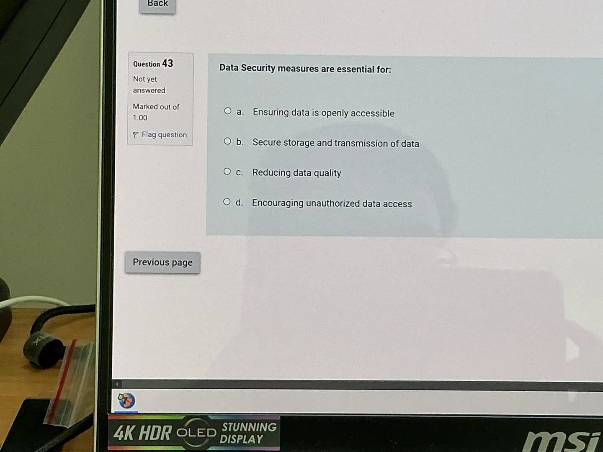

```
back

Question 43 Data Security measures are essential for:

Not yet
answered

Marked out of Oa

A Ensuring data is openly accessible

¥ Flag question ;
© b. Secure storage and transmission of data

Oc. Reducing data quality

© d. Encouraging unauthorized data access

Previous page

“1. STUNNING
4K HDR OLED pispiay
```

---

## Question 90

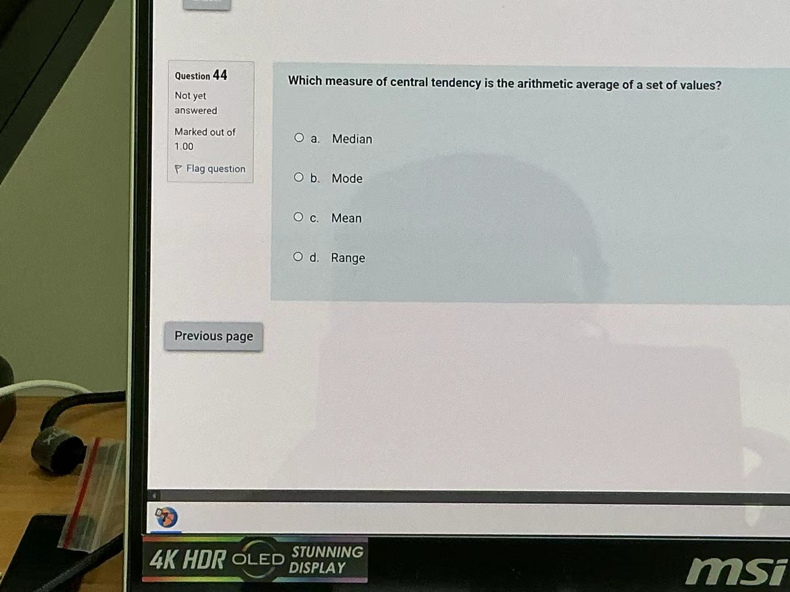

```
Question 44

Not yet
answered

Marked out of Oa. Median

1.00

F Flag question Oh Wee
Oc. Mean
Od. Range

Previous page

F 405 SIUNNING
4K HDR OLED pispiay

Which measure of central tendency is the arithmetic average of a set of values?

by
```

---

## Question 91

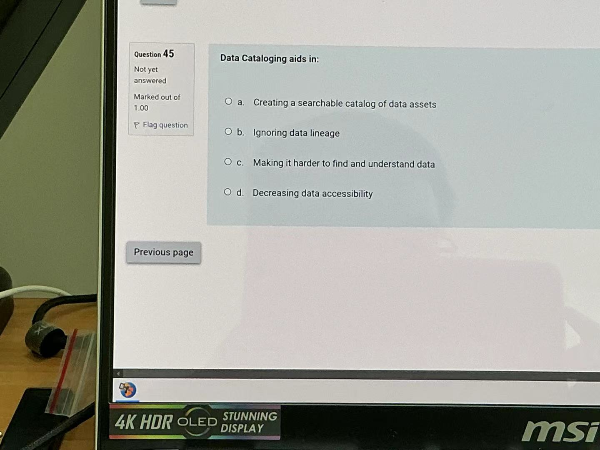

```
Question 45

Not yet
answered

Marked out of
1.00

¥ Flag question

Previous page

4K HDR Led

Data Cataloging aids in:

O a. Creating a searchable Catalog of data assets
O b. Ignoring data lineage
Oc. Making it harder to find and understand data

O d. Decreasing data accessibility

STUNNING
DISPLAY

a
```

---

## Question 92

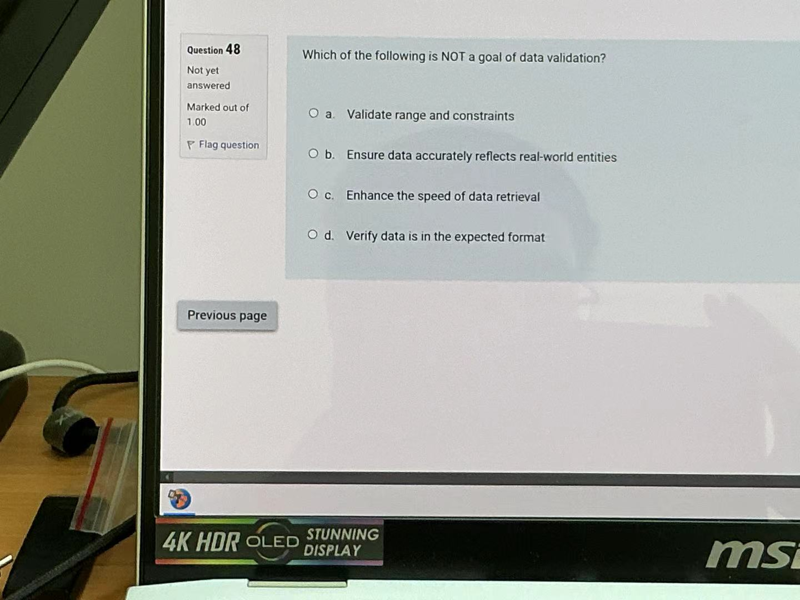

```
Question 48 Which of the following is NOT a goal of data validation?

Not yet
answered

Marked out of Oa

469 Validate range and constraints

¥ Flag question 5
© b. Ensure data accurately reflects real-world entities

O c. Enhance the speed of data retrieval

O d. Verify data is in the expected format

Previous page

Wn 4 <.. SIUNNING
4K HOR OLED pispiay
```

---

## Question 93

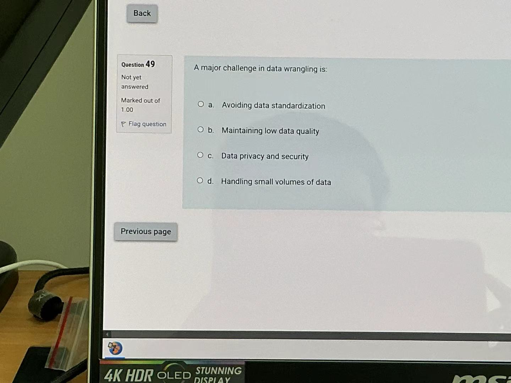

```
Back

Question 49 A major challenge in data wrangling is:

Not yet
answered

Marked out of

GR Oa. Avoiding data standardization

Fi
see O b. Maintaining low data quality

Oc. Data privacy and security

O d. Handling small volumes of data

Previous page
```

---

## Question 94

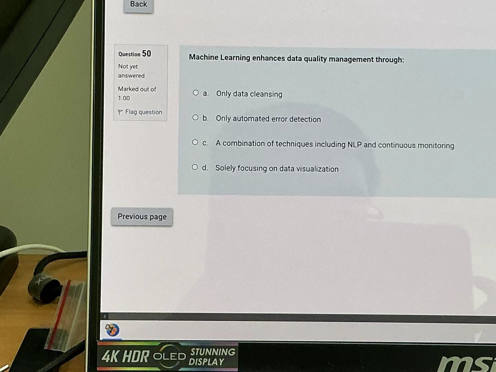

```
Back

Question 50 Machine Learning enhances data quality management through:

Not yet
answered

Marked out of Oa

Only data cleansi
ae ly cleansing

V Fla stion
bees! Ob. Only automated error detection

Oc. Acombination of techniques including NLP and continuous monitoring

O d. Solely focusing on data visualization

Previous page

“STUNNING
4K HDR OLED pispiay ad,
```

---

## Question 95


```
1gex matches a string if it starts with "http://" and d

ttp:\/\/ (2 Lwww\. )
```

---

## Question 96


```
WwW £§ wT DP Be CE UC Lt hel memnlte bo Ptinctr tant bed ww &

K
2 For what reasons might isati : t
- ight case normalisation not always be needed in text data pre-processing? (Select all that apply)
d
gue! q._ In information retrieval tasks
question :
b. In audio data processing
c. For graphical data representation
d. When performing named entity recognition
e. To maintain the original meaning of words
fious page

— nil
```

---

## Question 97


```
| oo ae ee ek ee Ue ieee emmicaiiet MOI dicts.’ Ma wt @= WW @e Ww

ack

| Time left 0:58:2

ion 3 : What does the regex \A(?: [0-9a-fA-F]{2}: ) {5} [0-9a-fA-F ] {2}\z match?

jet
vered

= out of a. An\Pv6 address

-lag question

b. AMAC address
c. An\Pv4 address

d. Anemail address

Previous page
```

---

## Question 98

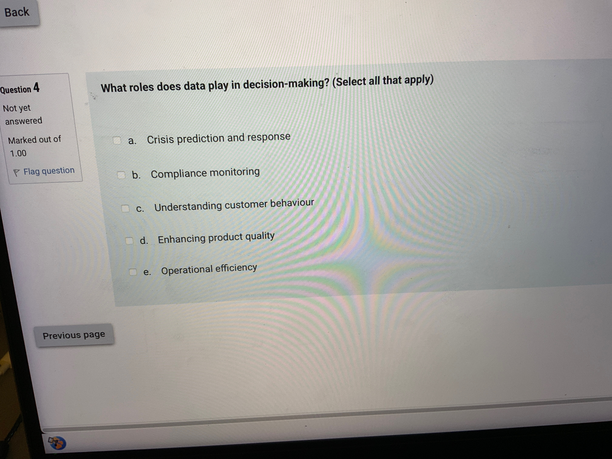

```
Question 4 f What roles does data play in decision-making? (Select all that apply)

Not yet
answered

Marked out of ee ee
ae a. Crisis prediction and response

¥ Flag question ee
b. Compliance monitoring
c. Understanding customer behaviour

d. Enhancing product quality

e. Operational efficiency

- Previous page

oriisracs Ra es TREE semi eeRUR EES TES SS pees Tae SS
Es PAs nee ee ee Ro ES a
```

---

## Question 99


*(No text extracted)*

---

## Question 100

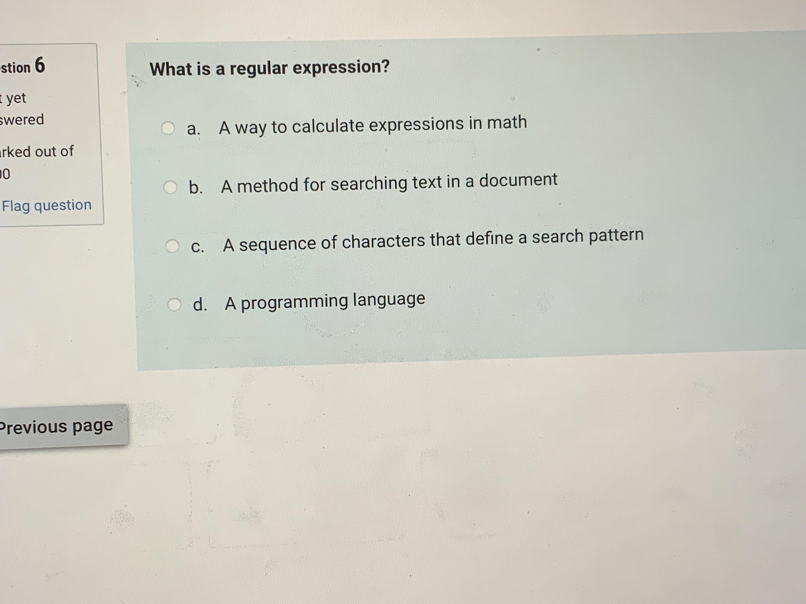

```
stion 6

‘yet
swered

rked out of
10

Flag question

>revious page ©

TTT

_ Whatisa regular expression?

a. Away to calculate expressions in math
b. Amethod for searching text in a document
c. Asequence of characters that define a search pattern

d. Aprogramming language
```

---

## Question 101

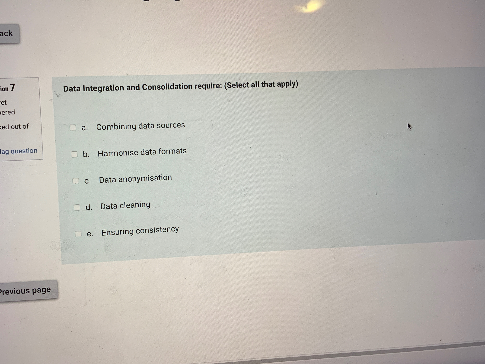

```
_ Data Integration and Consolidation require: (Select all that apply)

ion 7

et "|
jered Ce v7
ed outiol > a Combiningdatasources :
lag question : | : | a
| - — b. Harmonise data formats
p e. Ensuring consistency
```

---

## Question 102

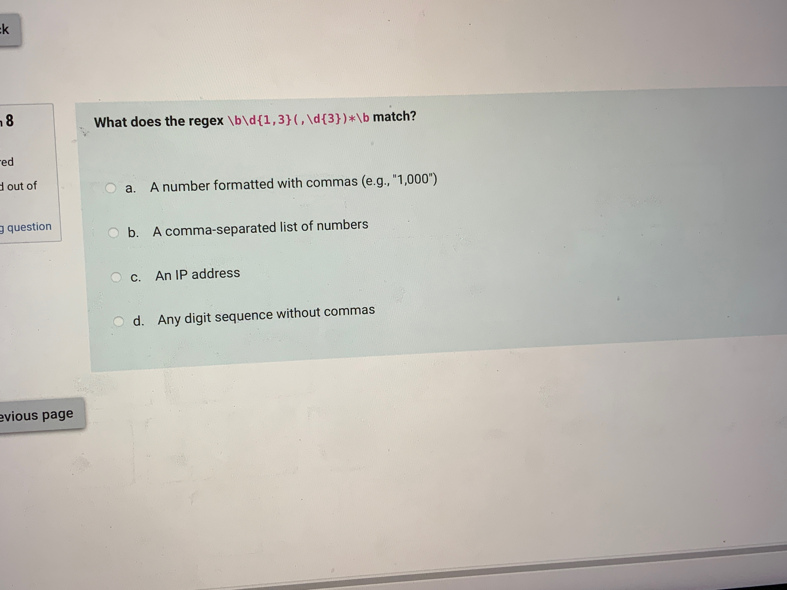

```
__ What does the regex \b\di{1.,3}(, \d{3})*\b match?
ed cl | |
ot ~~ a. Anumber formatted with commas (e.g.,"1,000")
j question , cs : : : . io
i () b: A comma-separated list ofnumbers : a
Oc. AnlPaddress — | ca a
, Cd Any digit sequence without commas a |
```

---

## Question 103


```
OK

11 : How do you select a single column named ‘Age’ from a DataFrame df? (Select al that apply)
ed

} question
: b. df.select(*Age”)

c. df.index('Age')

d. df.Age

ious page

Se
```

---

## Question 104

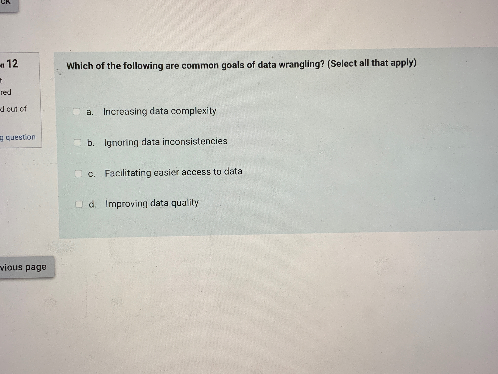

```
CA

n 12 : Which of the following are common goals of data wrangling? (Select all that apply)
t
red
d out of
a. Increasing data complexity
g question : : :
b. Ignoring data inconsistencies

c. Facilitating easier access to data

d. Improving data quality

vious page

ST
```

---

## Question 105


```
13

_ Which technique is used to handle categorical data by creating a binary column for each category?

out of

a. Label Encoding
question : :
b. Vectorisation

c. One-hot Encoding

d. Normalisation

ous page

ST
```

---

## Question 106

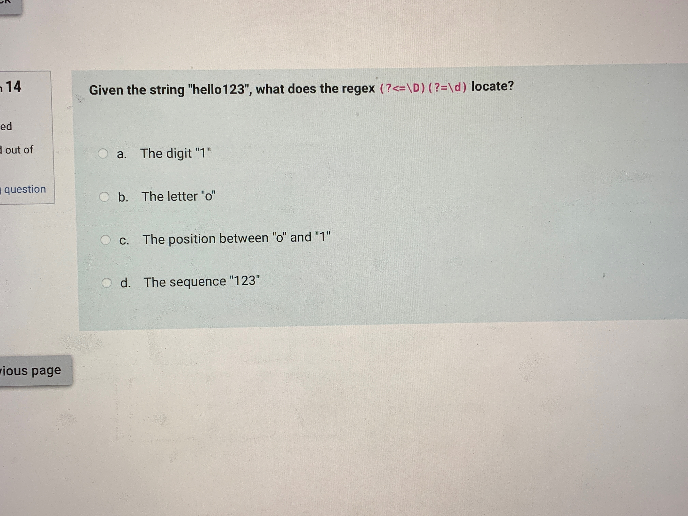

```
ik

114 : Given the string "hello123", what does the regex (?<=\D) (?=\d) locate?

ed
| out of a ~bhe digit 1:

| question Se
ae b. The letter ‘o

c. The position between "o" and "1"

d. The sequence "123°

ious page

I
```

---

## Question 107


```
bE)

- Ethical considerations in Data Collection include: (Select all that apply)

ut of a. Privacy and anonymity

uestion
b. Informed consent
c. Data retention and disposal

d. Data beautification

e. Compliance with laws and regulations

US page ©
```

---

## Question 108

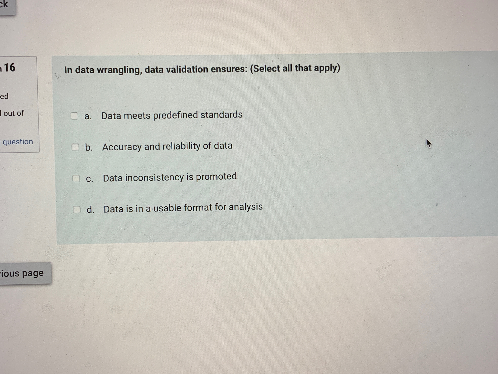

```
116

In data wrangling, data validation ensures: (Select all that apply)

ed

ao a. Data meets predefined standards

question eet.
, =: b. Accuracy and reliability of data

c. Data inconsistency is promoted

d. Data is in a usable format for analysis

ious page ©

ae
```

---

## Question 109


```
18

_ To drop rows with any missing values in the data frame df, you use:
d
BES ya dt.tilinal)

question
ees b. df.dropna()

. c. df.remove_na()

d. df.delete_missing()

ous page ~

Seana
```

---

## Question 110


```
19

: Which data types are primarily analysed during EDA? (Select all that apply)
d
ao a. Audio Data

juestion
b. Categorical Data

c. Numerical Data
d. Text Data

e. Image Data

ous page
```

---

## Question 111

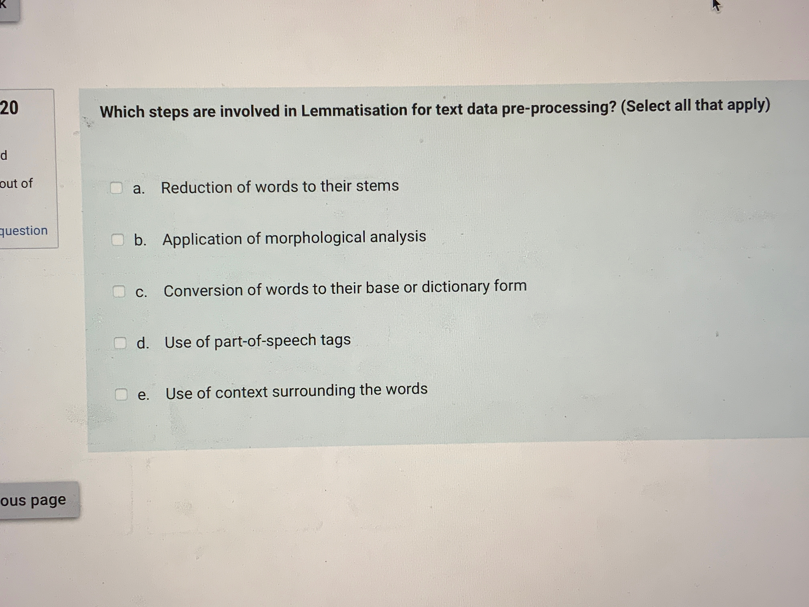

```
20 % Which steps are involved in Lemmatisation for text data pre-processing? (Select all that apply)
d
eo a. Reduction of words to their stems

juestion : : : !
j b. Application of morphological analysis

c. Conversion of words to their base or dictionary form
d. Use of part-of-speech tags

e. Use of context surrounding the words

OuS page |
```

---

## Question 112

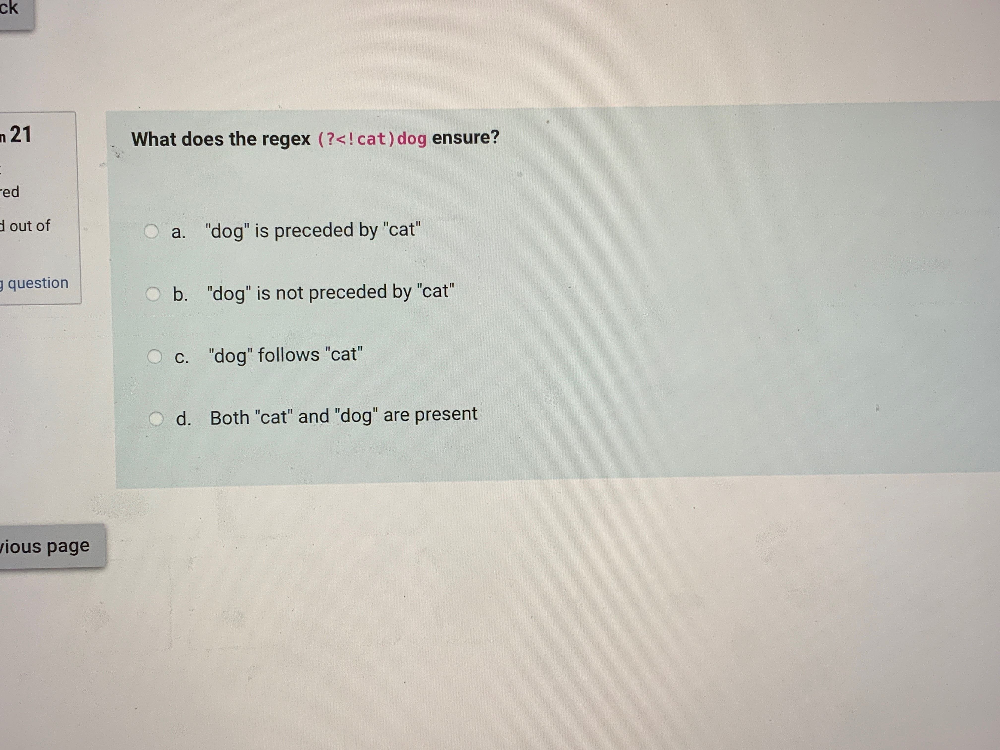

```
C

21

_ What does the regex (?<! cat) dog ensure?
ed
1 out of " ne " fT
a. "dog' is preceded by ‘cat

j question
a b. "dog" is not preceded by ‘cat’

c. "dog' follows "cat’

d. Both "cat" and "dog’ are present

fious page —

eee eee”
```

---

## Question 113

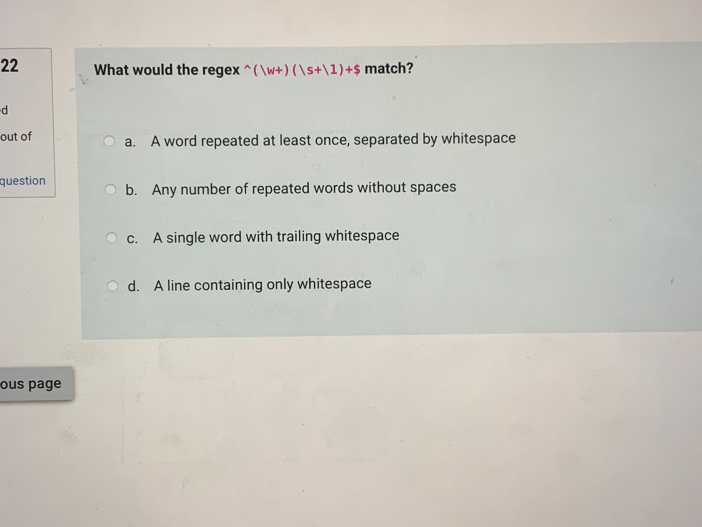

```
22 : What would the regex *(\w+) (\s+\1)+$ match?

d
out of

a. Aword repeated at least once, separated by whitespace

question :
i eee b. Any number of repeated words without spaces

c. Asingle word with trailing whitespace

d. Aline containing only whitespace

ous page
```

---

## Question 114

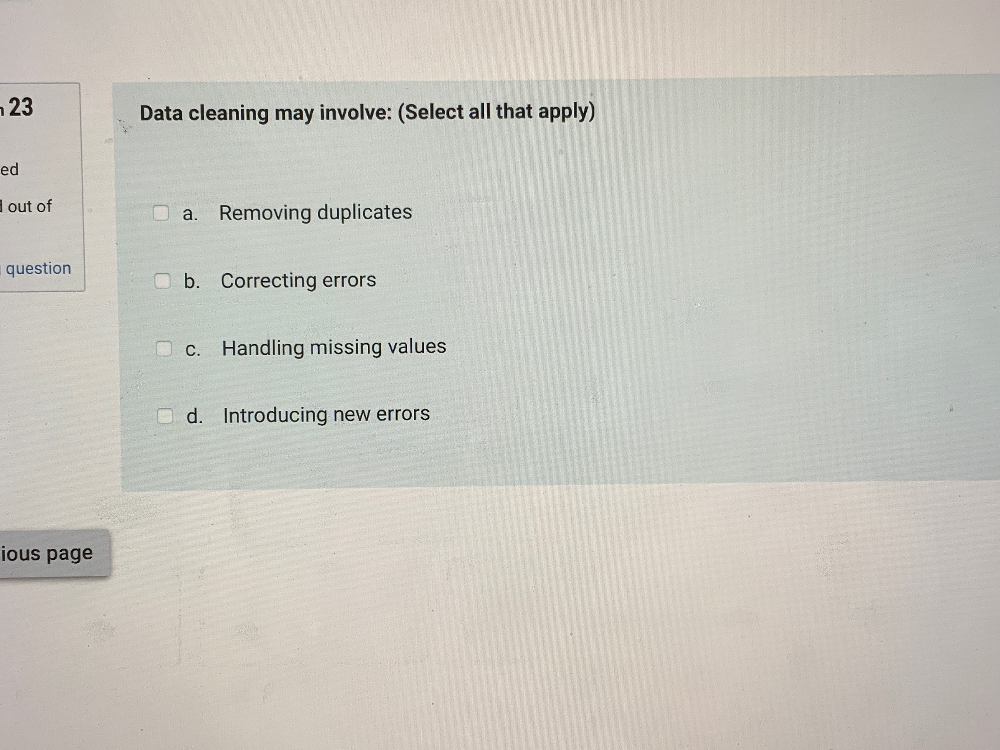

```
123

_ Data cleaning may involve: (Select all that apply)
ed
| out of

a. Removing duplicates

question
| b. Correcting errors

c. Handling missing values

d. Introducing new errors

ious page
```

---

## Question 115

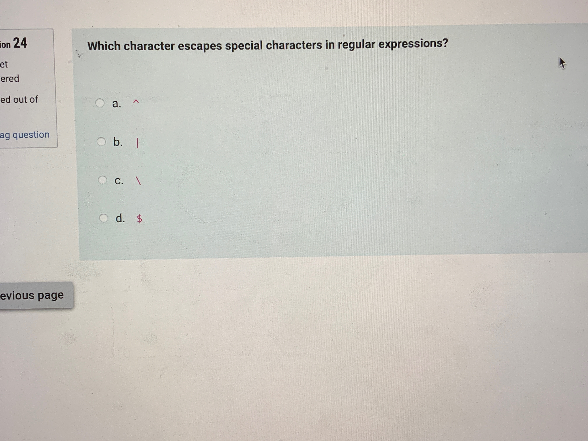

```
ion 24

et

_ Which character escapes special characters in regular expressions?

ered

ed out of 2h es

ag question Bb
Ge NX
qd s$

evious page
```

---

## Question 116

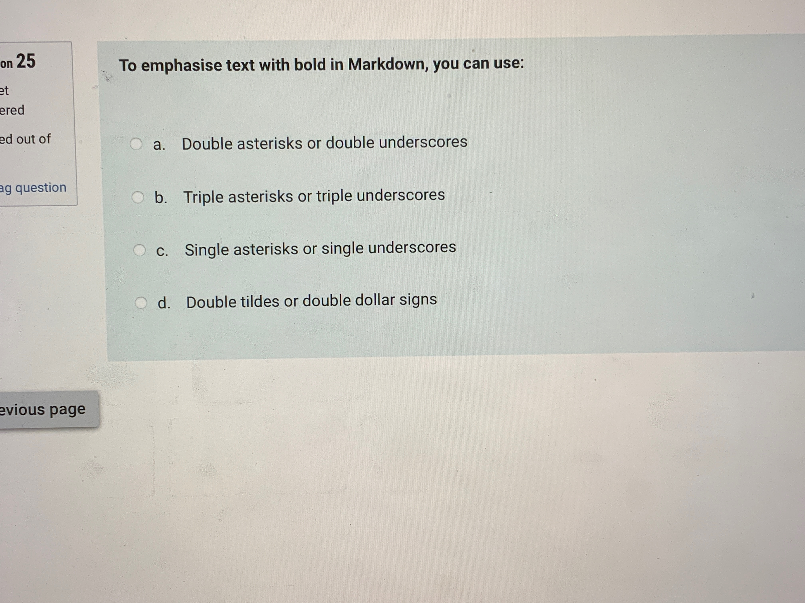

```
on 20

at
ored

_ To emphasise text with bold in Markdown, you can use:

ed out of a. Double asterisks or double underscores

4g question : : :
| b. Triple asterisks or triple underscores

c. Single asterisks or single underscores

d. Double tildes or double dollar signs

avious page

I
```

---

## Question 117


```
26

_ What is the function of the ? quantifier?
ad
out of

a. Matches one or more occurrences

question
: b. Matches zero or more occurrences

c. Matches zero or one occurrence

d. Matches exactly one occurrence

lous page
```

---

## Question 118

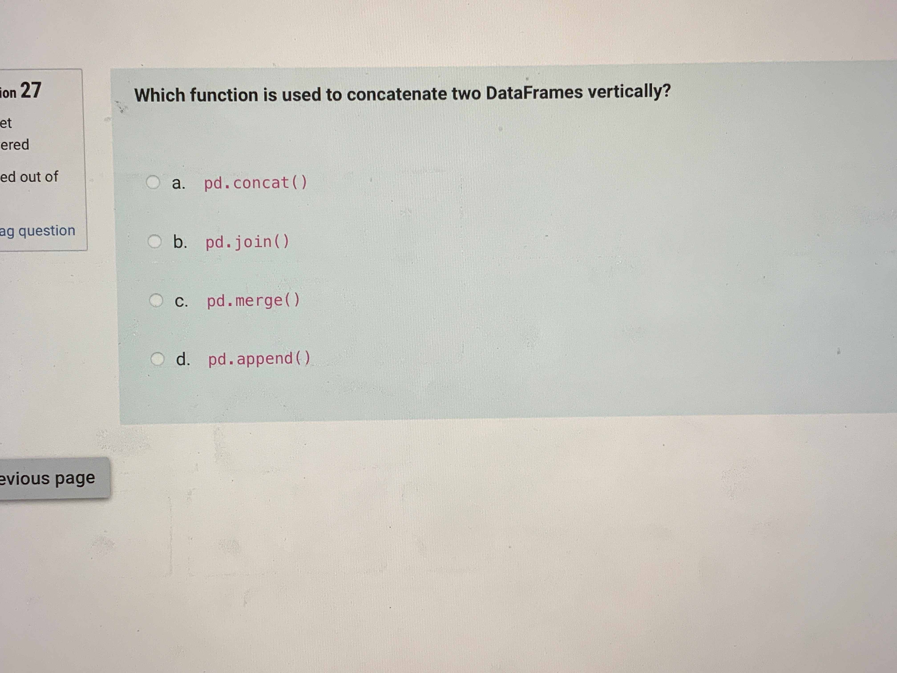

```
ion 27 Which function is used to concatenate two DataFrames vertically?
et | ;
ered

ed out of a. pd.concat()

ag question
ae bi: pd.join()

c. pd.merge()

) d. pd.append()

avious page

een eee
```

---

## Question 119


```
28 : Effective data validation checks are: (Select all that apply)

d

out of

ue

Completeness checking

question

b. Range checking

©

Encryption methods

d. Consistency checking

OuS page |
```

---

## Question 120


```
n29

[
red

: Which method is used to get a summary of a DataFrame's structure and column types?

d out of a. df.overview()

} question
| b. df.summary()

c. df.describe()

ad. df.into()

vious page
```

---

## Question 121


```
n 30
t
red

_ Data integration challenges include:

d out of

S

Combining data of varying formats and quality

g question ee are
ae b. Maintaining data in disparate formats

O

Simplifying the combination of similar data

d. Ignoring data from different sources

vious page
```

---

## Question 122

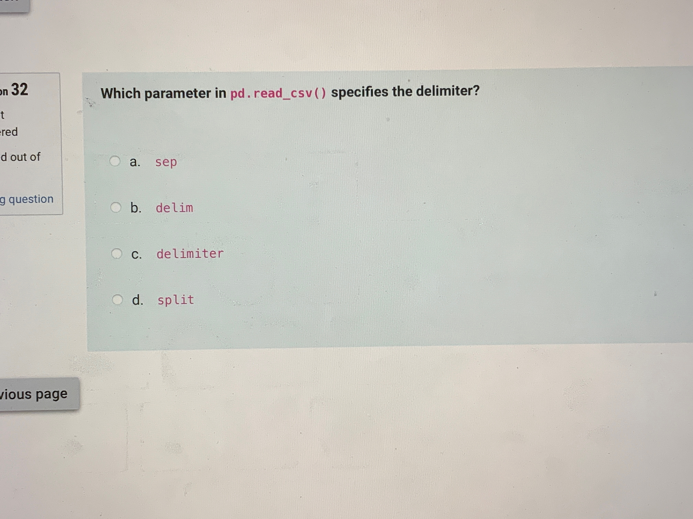

```
n 32

_ Which parameter in pd. read_csv() specifies the delimiter?

t

red

d out of a. sep

g question
ee b. delim

c. delimiter

G@ split

yious page ©

I TT TT I TT
```

---

## Question 123


```
133

‘ed

1 out of

} question

rious page

_ Whatis the aim of using Descriptive Statistics in EDA for Numerical Data?

a. TO manipulate the dataset
b. To encode textual information into numerical values

c. To provide insights into the central tendency, dispersion, and distribution shape

d. To visualize data in 3D
```

---

## Question 124


```
on 34 . What does continuous data represent?
at |
ered

ed out of a. Visual information encoded digitally

ag question : : : Led : i
a b. Quantifiable information that can be divided infinitely

c. Single alphabetic letters or symbols

d. Countable values or categories

vious page

a ae eae beennneenee eemeinall
```

---

## Question 125


```
~ Back

Question 39 < Which type of data anomalies refers to a single data point deviating significantly from the rest?
Not yet |

answered

ae oe a. Collective Anomalies

¥ Flag question : :
b. Point Anomalies

c. Complex Anomalies

d. Contextual Anomalies

_ Previous page
```

---

## Question 126


```
n 36 __. Data duplication is an example of:

E
red

d out of

y

Regular expression pattern
} question eee
: | b. Data quality issue

c. Data wrangling task

d. Data anomaly

sious page
```

---

## Question 127


```
on 3] : Qualitative Data is:
at :
ered

ed out of a. Descriptive and conceptual

4g question
| = b. Only numerical

c. Limited to structured research instruments

d. Exclusively about quantities

vious page
```

---

## Question 128

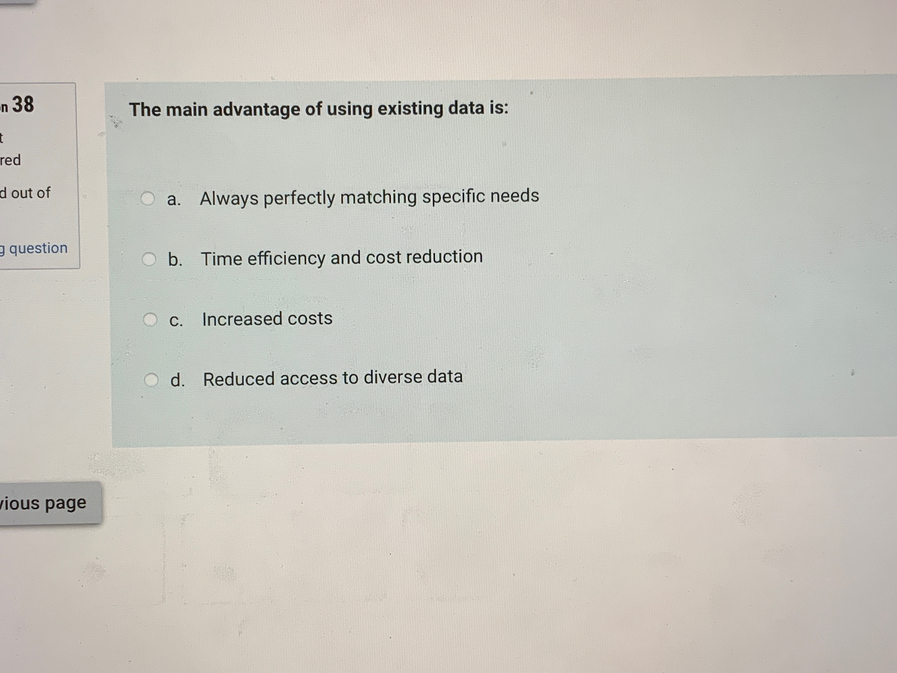

```
n38 _ The main advantage of using existing data is:
|
red

d out of a. Always perfectly matching specific needs

} question : :
ee b. Time efficiency and cost reduction

c. Increased costs

d. Reduced access to diverse data

jious page
```

---

## Question 129

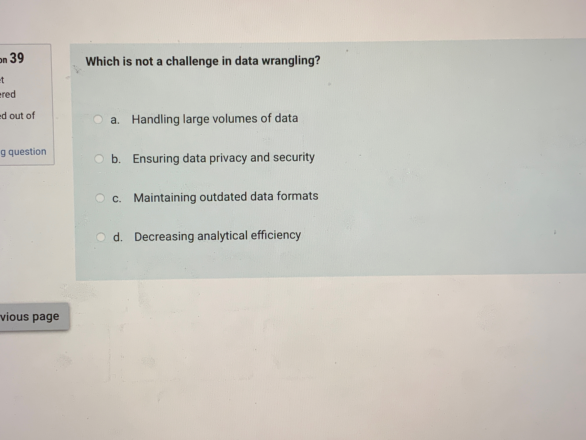

```
n 39

t
red

_ Which is not a challenge in data wrangling?

d out of a. Handling large volumes of data

g question ‘ i
b. Ensuring data privacy and security

G: Maintaining outdated data formats

d. Decreasing analytical efficiency

vious page
```

---

## Question 130


```
on 40
at
ared

- Which is NOT a challenge in maintaining data quality?

2d out of

S

Complexity of data integration
1g question
: 2 | b. Volume and variety of data

c. Datasilos

d. High-quality data tools

vious page
```

---

## Question 131

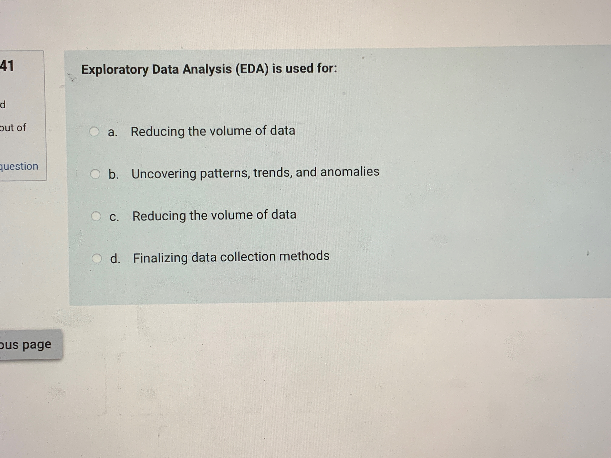

```
Al 4 Exploratory Data Analysis (EDA) is used for:

d

out of a. Reducing the volume of data

juestion : :
| b. Uncovering patterns, trends, and anomalies

c. Reducing the volume of data

d. Finalizing data collection methods

DUS page
```

---

## Question 132


```
mn 42 ._ Metadata in Data Cataloging includes:
t :
red

d out of a. Only structural metadata

g question Se. ;
b. Descriptive, Structural, and Technical Metadata

c. Only usage metadata

d. Only descriptive metadata

vious page
```

---

## Question 133

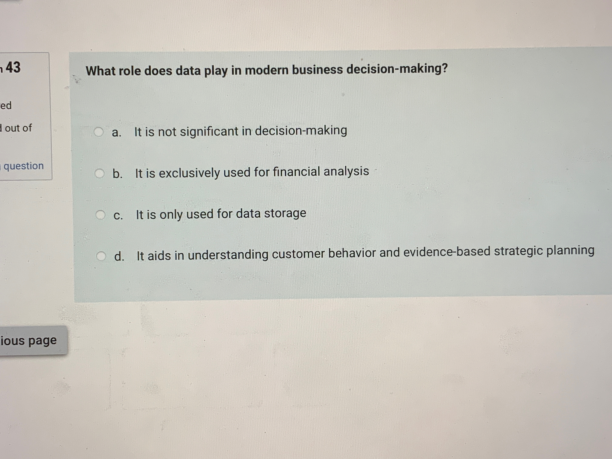

```
1 43

_ What role does data play in modern business decision-making?

ed

1 out of

2

It is not significant in decision-making

| question :
ae b. [tis exclusively used for financial analysis ~

O

lt is only used for data storage

d. It aids in understanding customer behavior and evidence-based strategic planning

ious page
```

---

## Question 134

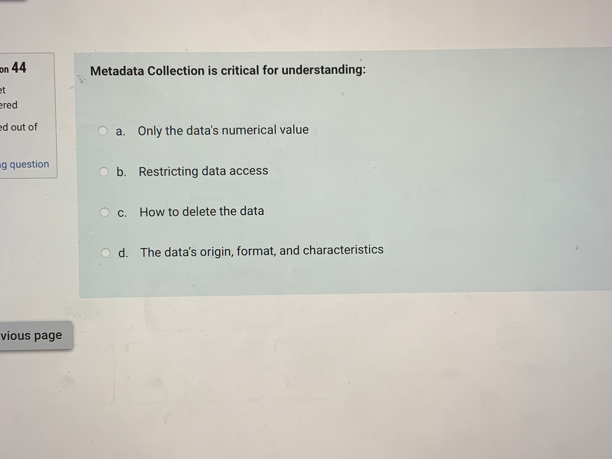

```
on 44 _ Metadata Collection is critical for understanding:
t |
ared

sd out of a. Only the data's numerical value

ig question ee
2 oe b. Restricting data access

c. How to delete the data

d. The data’s origin, format, and characteristics

vious page

SE
```

---

## Question 135


```
ata visualisation method is primarily used for numerical data to un
```

---

## Question 136

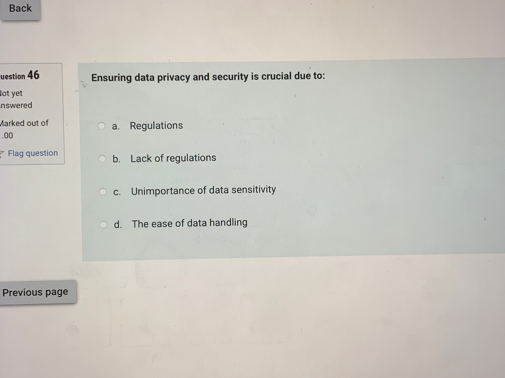

```
_ Back

uestion 46 : Ensuring data privacy and security is crucial due to:
lot yet |
nswered

Aarked out of

a. Regulations
.00

7 Flag question :
| | b. Lack of regulations

c. Unimportance of data sensitivity

d. The ease of data handling

Previous page

—
```

---

## Question 137


```
ion 47 : Which of the following is NOT a part of the Data Discovery Process?
et |
ered

ed out of a. Data Cataloging and Metadata Management

ag question :
oe b. Data Encryption

c. Data Exploration and Visualization

d. Data Integration and Consolidation

vious page
```

---

## Question 138

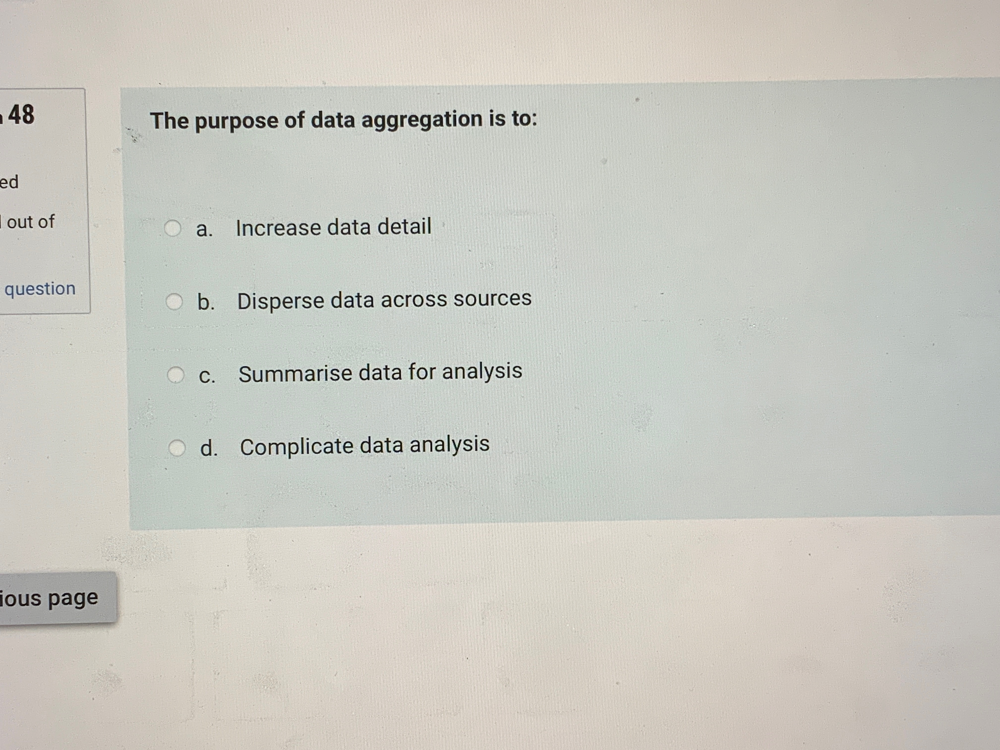

```
48

_ The purpose of data aggregation Is to:
ed
| out of

qa. Increase data detail
question i
& b. Disperse data across sources

c. Summarise data for analysis

d. Complicate data analysis

ious page
```

---

## Question 139

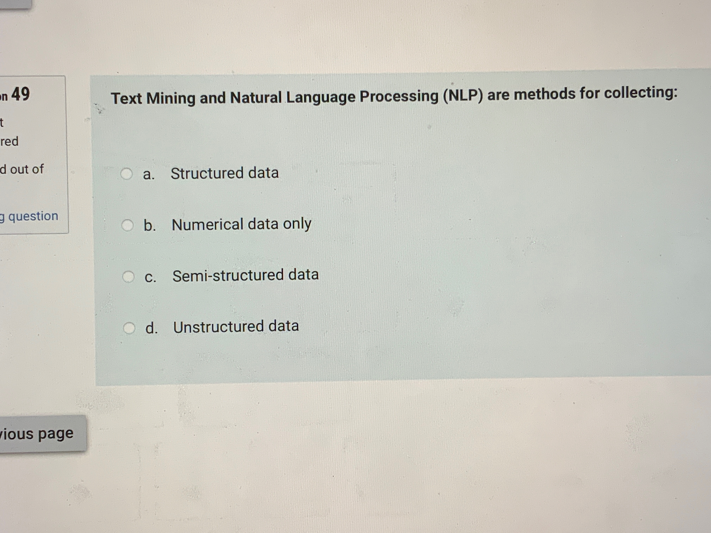

```
n 49 ‘ Text Mining and Natural Language Processing (NLP) are methods for collecting:

d out of a. Structured data

J question :
eg b. Numerical data only

c. Semi-structured data

d. Unstructured data

ious page
```

---

## Question 140


```
ion 50

et
ered

: Time-series data is indexed in:

ed out of a. Time order

ag question
b. Random order

c. Hierarchical order

d. Alphabetical order

avioUuS page
```

---

## Question 141


```
MonashELMS1

FIT5196 Data Wrangling - $1 2025

Back

oT seen

Time left 0:23:4

Question 19 What does the = quantifier do in regular expressions?
Answer saved

Marked out of

1.
ay a. Matches exactly one character

Y Remove flag
© b. Matches zero or more occurrences of the preceding element

c. Matches one or more occurrences of the preceding element

d. Matches zero or one occurrence of the preceding element

Clear my choice

Previous page
```

---

## Question 142


```
MonashELMS1

FIT5196 Data wrangling - $1 2025

Back

Time left 0:23:51

Question 17 What does (
Answer saved

->)\d+(?=<\/) match ina string like "<div>123</div>"2

Marked out of

tule a. The entire string including the tags

Y Remove flag

b. Any digits followed by "</"

c. Any digits preceded by ">

Od. 123, if it appears inside HTML tags

Clear my choice

Previous page
```

---

## Question 143

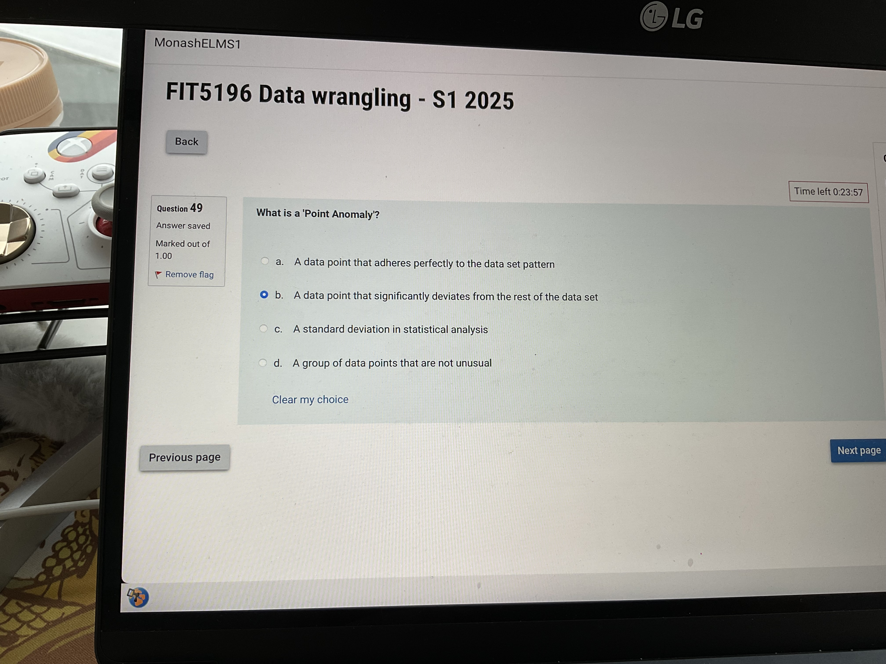

```
MonashELMS1

FIT5196 Data wrangling - $1 2025

Back

Time left 0:23:57

Question 49 What is a ‘Point Anomaly’?

Answer saved

Marked out of

ray a. A data point that adheres perfectly to the data set pattern

Y Remove flag
© b. A data point that significantly deviates from the rest of the data set

c. Astandard deviation in statistical analysis

d. Agroup of data points that are not unusual

Clear my choice

Next page
Previous page
```

---

## Question 144


*(No text extracted)*

---

## Question 145

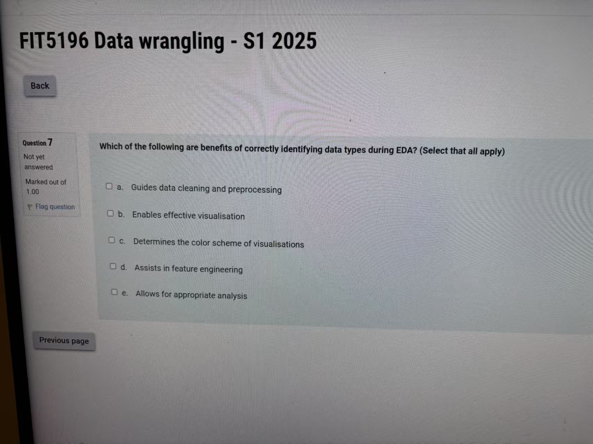

```
FIT5196 Data wrangling - $1 2025

Question 7 Which of the following are benefits of correctly identifying data types during EDA? (Select that all apply)
|» Not yet
answered

ohm Leah 1a. Guides data cleaning and preprocessing

Flag question Hip ! u i i
ae  b. Enables effective visualisation

Determines the color scheme of visualisations
Assists in feature engineering

Allows for appropriate analysis
```

---

## Question 146

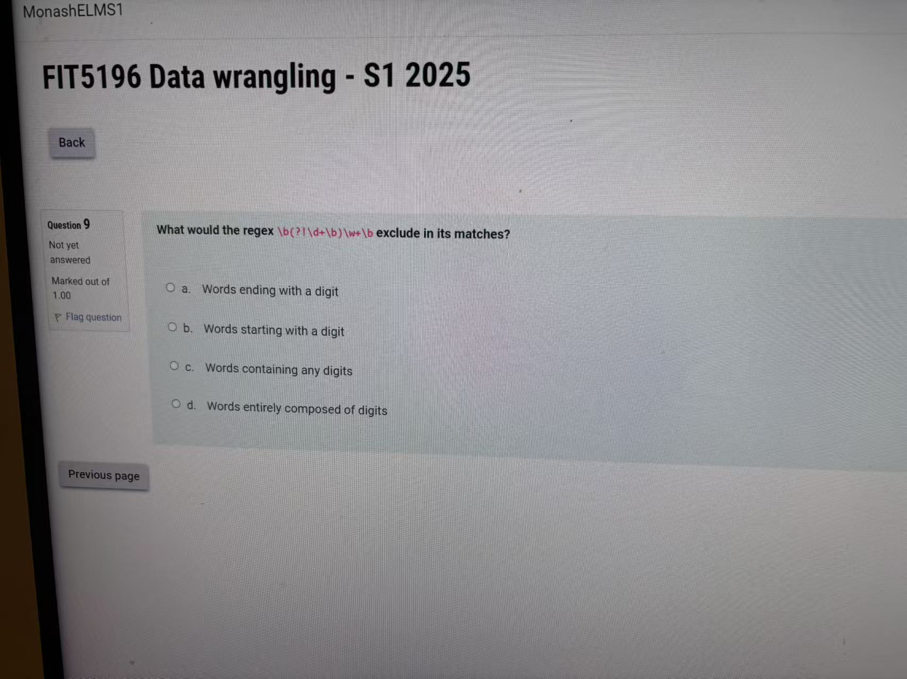

```
MonashELMS1

FIT5196 Data wrangling - $1 2025

Back

Question 9 What would the regex \b(?! \d+\b) \w+\b exclude in its matches?
Not yet

answered

he jana 2 a. Words ending with a digit
1

> Fi tion
ay mestion > b. Words starting with a digit

Oc. Words containing any digits

Words entirely composed of digits
```

---

## Question 147


```
96 Data wrangling - $1 2025

Which regex finds all instances of "not’ that are not immediately followed by "good"?

| © a. “nott?! good)

Ob. not(?=good)

Oc. not(?! good)

Od. not(?= good)
```

---

## Question 148

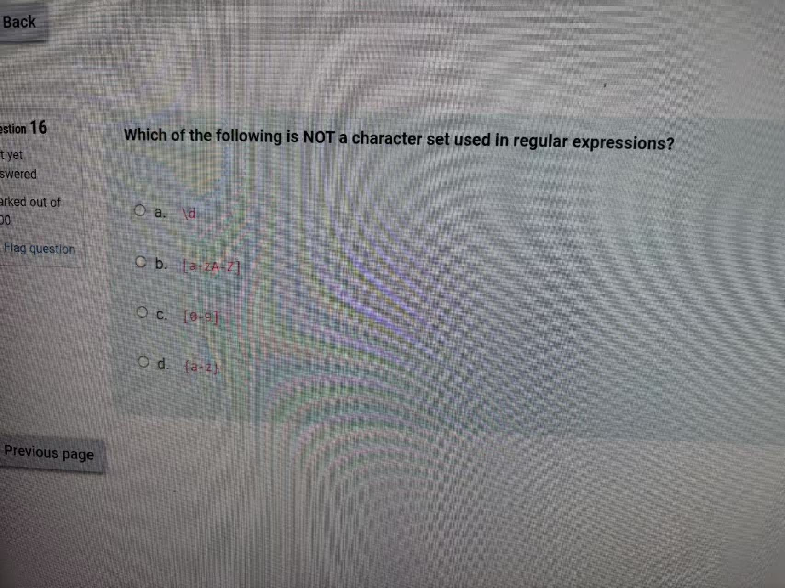

*(No text extracted)*

---

## Question 149


```
_ What challenges are presented by textual content in EDA for character and text data? (Select all that apply)

O a. Variability in text formats
Ob. Data sparsity a ==
Oc. Ambiguity in language . a
Od. High dimensionality a

High computational costs
```

---

## Question 150

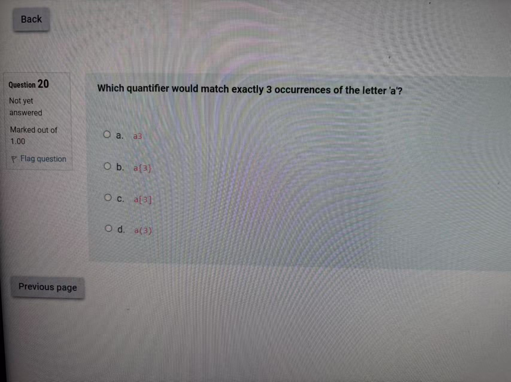

```
agate a

whi
. cee ws wont at
```

---

## Question 151

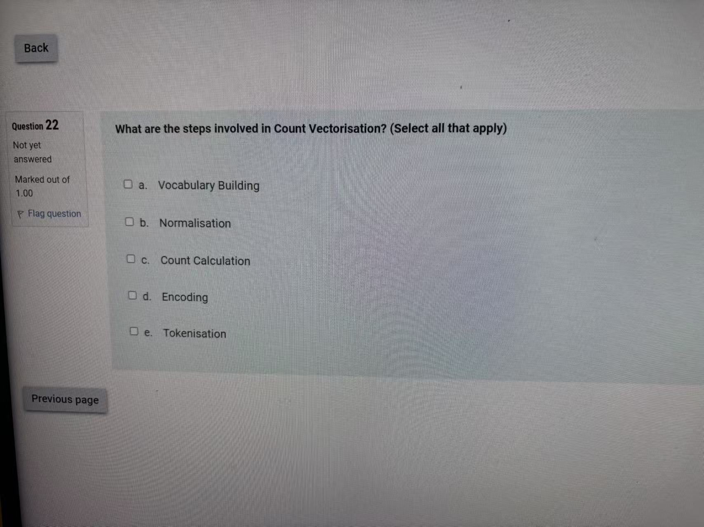

```
© a. Vocabulary Building
0 b. Normalisation
Oc. Count Calculation
Od. Encoding

Tokenisation

"What are the steps involved in Count Vectorisation? (Select all that apply)
```

---

## Question 152

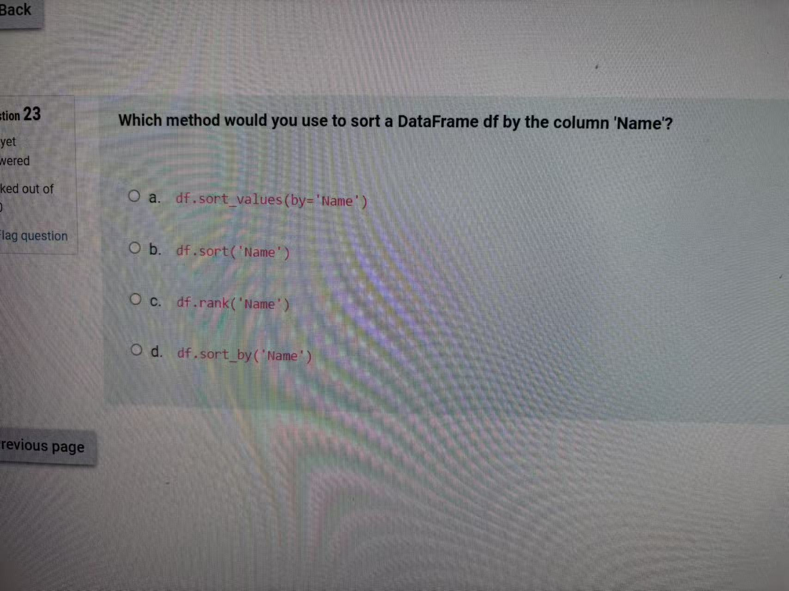

*(No text extracted)*

---

## Question 153

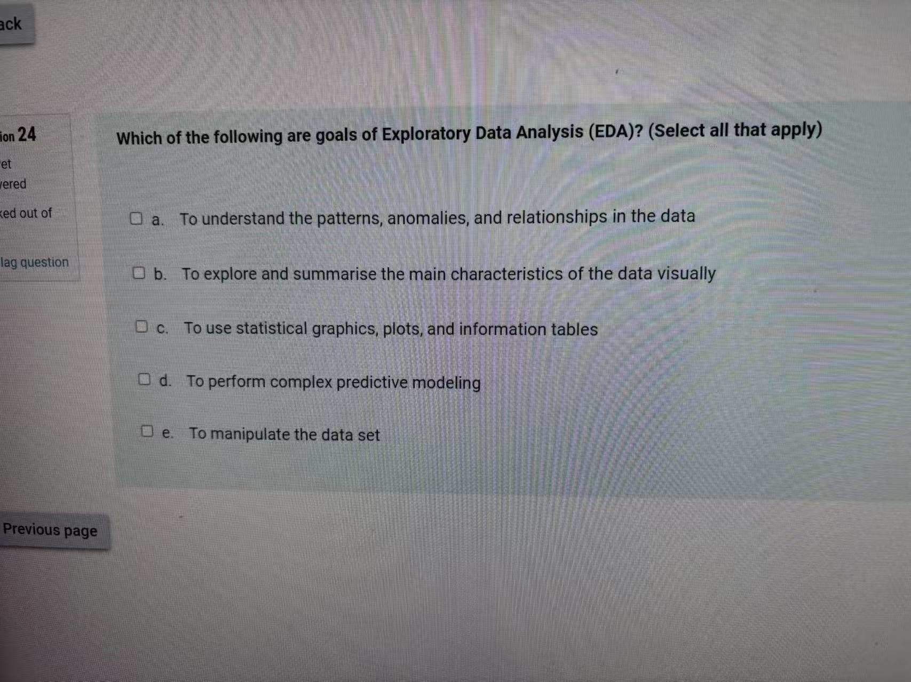

*(No text extracted)*

---

## Question 154


```
© a. Risk Management
Enhancing product quality |
Compliance monitoring |

Performance Optimisation

Understanding customer behaviour
```

---

## Question 155


*(No text extracted)*

---

## Question 156

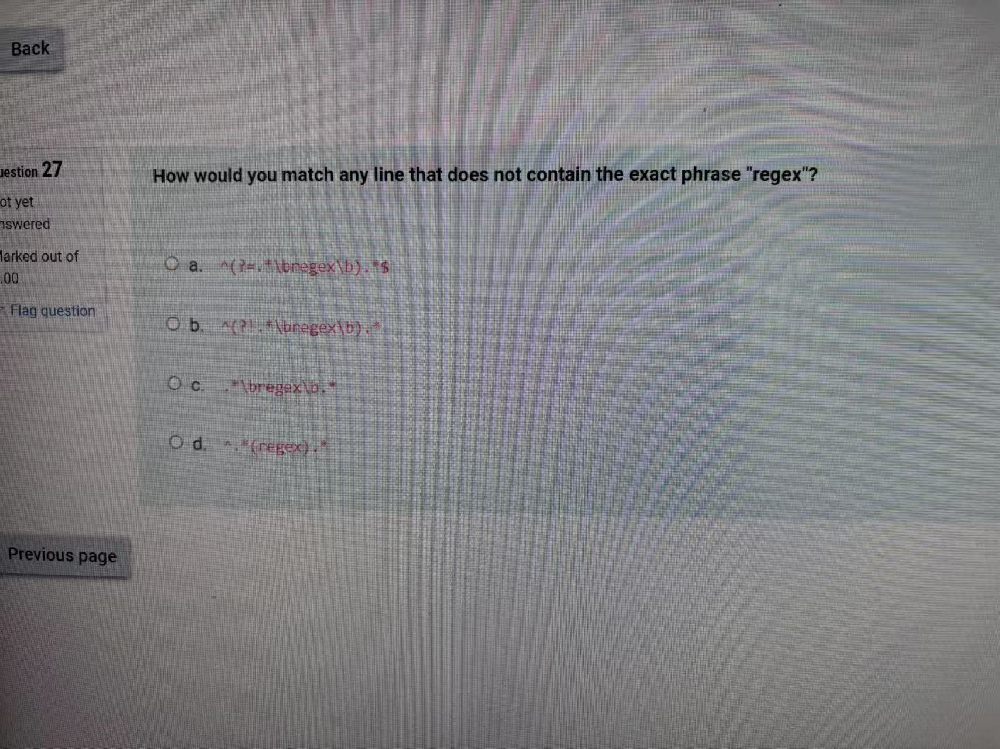

*(No text extracted)*

---

## Question 157


```
What will (\b[a-z4-2]{3}\b)\s+\1 match?

Any word repeated exactly once after one or more spaces

od Nh a A three-letter word followed by another three-letter word

Any three-letter word repeated with one or more spaces in between

A sequence of six letters with a space in the middle
```

---

## Question 158


```
In information retrieval tasks
(© b. When performing named entity recognition

Oc. Forgraphical data representation

Od. inaudio data processing

To maintain the original meaning of words
```

---

## Question 159


```
FIT5196 Data wrangling - $1 2025

Back

Question 30 Data Security measures are essential for:
, Not yet
/ answered

Marked out of

a a. Encouraging unauthorized data access

¥ Flag question af :
b. Reducing data quality

c. Ensuring data is openly accessible

) d. Secure storage and transmission of data
```

---

## Question 160


```
‘ What process involves scaling data to a small, specified range?

© a. Diversification
© b. Aggregation
Oc. Normalisation

O d. Segmentation
```

---

## Question 161

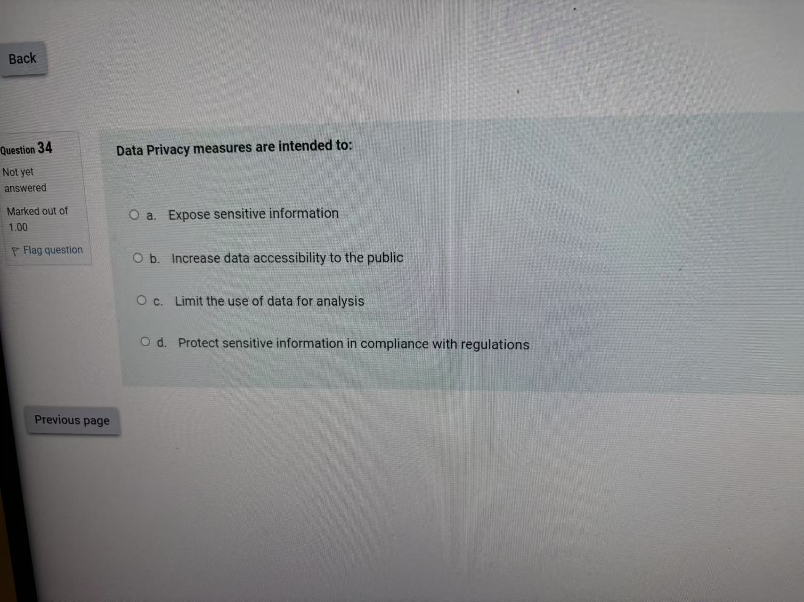

```
pata Privacy measures are intended to:

© a. Expose sensitive information
© b. Increase data accessibility to the public
O c. Limit the use of data for analysis

© d. Protect sensitive information in compliance with regulations
```

---

## Question 162

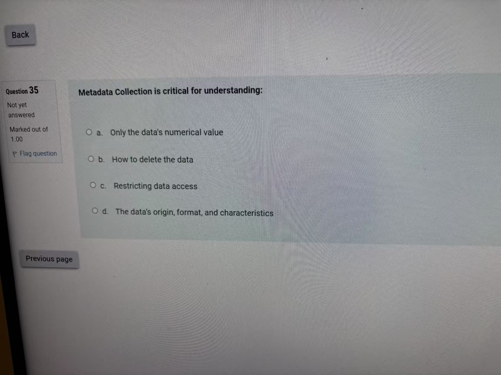

```
Metadata Collection is critical for understanding

© a. Only the data's numerical value
© b. How to delete the data

Oc. Restricting data access

Od. The data’s origin, format, and characteristics
```

---

## Question 163


*(No text extracted)*

---

## Question 164

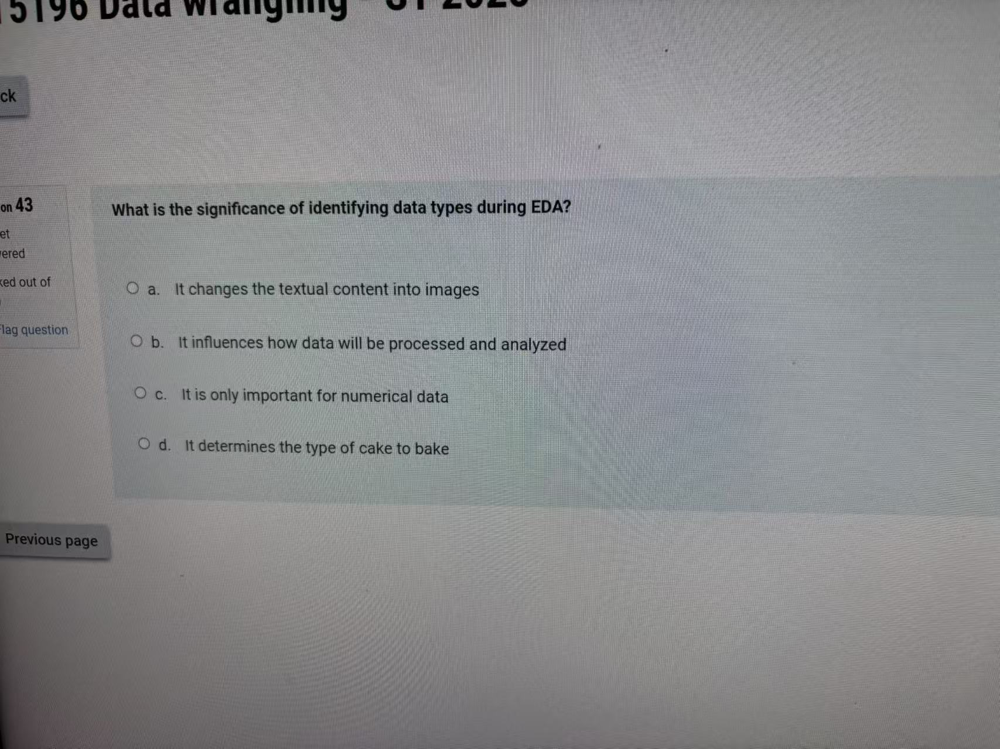

```
© a. Itchanges the textual content into images

© b. Itinfluences how data will be processed and analy

‘Oc. Itis only important for numerical data

bie

ih
```

---

